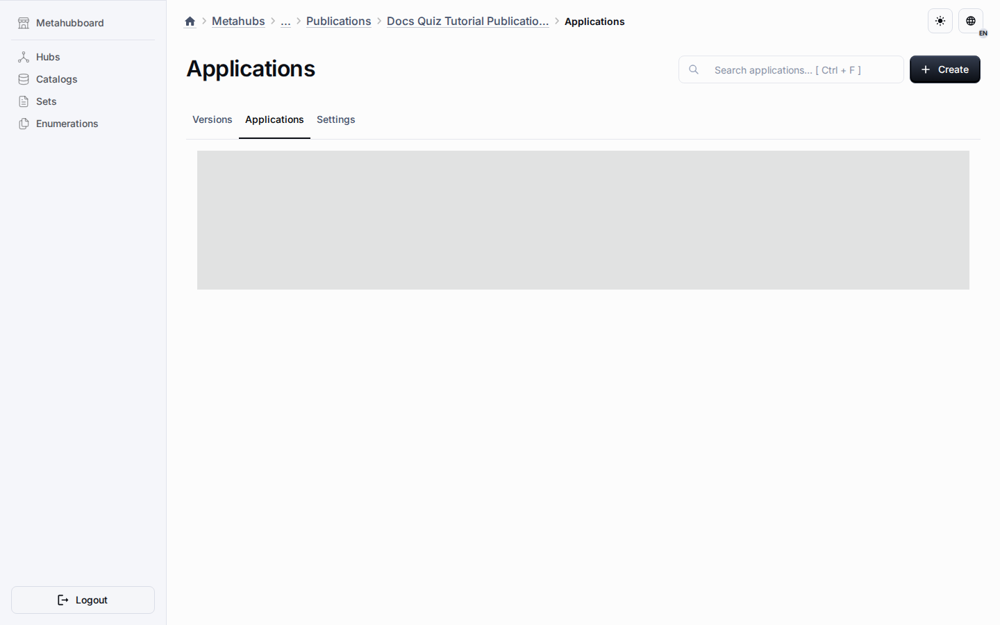

# Builder Flows

Builder tooling in Universo Platformo is documented as structured authoring,
template assembly, and controlled handoff from design-time work to publication.

## Current Scope

The public repository already contains reusable templates, structured domain
entities, migration-aware definitions, and documentation of shared package
boundaries used by the current authoring surfaces.

## Practical Use

- Guided creation of platform structures and applications.
- Better template-driven composition across domains.
- More explicit generation assistance for schemas and content structures.
- Safer handoff from design-time editing to publication or runtime execution.

The important point is repeatable structure and governance, not novelty alone.

