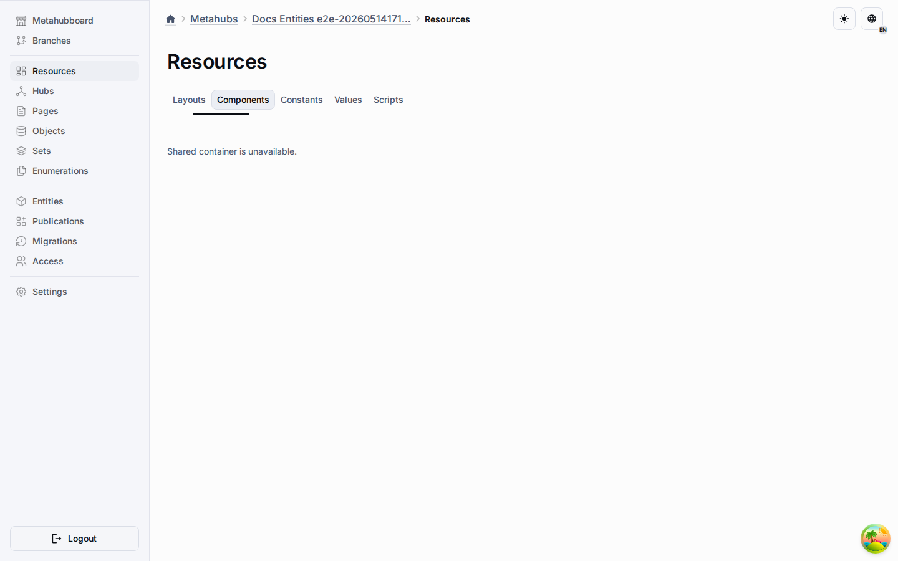

# Component Nodes

Component nodes attach reusable capabilities, fields, behaviors, or metadata to
other nodes.

## Typical Responsibilities

- Add optional or repeatable features to a base entity.
- Keep reusable concerns separate from primary identity.
- Support composition instead of deep inheritance.

In platform terms, component nodes can express business fields, presentation
settings, integration metadata, or execution-related capabilities.
