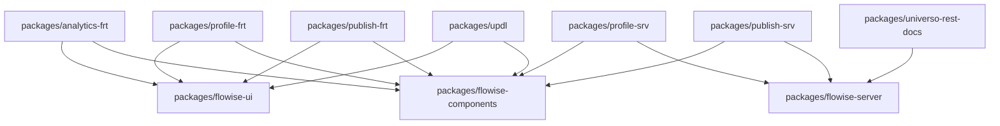

# Packages Analysis

## Brief Description

Detailed analysis of the workspace packages structure in Universo Platformo, examining shared components, dependencies, and their role in the current monolithic architecture and future microservices migration.

## Contents

- [Package Structure](#package-structure)
- [Dependency Analysis](#dependency-analysis)
- [Shared Components](#shared-components)
- [Migration Impact](#migration-impact)
- [Recommendations](#recommendations)

## Package Structure

### Current Workspace Layout

```
packages/
├── universo-rest-docs/   # API documentation generator
├── components/         # Shared UI and business components
├── server/            # Core server functionality
└── ui/               # Frontend UI library
```

### Package Details

#### API Documentation (`packages/universo-rest-docs/`)
**Purpose**: Automated API documentation generation
**Technology**: TypeScript + OpenAPI
**Dependencies**: 
- Express.js for serving docs
- Swagger UI for documentation interface

```json
{
  "name": "@universo-platformo/universo-rest-docs",
  "version": "0.21.0",
  "dependencies": {
    "express": "^4.18.0",
    "swagger-ui-express": "^4.6.0",
    "openapi-types": "^12.1.0"
  }
}
```

#### Components (`packages/flowise-components/`)
**Purpose**: Shared business logic and UI components
**Technology**: TypeScript + React
**Key Modules**:
- Interface definitions
- Validation utilities
- Storage utilities
- Error handling
- Model loading

```typescript
// Key interfaces from packages/flowise-components/src/Interface.ts
interface INode {
    id: string;
    type: string;
    data: any;
    position: { x: number; y: number };
}

interface INodeData {
    label: string;
    name: string;
    version: number;
    description?: string;
    inputParameters?: INodeParams[];
    outputParameters?: INodeParams[];
}

interface INodeParams {
    label: string;
    name: string;
    type: string;
    optional?: boolean;
    description?: string;
}
```

#### Server (`packages/flowise-server/`)
**Purpose**: Core server functionality and middleware
**Technology**: Node.js + Express.js + TypeScript
**Key Features**:
- Authentication middleware
- Database connections
- API routing
- File upload handling
- WebSocket support

```typescript
// Core server interfaces
interface IServerConfig {
    port: number;
    cors: CorsOptions;
    database: DatabaseConfig;
    auth: AuthConfig;
    storage: StorageConfig;
}

interface DatabaseConfig {
    url: string;
    ssl: boolean;
    poolSize: number;
}
```

#### UI (`packages/flowise-ui/`)
**Purpose**: Frontend UI library and components
**Technology**: React + Material-UI + TypeScript
**Key Components**:
- Layout components
- Form components
- Data visualization
- Theme system

## Dependency Analysis

### Inter-Package Dependencies



### External Dependencies

#### Frontend Dependencies
```json
{
  "react": "^18.2.0",
  "react-dom": "^18.2.0",
  "@mui/material": "^5.14.0",
  "@mui/icons-material": "^5.14.0",
  "typescript": "^5.0.0",
  "vite": "^4.4.0"
}
```

#### Backend Dependencies
```json
{
  "express": "^4.18.0",
  "cors": "^2.8.5",
  "@supabase/supabase-js": "^2.38.0",
  "joi": "^17.9.0",
  "winston": "^3.10.0",
  "multer": "^1.4.5"
}
```

## Shared Components

### Business Logic Components

#### Node System (`packages/flowise-components/src/`)
- **Interface.ts**: Core type definitions
- **validator.ts**: Input validation
- **modelLoader.ts**: Dynamic model loading
- **handler.ts**: Request handling utilities

#### Storage Utilities
```typescript
// packages/flowise-components/src/storageUtils.ts
export interface IStorageConfig {
    provider: 'supabase' | 'local' | 's3';
    bucket?: string;
    region?: string;
    credentials?: any;
}

export class StorageManager {
    async uploadFile(file: File, path: string): Promise<string>;
    async downloadFile(path: string): Promise<Blob>;
    async deleteFile(path: string): Promise<void>;
    async listFiles(prefix: string): Promise<string[]>;
}
```

#### Error Handling
```typescript
// packages/flowise-components/src/error.ts
export class UniversoError extends Error {
    code: string;
    statusCode: number;
    details?: any;
    
    constructor(message: string, code: string, statusCode = 500, details?: any) {
        super(message);
        this.code = code;
        this.statusCode = statusCode;
        this.details = details;
    }
}

export const ErrorCodes = {
    VALIDATION_ERROR: 'VALIDATION_ERROR',
    AUTHENTICATION_ERROR: 'AUTHENTICATION_ERROR',
    AUTHORIZATION_ERROR: 'AUTHORIZATION_ERROR',
    NOT_FOUND: 'NOT_FOUND',
    INTERNAL_ERROR: 'INTERNAL_ERROR'
} as const;
```

### UI Components

#### Layout Components (`packages/flowise-ui/src/`)
- Header and navigation
- Sidebar components
- Modal dialogs
- Loading indicators

#### Form Components
- Input fields with validation
- File upload components
- Date/time pickers
- Multi-select dropdowns

#### Data Visualization
- Charts and graphs
- Data tables
- Progress indicators
- Status displays

## Migration Impact

### Challenges for Microservices Migration

#### 1. Shared State Management
**Current**: Centralized state in monolithic application
**Challenge**: Distribute state across microservices
**Solution**: Event-driven architecture with Supabase Realtime

#### 2. Component Reusability
**Current**: Direct imports from packages
**Challenge**: Package distribution across services
**Solution**: NPM packages or shared libraries

#### 3. Type Safety
**Current**: Shared TypeScript interfaces
**Challenge**: Maintain type safety across services
**Solution**: API-first approach with OpenAPI schemas

### Migration Strategy for Packages

#### Phase 1: Extract Shared Libraries
1. **@universo-platformo/types**: Common TypeScript interfaces
2. **@universo-platformo/utils**: Utility functions
3. **@universo-platformo/ui-components**: Reusable UI components

#### Phase 2: Service-Specific Packages
1. **@universo-platformo/auth**: Authentication utilities
2. **@universo-platformo/storage**: Storage abstractions
3. **@universo-platformo/validation**: Validation schemas

#### Phase 3: Platform Packages
1. **@universo-platformo/sdk**: Client SDK for external developers
2. **@universo-platformo/templates**: Export template system
3. **@universo-platformo/nodes**: UPDL node definitions

### Package Distribution Strategy

```typescript
// Future package structure
interface PackageDistribution {
    sharedLibraries: {
        '@universo-platformo/types': string;
        '@universo-platformo/utils': string;
        '@universo-platformo/ui-components': string;
    };
    servicePackages: {
        [serviceName: string]: {
            dependencies: string[];
            version: string;
        };
    };
}
```

## Recommendations

### Immediate Actions

1. **Package Audit**: Review all package dependencies and usage
2. **Interface Standardization**: Define clear interfaces for shared components
3. **Documentation**: Document all package APIs and usage patterns

### Migration Preparation

1. **Extract Common Types**: Create shared type definitions package
2. **Modularize Components**: Break down large components into smaller modules
3. **Version Management**: Implement semantic versioning for packages

### Long-term Strategy

1. **NPM Registry**: Set up private NPM registry for package distribution
2. **Automated Testing**: Implement comprehensive testing for all packages
3. **CI/CD Pipeline**: Automate package building and publishing

## Related Pages

- [Current Architecture](README.md)
- [Existing Applications](existing-apps.md)
- [Integration Patterns](integration-patterns.md)
- [Target Architecture](../target-architecture/README.md)

## Status

- [x] Package structure analyzed
- [x] Dependencies mapped
- [x] Migration challenges identified
- [ ] Package extraction planning

---
*Last updated: August 5, 2025*
