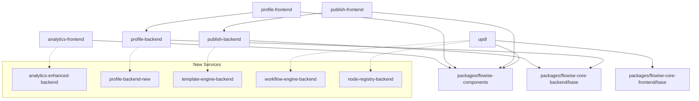

# Migration Strategy

## Brief Description

Comprehensive migration strategy from the current monolithic Universo Platformo architecture (6 applications based on Flowise) to the target microservices architecture (20+ independent services).

## Contents

- [Migration Principles](#migration-principles)
- [Migration Phases](#migration-phases)
- [Dependency Graph](#dependency-graph)
- [Data Strategy](#data-strategy)
- [Risk Management](#risk-management)

## Migration Principles

### Core Principles

1. **Gradual Migration**: Phased service extraction without service interruption
2. **Backward Compatibility**: Support for old APIs during transition period
3. **Rollback Readiness**: Ability to rollback at any stage
4. **Zero Downtime**: Migration without service downtime
5. **Data Integrity**: Preservation of data integrity

### Strategic Approaches

#### Strangler Fig Pattern
```typescript
interface StranglerFigMigration {
    phase: 'preparation' | 'parallel_run' | 'cutover' | 'cleanup';
    oldService: {
        name: string;
        status: 'active' | 'deprecated' | 'retired';
        trafficPercentage: number;
    };
    newService: {
        name: string;
        status: 'development' | 'testing' | 'production';
        trafficPercentage: number;
    };
    migrationRules: {
        routingRules: RoutingRule[];
        dataSync: DataSyncRule[];
        rollbackTriggers: RollbackTrigger[];
    };
}
```

#### Database per Service
```typescript
interface DatabaseMigration {
    sourceSchema: string;
    targetSchemas: {
        [serviceName: string]: {
            schema: string;
            tables: string[];
            migrationScript: string;
        };
    };
    sharedData: {
        tables: string[];
        accessPattern: 'read_only' | 'event_sourcing' | 'api_gateway';
    };
}
```

## Migration Phases

### Phase 1: Infrastructure Preparation (4 weeks)

#### Goals
- Set up CI/CD for microservices
- Create monitoring and logging
- Prepare containerization

#### Tasks

**Week 1-2: DevOps Infrastructure**
```yaml
infrastructure_setup:
  containerization:
    - docker_setup
    - docker_compose_development
    - kubernetes_cluster_preparation
  
  ci_cd:
    - github_actions_workflows
    - automated_testing_pipeline
    - deployment_automation
  
  monitoring:
    - prometheus_setup
    - grafana_dashboards
    - alertmanager_configuration
```

**Week 3-4: Service Infrastructure**
```yaml
service_infrastructure:
  api_gateway:
    - nginx_or_traefik_setup
    - rate_limiting
    - authentication_middleware
  
  service_discovery:
    - consul_or_kubernetes_dns
    - health_checks
    - load_balancing
  
  data_infrastructure:
    - database_per_service_setup
    - redis_cluster
    - message_queue_setup
```

### Phase 2: Simple Service Extraction (6 weeks)

#### Extraction Priority (by complexity)

1. **analytics-frontend** → `analytics-enhanced-backend` (Week 1-2)
2. **profile-backend** → `profile-backend` microservice (Week 3-4)
3. **profile-frontend** → update for new API (Week 5-6)

#### Example Migration: Analytics Service

```typescript
interface AnalyticsServiceMigration {
    step1_create_service: {
        repository: 'analytics-enhanced-backend';
        database: 'analytics_db';
        api_endpoints: [
            'GET /api/v1/analytics/events',
            'POST /api/v1/analytics/events',
            'GET /api/v1/analytics/reports'
        ];
    };
    
    step2_data_migration: {
        source_tables: ['analytics_events', 'user_interactions'];
        migration_script: 'migrate_analytics_data.sql';
        validation_queries: string[];
    };
    
    step3_traffic_routing: {
        initial_percentage: 10;
        increment_schedule: '10% every 2 days';
        rollback_triggers: ['error_rate > 5%', 'latency > 500ms'];
    };
}
```

### Phase 3: Complex Service Extraction (8 weeks)

#### Extraction Order

1. **publish-backend** → `template-engine-backend` + `publish-backend` (Week 1-4)
2. **publish-frontend** → update for new APIs (Week 5-6)
3. **Flowise core** → `workflow-engine-backend` + `node-registry-backend` (Week 7-8)

#### Example Migration: Template Engine

```typescript
interface TemplateEngineMigration {
    complexity: 'high';
    dependencies: ['node-registry-backend', 'file-storage'];
    
    migration_phases: {
        phase1_extract_templates: {
            duration: '2 weeks';
            tasks: [
                'extract_template_definitions',
                'create_template_api',
                'migrate_template_storage'
            ];
        };
        
        phase2_extract_engine: {
            duration: '2 weeks';
            tasks: [
                'extract_compilation_logic',
                'create_generation_api',
                'integrate_with_templates'
            ];
        };
    };
    
    rollback_strategy: {
        checkpoints: ['after_phase1', 'after_phase2'];
        rollback_time: '< 30 minutes';
        data_backup: 'automated_daily';
    };
}
```

### Phase 4: UPDL System Extraction (10 weeks)

#### Most Complex Component

```typescript
interface UPDLSystemMigration {
    complexity: 'critical';
    business_impact: 'high';
    
    decomposition: {
        node_registry_srv: {
            responsibility: 'Node definition management';
            duration: '3 weeks';
            dependencies: [];
        };
        
        workflow_engine_srv: {
            responsibility: 'Chatflow execution';
            duration: '4 weeks';
            dependencies: ['node-registry-backend'];
        };
        
        updl_frontend: {
            responsibility: 'Visual editor';
            duration: '3 weeks';
            dependencies: ['node-registry-backend', 'workflow-engine-backend'];
        };
    };
    
    migration_strategy: {
        approach: 'big_bang_with_fallback';
        reason: 'Too tight coupling between components';
        fallback_plan: 'Full rollback to monolith within 1 hour';
    };
}
```

## Dependency Graph

### Application Dependencies



### Migration Order by Dependencies

```typescript
interface MigrationOrder {
    wave1_independent: {
        services: ['analytics-enhanced-backend'];
        duration: '2 weeks';
        risk: 'low';
    };
    
    wave2_simple_dependencies: {
        services: ['profile-backend'];
        duration: '2 weeks';
        risk: 'low';
        depends_on: [];
    };
    
    wave3_moderate_dependencies: {
        services: ['template-engine-backend', 'publish-backend'];
        duration: '4 weeks';
        risk: 'medium';
        depends_on: ['profile-backend'];
    };
    
    wave4_complex_dependencies: {
        services: ['node-registry-backend', 'workflow-engine-backend'];
        duration: '6 weeks';
        risk: 'high';
        depends_on: ['template-engine-backend'];
    };
}
```

## Data Strategy

### Current Database Schema

```sql
-- Monolithic database
CREATE SCHEMA public;

-- Users (used by all services)
CREATE TABLE profiles (
    id UUID PRIMARY KEY,
    email VARCHAR(255),
    display_name VARCHAR(100),
    -- used by: profile-backend, analytics-frontend, updl
);

-- UPDL flows (used by updl, publish-backend)
CREATE TABLE updl_flows (
    id UUID PRIMARY KEY,
    user_id UUID REFERENCES profiles(id),
    flow_data JSONB,
    -- used by: updl, publish-backend
);

-- Published apps (used by publish-backend, analytics-frontend)
CREATE TABLE published_apps (
    id UUID PRIMARY KEY,
    flow_id UUID REFERENCES updl_flows(id),
    -- used by: publish-backend, analytics-frontend
);
```

### Target Microservices Schema

```sql
-- Schema per service
CREATE SCHEMA profiles_service;
CREATE TABLE profiles_service.users (
    id UUID PRIMARY KEY,
    email VARCHAR(255),
    display_name VARCHAR(100)
);

CREATE SCHEMA analytics_service;
CREATE TABLE analytics_service.events (
    id UUID PRIMARY KEY,
    user_id UUID, -- reference via API
    event_data JSONB
);

CREATE SCHEMA workflow_service;
CREATE TABLE workflow_service.flows (
    id UUID PRIMARY KEY,
    owner_id UUID, -- reference via API
    flow_definition JSONB
);
```

### Data Migration Strategy

```typescript
interface DataMigrationStrategy {
    approach: 'event_sourcing' | 'dual_write' | 'bulk_migration';
    
    event_sourcing: {
        description: 'All changes through events';
        use_for: ['user_profiles', 'workflow_changes'];
        implementation: {
            event_store: 'supabase_realtime';
            replay_capability: true;
            snapshot_frequency: 'daily';
        };
    };
    
    dual_write: {
        description: 'Write to both old and new DB simultaneously';
        use_for: ['analytics_events', 'published_apps'];
        duration: '2-4 weeks per service';
        validation: 'continuous_comparison';
    };
    
    bulk_migration: {
        description: 'One-time migration';
        use_for: ['static_reference_data'];
        downtime: '< 1 hour';
        rollback_time: '< 15 minutes';
    };
}
```

## Risk Management

### Identified Risks

#### High Risks

1. **Data Loss During Migration**
   - Probability: Medium
   - Impact: Critical
   - Mitigation: Automated backups, migration testing

2. **UPDL System Disruption**
   - Probability: High
   - Impact: Critical
   - Mitigation: Phased migration, fallback plan

3. **New Service Performance**
   - Probability: Medium
   - Impact: High
   - Mitigation: Load testing, monitoring

#### Medium Risks

1. **Integration Complexity**
   - Mitigation: API-first approach, contracts
2. **Increased Operational Complexity**
   - Mitigation: Automation, monitoring
3. **Time Overruns**
   - Mitigation: Buffer time, prioritization

### Risk Management Plan

```typescript
interface RiskManagementPlan {
    monitoring: {
        metrics: [
            'service_availability',
            'response_times',
            'error_rates',
            'data_consistency'
        ];
        alerts: {
            critical: 'immediate_notification';
            warning: 'daily_summary';
        };
    };
    
    rollback_procedures: {
        service_level: {
            trigger: 'error_rate > 5% for 5 minutes';
            action: 'route_traffic_to_old_service';
            time: '< 5 minutes';
        };
        
        system_level: {
            trigger: 'multiple_service_failures';
            action: 'full_rollback_to_monolith';
            time: '< 30 minutes';
        };
    };
    
    communication_plan: {
        stakeholders: ['development_team', 'operations', 'users'];
        channels: ['slack', 'email', 'status_page'];
        frequency: 'real_time_during_migration';
    };
}
```

### Migration Success Criteria

```typescript
interface MigrationSuccessCriteria {
    technical: {
        zero_data_loss: true;
        performance_maintained: 'response_time < 200ms';
        availability: 'uptime > 99.9%';
        rollback_capability: 'tested_and_verified';
    };
    
    business: {
        feature_parity: 'all_existing_features_work';
        user_experience: 'no_degradation';
        development_velocity: 'maintained_or_improved';
    };
    
    operational: {
        monitoring_coverage: '100%';
        automated_deployment: 'fully_automated';
        documentation: 'complete_and_current';
    };
}
```

## Related Pages

- [Implementation Plan](README.md)
- [Phase 1: MVP](phase-1-mvp.md)
- [Current Architecture](../current-architecture/README.md)
- [Target Architecture](../target-architecture/README.md)

## Migration Status

- [x] Migration strategy defined
- [x] Dependency graph created
- [x] Risk management plan developed
- [ ] Infrastructure preparation
- [ ] Migration start

---
*Last updated: August 5, 2025*
