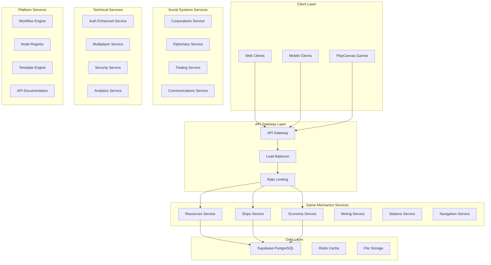

# Target Architecture

## Brief Description

The target architecture for Universo Platformo represents a complete transformation from the current monolithic structure to a comprehensive microservices ecosystem of 20+ applications, designed to support full-featured Universo MMOOMM and other 3D/AR/VR applications.

## Contents

- [Architecture Overview](#architecture-overview)
- [Application Categories](#application-categories)
- [Microservices Design](#microservices-design)
- [Integration Strategy](#integration-strategy)
- [Scalability Goals](#scalability-goals)

## Architecture Overview

### Vision Statement

Transform Universo Platformo from a 6-application monolith into a scalable, distributed ecosystem capable of supporting:
- **10,000+ concurrent players** in Universo MMOOMM
- **Multiple game worlds** with different economic systems
- **Real-time multiplayer** interactions
- **Complex social systems** (corporations, alliances, diplomacy)
- **Advanced gameplay mechanics** (PvP, territorial warfare, industry)

### High-Level Architecture



## Application Categories

### 1. Game Mechanics (8 Applications)

Core gameplay systems for Universo MMOOMM:

- **resources-frontend/srv**: Resource management with 16 material types
- **ships-frontend/srv**: Fleet management and ship customization
- **economy-frontend/srv**: Inmo currency and inter-world economics
- **mining-frontend/srv**: Industrial laser mining with automation
- **stations-frontend/srv**: Space stations and production facilities
- **navigation-frontend/srv**: Star gates and inter-world travel
- **combat-frontend/srv**: PvP combat and warfare mechanics
- **skills-frontend/srv**: Character progression and skill system

### 2. Social Systems (6 Applications)

Player interaction and organization systems:

- **corporations-frontend/srv**: Corporate structures and management
- **diplomacy-frontend/srv**: Alliances, wars, and negotiations
- **trading-frontend/srv**: Advanced trading and market systems
- **communications-frontend/srv**: In-game messaging and forums
- **reputation-frontend/srv**: Player reputation and trust systems
- **events-frontend/srv**: Game events and community activities

### 3. Technical Systems (6 Applications)

Platform infrastructure and support services:

- **auth-enhanced-frontend/srv**: Advanced authentication and authorization
- **multiplayer-frontend/srv**: Real-time multiplayer synchronization
- **security-frontend/srv**: Anti-cheat and security monitoring
- **analytics-enhanced-frontend/srv**: Advanced analytics and metrics
- **monitoring-frontend/srv**: System monitoring and alerting
- **backup-frontend/srv**: Data backup and recovery systems

### 4. Platform Core (4 Applications)

Core platform functionality:

- **workflow-engine-backend**: Chatflow execution engine
- **node-registry-backend**: UPDL node management
- **template-engine-backend**: Multi-platform export system
- **api-gateway-backend**: Unified API gateway

## Microservices Design

### Design Principles

1. **Single Responsibility**: Each service owns one business domain
2. **Database per Service**: Isolated data storage
3. **API-First**: All communication through well-defined APIs
4. **Event-Driven**: Asynchronous communication via events
5. **Fault Tolerance**: Graceful degradation and circuit breakers

### Service Communication Patterns

#### Synchronous Communication (REST API)
```typescript
interface ServiceAPI {
    baseUrl: string;
    version: string;
    endpoints: {
        [operation: string]: {
            method: 'GET' | 'POST' | 'PUT' | 'DELETE';
            path: string;
            auth: boolean;
            rateLimit?: number;
        };
    };
}

// Example: Resources Service API
const resourcesAPI: ServiceAPI = {
    baseUrl: 'https://api.universo-platformo.com/resources',
    version: 'v1',
    endpoints: {
        getInventory: { method: 'GET', path: '/inventory/:playerId', auth: true },
        transferResources: { method: 'POST', path: '/transfer', auth: true, rateLimit: 10 },
        getMaterialTypes: { method: 'GET', path: '/materials', auth: false }
    }
};
```

#### Asynchronous Communication (Events)
```typescript
interface GameEvent {
    id: string;
    type: string;
    source: string;
    timestamp: number;
    data: any;
    metadata: {
        correlationId: string;
        userId?: string;
        worldId?: string;
    };
}

// Example events
const eventTypes = {
    RESOURCE_MINED: 'resource.mined',
    SHIP_DESTROYED: 'ship.destroyed',
    TRADE_COMPLETED: 'trade.completed',
    CORPORATION_CREATED: 'corporation.created',
    WAR_DECLARED: 'diplomacy.war.declared'
} as const;
```

### Data Architecture

#### Service-Specific Schemas
```sql
-- Resources Service Database
CREATE SCHEMA resources;
CREATE TABLE resources.material_types (
    id VARCHAR(50) PRIMARY KEY,
    name VARCHAR(100),
    density_kg_m3 DECIMAL(10,2),
    base_value_inmo DECIMAL(10,2)
);

-- Ships Service Database  
CREATE SCHEMA ships;
CREATE TABLE ships.ship_types (
    id VARCHAR(50) PRIMARY KEY,
    name VARCHAR(100),
    category VARCHAR(50),
    base_stats JSONB
);

-- Economy Service Database
CREATE SCHEMA economy;
CREATE TABLE economy.world_economies (
    world_id VARCHAR(50) PRIMARY KEY,
    characteristics JSONB,
    exchange_rates JSONB
);
```

## Integration Strategy

### UPDL Node Integration

Mapping of UPDL high-level nodes to microservices:

```typescript
interface UPDLServiceMapping {
    Space: {
        services: ['navigation-backend', 'stations-backend'];
        description: 'Game worlds and spatial systems';
    };
    Entity: {
        services: ['ships-backend', 'resources-backend', 'mining-backend'];
        description: 'Game objects and entities';
    };
    Component: {
        services: ['ships-backend', 'stations-backend'];
        description: 'Entity components and modules';
    };
    Event: {
        services: ['multiplayer-backend', 'events-backend', 'communications-backend'];
        description: 'Game events and triggers';
    };
    Action: {
        services: ['combat-backend', 'trading-backend', 'diplomacy-backend'];
        description: 'Player and system actions';
    };
    Data: {
        services: ['resources-backend', 'economy-backend', 'analytics-enhanced-backend'];
        description: 'Game data and metrics';
    };
    Universo: {
        services: ['workflow-engine-backend', 'node-registry-backend'];
        description: 'Global rules and configuration';
    };
}
```

### PlayCanvas Integration

```typescript
interface PlayCanvasIntegration {
    gameClient: {
        services: ['multiplayer-backend', 'ships-backend', 'resources-backend'];
        realTimeEvents: ['player.position', 'ship.status', 'resource.update'];
    };
    visualization: {
        ships: '3D ship models with customization';
        resources: 'Material visualization and effects';
        mining: 'Laser mining animations';
        combat: 'Battle effects and damage visualization';
    };
    networking: {
        protocol: 'WebSocket + REST API';
        updateRate: '20 Hz for critical updates';
        compression: 'Binary protocol for position data';
    };
}
```

## Scalability Goals

### Performance Targets

#### Concurrent Users
- **Phase 1 (MVP)**: 1,000 concurrent players
- **Phase 2 (Beta)**: 5,000 concurrent players  
- **Phase 3 (Release)**: 10,000 concurrent players
- **Phase 4 (Scale)**: 50,000+ concurrent players

#### Response Times
- **API Calls**: 95% < 100ms, 99% < 500ms
- **Real-time Updates**: < 50ms latency
- **Database Queries**: 95% < 50ms
- **File Operations**: 95% < 1000ms

#### Throughput
- **API Gateway**: 10,000+ RPS
- **Individual Services**: 1,000+ RPS
- **Event Processing**: 100,000+ events/second
- **Database**: 50,000+ queries/second

### Horizontal Scaling Strategy

```yaml
scaling_strategy:
  load_balancing:
    algorithm: "round_robin_with_health_checks"
    health_check_interval: "30s"
    
  auto_scaling:
    metrics:
      - cpu_utilization > 70%
      - memory_utilization > 80%
      - request_latency > 500ms
    scale_up:
      min_instances: 2
      max_instances: 10
      scale_factor: 2
    scale_down:
      cooldown: "5m"
      scale_factor: 0.5
      
  database_scaling:
    read_replicas: 3
    connection_pooling: true
    query_caching: true
    
  caching_strategy:
    redis_cluster: true
    cache_levels:
      - application_cache
      - database_query_cache
      - cdn_cache
```

## Related Pages

- [MMOOMM Applications](mmoomm-apps.md)
- [Core Platform Applications](core-platform-apps.md)
- [Microservices Design](microservices-design.md)
- [Implementation Plan](../implementation-plan/README.md)

## Status

- [x] Target architecture defined
- [x] Service boundaries identified
- [x] Integration patterns designed
- [ ] Implementation planning
- [ ] Migration strategy execution

---
*Last updated: August 5, 2025*
