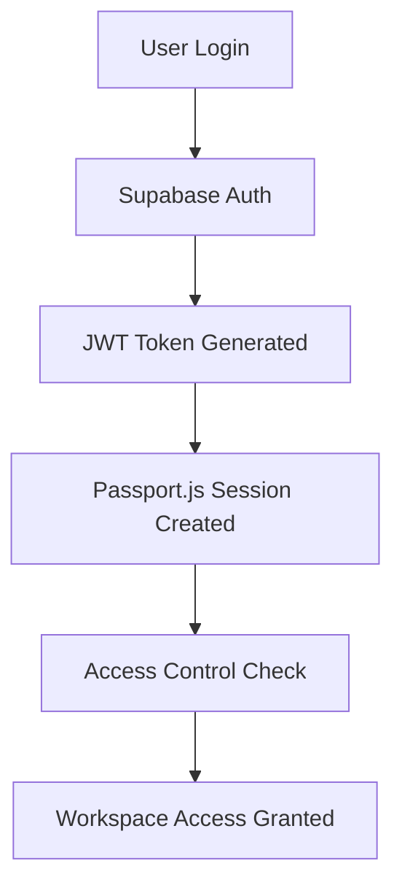
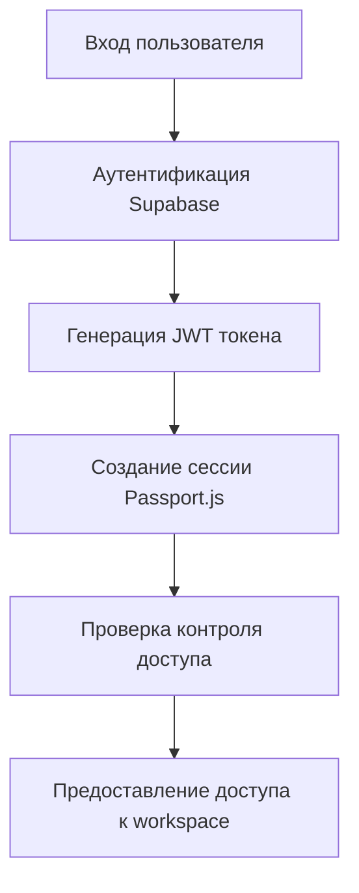

# Authentication Architecture

## Overview

Universo Platformo uses a hybrid authentication system combining Passport.js for session management with Supabase for user data and JWT token validation. This architecture provides secure, scalable authentication for multi-tenant workspaces.

## Система аутентификации

Universo Platformo использует гибридную систему аутентификации, сочетающую Passport.js для управления сессиями с Supabase для пользовательских данных и валидации JWT токенов. Эта архитектура обеспечивает безопасную, масштабируемую аутентификацию для мультитенантных workspace'ов.

## Architecture Components

### Authentication Flow

The authentication system consists of three main components:

1. **Passport.js Session Management** - Handles user sessions and middleware
2. **Supabase JWT Validation** - Validates and manages user tokens
3. **TypeORM Access Control** - Enforces workspace-level permissions

Архитектура аутентификации состоит из трёх основных компонентов:

1. **Управление сессиями Passport.js** - Обрабатывает пользовательские сессии и middleware
2. **Валидация JWT Supabase** - Валидирует и управляет пользовательскими токенами
3. **Контроль доступа TypeORM** - Обеспечивает разрешения на уровне workspace'ов

### User Authentication Process



Процесс аутентификации пользователя:



## Configuration

### Environment Variables

Set the following environment variables for authentication:

```bash
# Supabase Configuration
SUPABASE_URL=your_supabase_url
SUPABASE_ANON_KEY=your_supabase_anon_key
SUPABASE_SERVICE_ROLE_KEY=your_supabase_service_role_key

# Session Configuration
SESSION_SECRET=your_session_secret
COOKIE_DOMAIN=your_domain

# Authentication Settings
AUTH_ENABLED=true
DISABLE_FLOWISE_TELEMETRY=true
```

Установите следующие переменные окружения для аутентификации:

```bash
# Конфигурация Supabase
SUPABASE_URL=ваш_supabase_url
SUPABASE_ANON_KEY=ваш_supabase_anon_key
SUPABASE_SERVICE_ROLE_KEY=ваш_supabase_service_role_key

# Конфигурация сессий
SESSION_SECRET=ваш_session_secret
COOKIE_DOMAIN=ваш_домен

# Настройки аутентификации
AUTH_ENABLED=true
DISABLE_FLOWISE_TELEMETRY=true
```

### Passport.js Configuration

The system uses Passport.js with custom JWT strategy:

```typescript
passport.use(new JwtStrategy({
  jwtFromRequest: ExtractJwt.fromAuthHeaderAsBearerToken(),
  secretOrKey: process.env.SUPABASE_JWT_SECRET,
}, async (payload, done) => {
  // Validate user against Supabase
  const user = await validateSupabaseUser(payload);
  return done(null, user);
}));
```

Система использует Passport.js с кастомной JWT стратегией:

```typescript
passport.use(new JwtStrategy({
  jwtFromRequest: ExtractJwt.fromAuthHeaderAsBearerToken(),
  secretOrKey: process.env.SUPABASE_JWT_SECRET,
}, async (payload, done) => {
  // Валидация пользователя против Supabase
  const user = await validateSupabaseUser(payload);
  return done(null, user);
}));
```

## Access Control System

### Role-Based Access Control

The platform implements a strict role-based access control system:

- **Owner** (Level 4) - Full workspace control, can delete workspace
- **Admin** (Level 3) - Administrative privileges, can manage members
- **Editor** (Level 2) - Content editing permissions
- **Member** (Level 1) - Basic access permissions

Платформа реализует строгую систему контроля доступа на основе ролей:

- **Владелец** (Уровень 4) - Полный контроль workspace'а, может удалять workspace
- **Администратор** (Уровень 3) - Административные привилегии, может управлять участниками
- **Редактор** (Уровень 2) - Разрешения на редактирование контента
- **Участник** (Уровень 1) - Базовые разрешения доступа

### WorkspaceAccessService

The `WorkspaceAccessService` provides centralized membership validation:

```typescript
import { WorkspaceAccessService } from '@/services/access-control/WorkspaceAccessService';

// Validate user membership in workspace
const hasAccess = await WorkspaceAccessService.validateMembership(
  userId, 
  workspaceId, 
  ['admin', 'owner']
);

if (!hasAccess) {
  throw new UnauthorizedError('Insufficient permissions');
}
```

`WorkspaceAccessService` обеспечивает централизованную валидацию членства:

```typescript
import { WorkspaceAccessService } from '@/services/access-control/WorkspaceAccessService';

// Валидация членства пользователя в workspace
const hasAccess = await WorkspaceAccessService.validateMembership(
  userId, 
  workspaceId, 
  ['admin', 'owner']
);

if (!hasAccess) {
  throw new UnauthorizedError('Недостаточно разрешений');
}
```

## Database Schema

### Uniks Schema

The platform uses a dedicated `uniks` schema for workspace isolation:

```sql
-- Uniks workspace table
CREATE TABLE uniks.uniks (
  id UUID PRIMARY KEY DEFAULT gen_random_uuid(),
  name TEXT NOT NULL,
  description TEXT,
  created_at TIMESTAMPTZ DEFAULT NOW(),
  updated_at TIMESTAMPTZ DEFAULT NOW()
);

-- Workspace membership table
CREATE TABLE uniks.uniks_users (
  id UUID PRIMARY KEY DEFAULT gen_random_uuid(),
  user_id UUID REFERENCES auth.users(id) ON DELETE CASCADE,
  unik_id UUID REFERENCES uniks.uniks(id) ON DELETE CASCADE,
  role TEXT NOT NULL CHECK (role IN ('owner', 'admin', 'editor', 'member')),
  created_at TIMESTAMPTZ DEFAULT NOW(),
  UNIQUE(user_id, unik_id)
);
```

Платформа использует выделенную схему `uniks` для изоляции workspace'ов:

```sql
-- Таблица workspace'ов Uniks
CREATE TABLE uniks.uniks (
  id UUID PRIMARY KEY DEFAULT gen_random_uuid(),
  name TEXT NOT NULL,
  description TEXT,
  created_at TIMESTAMPTZ DEFAULT NOW(),
  updated_at TIMESTAMPTZ DEFAULT NOW()
);

-- Таблица членства в workspace
CREATE TABLE uniks.uniks_users (
  id UUID PRIMARY KEY DEFAULT gen_random_uuid(),
  user_id UUID REFERENCES auth.users(id) ON DELETE CASCADE,
  unik_id UUID REFERENCES uniks.uniks(id) ON DELETE CASCADE,
  role TEXT NOT NULL CHECK (role IN ('owner', 'admin', 'editor', 'member')),
  created_at TIMESTAMPTZ DEFAULT NOW(),
  UNIQUE(user_id, unik_id)
);
```

### Row Level Security (RLS)

RLS policies ensure data isolation between workspaces:

```sql
-- Only workspace members can view uniks
CREATE POLICY "uniks_select_members" ON uniks.uniks
  FOR SELECT USING (
    EXISTS (
      SELECT 1 FROM uniks.uniks_users 
      WHERE unik_id = uniks.id AND user_id = auth.uid()
    )
  );

-- Only owners/admins can update uniks
CREATE POLICY "uniks_update_admin" ON uniks.uniks
  FOR UPDATE USING (
    EXISTS (
      SELECT 1 FROM uniks.uniks_users 
      WHERE unik_id = uniks.id 
        AND user_id = auth.uid() 
        AND role IN ('owner', 'admin')
    )
  );
```

Политики RLS обеспечивают изоляцию данных между workspace'ами:

```sql
-- Только участники workspace могут просматривать uniks
CREATE POLICY "uniks_select_members" ON uniks.uniks
  FOR SELECT USING (
    EXISTS (
      SELECT 1 FROM uniks.uniks_users 
      WHERE unik_id = uniks.id AND user_id = auth.uid()
    )
  );

-- Только владельцы/администраторы могут обновлять uniks
CREATE POLICY "uniks_update_admin" ON uniks.uniks
  FOR UPDATE USING (
    EXISTS (
      SELECT 1 FROM uniks.uniks_users 
      WHERE unik_id = uniks.id 
        AND user_id = auth.uid() 
        AND role IN ('owner', 'admin')
    )
  );
```

## Security Best Practices

### Token Management

- Use secure HTTP-only cookies for session storage
- Implement token rotation for enhanced security
- Set appropriate cookie domain and path restrictions

Управление токенами:

- Используйте безопасные HTTP-only куки для хранения сессий
- Реализуйте ротацию токенов для повышения безопасности
- Установите соответствующие ограничения домена и пути куки

### Access Control Patterns

- Always validate user permissions before data access
- Use TypeORM repositories instead of direct database queries
- Implement per-request caching for membership validation
- Apply principle of least privilege

Паттерны контроля доступа:

- Всегда валидируйте разрешения пользователя перед доступом к данным
- Используйте репозитории TypeORM вместо прямых запросов к базе данных
- Реализуйте кэширование на уровне запросов для валидации членства
- Применяйте принцип минимальных привилегий

## Migration Guide

### From Supabase REST to TypeORM

If migrating from direct Supabase REST API calls:

1. Replace `supabase.from('table')` with TypeORM repositories
2. Update access control to use `WorkspaceAccessService`
3. Migrate to schema-qualified table names (`uniks.uniks_users`)
4. Implement role-based permissions using strict TypeScript enums

При миграции с прямых вызовов Supabase REST API:

1. Замените `supabase.from('table')` на репозитории TypeORM
2. Обновите контроль доступа для использования `WorkspaceAccessService`
3. Мигрируйте на имена таблиц с указанием схемы (`uniks.uniks_users`)
4. Реализуйте разрешения на основе ролей используя строгие TypeScript enum'ы

### Before/After Examples

**Before (Supabase REST):**
```typescript
const { data } = await supabase
  .from('user_uniks')
  .select('*')
  .eq('user_id', userId);
```

**After (TypeORM):**
```typescript
const membership = await getDataSource()
  .getRepository(UnikUser)
  .findOne({ 
    where: { userId, unikId },
    relations: ['unik']
  });
```

**До (Supabase REST):**
```typescript
const { data } = await supabase
  .from('user_uniks')
  .select('*')
  .eq('user_id', userId);
```

**После (TypeORM):**
```typescript
const membership = await getDataSource()
  .getRepository(UnikUser)
  .findOne({ 
    where: { userId, unikId },
    relations: ['unik']
  });
```

## Troubleshooting

### Common Issues

**Issue: Authentication middleware not working**
- Verify environment variables are set correctly
- Check Passport.js strategy configuration
- Ensure JWT secret matches Supabase configuration

**Issue: Access denied errors**
- Validate user has correct role in workspace
- Check RLS policies are enabled
- Verify WorkspaceAccessService implementation

Распространённые проблемы:

**Проблема: Middleware аутентификации не работает**
- Проверьте, что переменные окружения установлены правильно
- Проверьте конфигурацию стратегии Passport.js
- Убедитесь, что JWT секрет соответствует конфигурации Supabase

**Проблема: Ошибки отказа в доступе**
- Валидируйте, что пользователь имеет правильную роль в workspace
- Проверьте, что политики RLS включены
- Проверьте реализацию WorkspaceAccessService

## API Reference

### Authentication Endpoints

**POST /auth/login**
- Authenticate user with Supabase credentials
- Returns JWT token and session cookie

**POST /auth/logout**  
- Invalidate user session
- Clear authentication cookies

**GET /auth/me**
- Get current user information
- Requires valid authentication

Конечные точки аутентификации:

**POST /auth/login**
- Аутентификация пользователя с учётными данными Supabase
- Возвращает JWT токен и куки сессии

**POST /auth/logout**  
- Инвалидация пользовательской сессии
- Очистка куки аутентификации

**GET /auth/me**
- Получение информации о текущем пользователе
- Требует валидную аутентификацию

### Access Control Endpoints

**GET /uniks/:id/members**
- List workspace members and their roles
- Requires member-level access

**POST /uniks/:id/members**
- Add new member to workspace
- Requires admin/owner permissions

**PUT /uniks/:id/members/:userId**
- Update member role
- Requires owner permissions

**DELETE /uniks/:id/members/:userId**
- Remove member from workspace  
- Requires owner permissions

Конечные точки контроля доступа:

**GET /uniks/:id/members**
- Список участников workspace и их ролей
- Требует доступ уровня участника

**POST /uniks/:id/members**
- Добавление нового участника в workspace
- Требует разрешения администратора/владельца

**PUT /uniks/:id/members/:userId**
- Обновление роли участника
- Требует разрешения владельца

**DELETE /uniks/:id/members/:userId**
- Удаление участника из workspace  
- Требует разрешения владельца