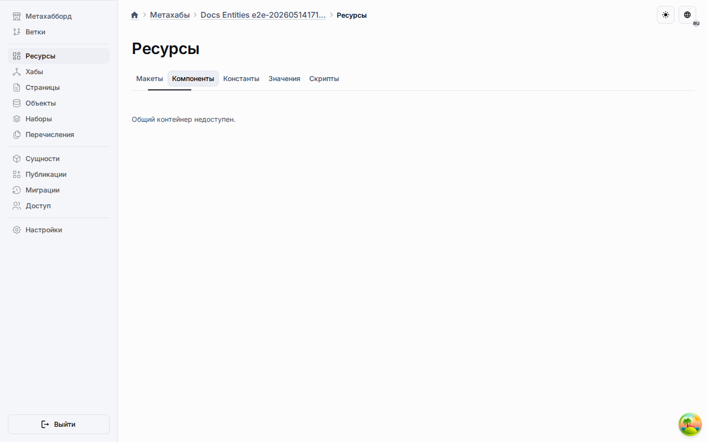

# Переопределения общих сущностей

Конечные точки переопределений общих сущностей управляют разреженным состоянием целевых объектов для общих компонентов, констант и значений перечислений.
Они требуют права на управление метахабом и не клонируют исходную общую строку.

## Конечные точки чтения

- `GET /metahub/{metahubId}/shared-entity-overrides?entityKind=component&sharedEntityId={id}` перечисляет все переопределения целевых объектов для одной общей строки.
- `GET /metahub/{metahubId}/shared-entity-overrides?entityKind=component&targetObjectId={id}` перечисляет все общие переопределения, влияющие на один целевой объект.
- Должен присутствовать ровно один из параметров: `sharedEntityId` или `targetObjectId`.
- `entityKind` принимает значения `component`, `constant` или `value`.

## Конечная точка upsert

- `PATCH /metahub/{metahubId}/shared-entity-overrides`
- Поля тела запроса: `entityKind`, `sharedEntityId`, `targetObjectId` и как минимум одно из `isExcluded`, `isActive` или `sortOrder`.
- Бэкенд отклоняет исключение, деактивацию или перестановку, когда общая строка блокирует такое поведение.
- Возврат к состоянию по умолчанию удаляет разреженную строку переопределения.

## Конечная точка очистки

- `DELETE /metahub/{metahubId}/shared-entity-overrides?entityKind=component&sharedEntityId={id}&targetObjectId={targetId}`
- Используйте её, когда целевой объект должен вернуться к унаследованному поведению по умолчанию.
- Конечная точка возвращает `204 No Content` при успешном выполнении.
- Удаление переопределения никогда не удаляет исходную общую строку.

## Что читать дальше

- [REST API](rest-api.md)
- [Настройки общего поведения](../platform/metahubs/shared-behavior-settings.md)
- [Исключения](../platform/metahubs/exclusions.md)
