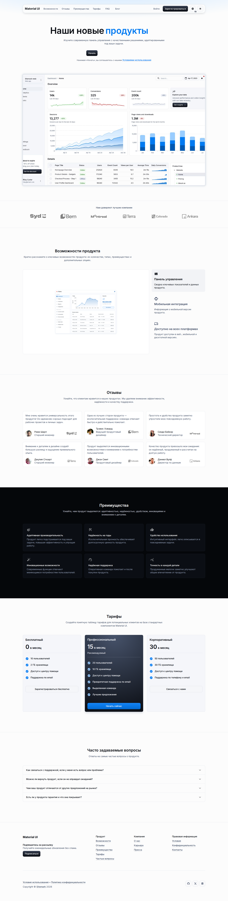

# Виджеты на основе Сущностей

Виджеты служат интерфейсами авторинга и представления. Они компонуют приложение и показывают только те настройки представления, которые объявлены в реестре. Бизнес- и редакционный контент остаётся в записях существующих типов Сущностей платформы — обычно в Объектах с Компонентами. Этот контракт не добавляет новый тип Сущности или вторую модель конструктора страниц.

## Владение данными

| Уровень                   | Владеет                                                                                         | Не владеет                                                      |
| ------------------------- | ----------------------------------------------------------------------------------------------- | --------------------------------------------------------------- |
| Метахаб                   | Схемами Сущностей, каноническим seed-контентом, исходными размещениями виджетов и их привязками | Переопределениями представления развёрнутого приложения         |
| Панель приложения         | Переопределениями представления приложения и исключениями                                       | Контентом Сущностей и идентичностью исходной привязки           |
| Опубликованное приложение | Проверенной доступной только для чтения проекцией опубликованных записей                        | Авторингом и произвольным доступом к таблицам Сущностей         |
| Рабочее пространство      | Пользовательскими runtime-данными, если функция явно задаёт такой жизненный цикл                | Контентом Hero, принадлежащим источнику в пилоте marketing-page |

Для пилота marketing-page `MarketingPageHero` — канонический обычный Объект. Seed создаёт одну запись `default`, но `marketing.hero` остаётся повторяемым. При обычном добавлении Hero новая запись Сущности и её размещение создаются одной транзакцией; при дублировании Hero исходная запись копируется в новую запись, к которой привязывается новое размещение. В расширенных настройках источника автор может намеренно выбрать существующую совместимую запись или создать отдельный совместимый Объект, Компоненты которого соответствуют зарегистрированному контракту слота Hero. Удаление размещения не удаляет запись. Запись `default` и любая запись, на которую ссылается активное размещение, не могут быть удалены; её семантический ключ нельзя менять.

## Контракт привязки

Реестр виджетов объявляет обязательные слоты, кратность, возможности типа Сущности и проекцию семантических Компонентов. Сохранённый экземпляр размещает выбранную цель в зарезервированных метаданных `__layout.bindings`. Версионируемый конверт содержит семантические имена Сущностей и Компонентов и ограниченный selector по семантическому ключу. В нём нет физических имён таблиц, UUID строк и Компонентов, SQL-идентификаторов или исполняемых частей запросов.

`instanceKey` виджета определяет отдельный экземпляр композиции. Selector привязки определяет запись контента. Это разные идентичности: обычные добавление и дублирование дают повторным размещениям отдельные записи, а расширенный выбор источника позволяет намеренно использовать одну совместимую запись совместно. Если запись уже используется другим Hero, интерфейс показывает это до перепривязки или редактирования, чтобы автор понимал: изменения записи увидят все её потребители.

Сервер проверяет каждую привязку по слоту реестра, возможностям Сущности, метаданным Компонентов, политике selector, проекции и кратности. Клиент не может предоставить доступ, отправив codename или поддельную привязку. API авторинга проверяет существующие разрешения метахаба и приложения. Мутации представления приложения сохраняют доверенную исходную привязку и не могут её заменить.

## Жизненный цикл и граница runtime

Привязки перемещаются вместе с экземпляром виджета при seed, создании и восстановлении снимка макета, публикации, материализации приложения, синхронизации источника, сбросе и вычислении эффективного макета. Канонический порядок и семантическое хеширование стабилизируют эквивалентные привязки и сохраняют обнаружение конфликтов. Для этого пилота копирование макета с Hero в приложение отклоняется: такая операция создала бы приложение-источник без доверенной привязки.

Авторизованный и анонимный опубликованные runtime используют ограниченные серверные загрузчики через существующую SQL-first границу доступа к данным. Они разрешают семантические selector в allowlist-проекцию локализованной модели представления; публичный ответ содержит только утверждённый контент и сохраняет `Cache-Control: no-store`. Опубликованный клиент получает типизированную модель и не обращается к хранилищу напрямую. DTO Hero сохраняет существующую внешнюю оболочку `data.records` и содержит ровно одну запись `heroContent` с ограниченной проекцией `content`; идентификатор строки Сущности и метаданные хранения не покидают сервер. Универсальные API записи runtime запрещают изменять записи Hero, принадлежащие источнику.

Путь публичного API `/public/applications/:applicationRef/runtime` сохраняется, но контракт Hero намеренно заменяет прежние поля `siteSettings`/`sectionCopy` на `heroContent`. Это ломающий контракт clean cutover без совместимого DTO. Backend и runtime-клиент `@universo-react/apps-template-mui` выпускаются согласованно; клиенты предыдущего контракта, ожидающие прежний payload Hero, не поддерживаются.

Для редактирования контента используются обычный список записей Объекта и динамическая форма записи. Обычные действия **Добавить Hero** и **Дублировать Hero** автоматически создают независимый контент Сущности без обязательного мастера привязки. Редактор привязки остаётся расширенным путём: в нём можно выбрать другой совместимый Объект/запись, создать отдельный совместимый Объект по зарегистрированному контракту полей и перейти в стандартный интерфейс Компонентов для дальнейшей настройки метаданных. Настройки представления используют общие примитивы макета. Подписи, проверки, предупреждения об общем источнике и сообщения об отказе локализованы. Пользовательские экраны не показывают JSON привязки, внутренние codenames и технические идентификаторы; codename Объекта показывается только в явной расширенной форме создания модели.

## Контракт пилота Marketing Hero

-   Каноническая модель контента — seed-Объект `MarketingPageHero` с Компонентами для локализованных заголовка, акцента, описания, подписей и типизированных действий. В расширенном режиме можно создать или выбрать другой Объект только при соответствии его политики записей и Компонентов тому же контракту слота `marketing.hero/content`.
-   `marketing.hero` остаётся повторяемым и владеет размещением, порядком, активностью и представлением, например `showLeadForm`.
-   Обязательный слот `content` проецирует только зарегистрированные семантические поля проверенной записи Объекта.
-   При добавлении Hero автоматически создаётся и привязывается новая запись канонического источника; при дублировании Hero автоматически копируется связанная запись в том же совместимом источнике. Создание записи, семантического ключа и размещения фиксируются атомарно.
-   Расширенные настройки источника используются по желанию. Они позволяют привязать существующую совместимую запись или создать отдельный совместимый Объект и начальную запись. При явном совместном использовании записи показывается предупреждение: её изменения видны во всех связанных размещениях.
-   Контент Hero удаляется из `MarketingPageSiteSettings` и из прежнего пути копирования `MarketingPageSection/hero`; совместимого читателя не остаётся.
-   В макете приложения можно менять и сбрасывать представление, но нельзя редактировать контент или перепривязать Hero, принадлежащий источнику.
-   Создание нового размещения использует явный режим контента auto/existing, проверяет UUID v7 и версию макета и выполняет автоматическое создание записи в той же транзакции. Авторизованный endpoint перепривязки существующего размещения продолжает принимать `{ recordId, expectedVersion }`. Авторинг требует заполнить обязательный текст на английском и русском; заполненные локализованные необязательные поля также должны содержать оба языка.
-   Серверная политика Hero защищена для канонического и автоматически созданных совместимых Объектов: обычное изменение метаданных не может ослабить запрет runtime-записи, защиту удаления и неизменность ключа привязки; несовместимые Объекты отклоняются.
-   Миграция базы не нужна, версия схемы и шаблона метахаба не увеличивается; тестовая база создаётся заново из нового seed.

**Для перехода требуется пересоздание:** существующие метахабы маркетинговой страницы, макеты, снимки, публикации и приложения автоматически не преобразуются. Чтобы использовать новый контракт, создайте метахаб из актуального seed шаблона, опубликуйте его и создайте новое приложение из этой публикации. Тестовую базу пересоздайте из текущего seed. Совместимого читателя и автоматической миграции данных нет.

Пользовательский процесс на двух языках и актуальные seed-поля описаны в разделе [Шаблон маркетинговой страницы](../platform/marketing-page-template.md).
