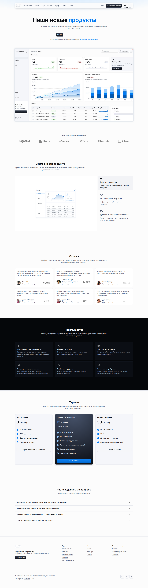

# Виджеты на основе Сущностей

Виджеты формируют макет и показывают только те параметры представления, которые зарегистрированы для соответствующего типа. Виджеты с контентом получают его из обычных записей Сущностей платформы — обычно из Объектов с Компонентами. Контракт не добавляет отдельное хранилище конструктора страниц или новый тип Сущности.

## Владение данными

| Уровень                            | Владеет                                                                                                         | Не владеет                                                     |
| ---------------------------------- | --------------------------------------------------------------------------------------------------------------- | -------------------------------------------------------------- |
| Метахаб                            | Схемами и записями Сущностей, каноническими seed-данными, исходными размещениями виджетов и выборами привязок   | Переопределениями представления конкретного приложения         |
| Панель приложения                  | Зарегистрированными настройками представления и разрешёнными переопределениями активности, порядка и размещения | Контентом метахаба, выбором источника и идентичностью привязки |
| Runtime опубликованного приложения | Проверенной ограниченной проекцией разрешённых записей Сущностей                                                | Авторингом или произвольным доступом к таблицам Сущностей      |
| Workspace                          | Контентом, создаваемым в runtime, только если функция явно задаёт такой жизненный цикл                          | Копией контента маркетинговой страницы из источника            |

Реестр виджетов задаёт межпакетный контракт. Определения объявляют совместимые шаблоны и зоны, слоты привязок, кардинальность источников и результатов, требования к возможностям Сущностей и семантике Компонентов, роли сортировки и видимости, политики записей, разрешённые действия авторинга и поля представления. Эти декларативные определения слотов отделены от экземпляра привязки конкретного размещения.

Конфигурация renderer хранит параметры представления. Версионируемая оболочка привязок хранится в зарезервированных нейтральных метаданных макета (<code>\_\_layout.bindings</code>), а не в контенте renderer. При материализации приложения доверенная оболочка источника сохраняется отдельно от локального состояния представления.

## Безопасные селекторы

Привязки используют строгий discriminated union из трёх видов селекторов:

| Селектор                  | Значение                                                                             | Форма сохранённого селектора                                         |
| ------------------------- | ------------------------------------------------------------------------------------ | -------------------------------------------------------------------- |
| <code>semantic-key</code> | Выбрать одну запись по зарегистрированному семантическому Компоненту и значению      | <code>{"kind":"semantic-key","field":"key","value":"default"}</code> |
| <code>record-set</code>   | Выбрать ограниченный набор записей из одного совместимого источника-Сущности         | <code>{"kind":"record-set"}</code>                                   |
| <code>relation-set</code> | Выбрать ограниченный набор дочерних записей, связанных с источником из другого слота | <code>{"kind":"relation-set","parentSlot":"tiers"}</code>            |

Цель привязки указывает тип Сущности и семантический codename. Её проекция должна соответствовать Компонентам, объявленным в реестре слота. Клиент не может передавать SQL, физические имена таблиц или столбцов, UUID строк, произвольные фильтры, предикаты связей, правила сортировки или видимости либо проекцию, созданную renderer. В интерфейсе авторинга показываются локализованные названия источников и записей, а не JSON привязок и идентификаторы хранения.

Совместимость проверяется по обязательным возможностям Сущности и типам Компонентов слота, их правилам проверки и целевому типу связи. Явное ограничение типа Сущности может дополнительно сузить совместимость. Встроенные codenames маркетинговой страницы задают стандартные seed-источники; совместимому источнику не нужна дополнительная запись в центральном списке Marketing codenames.

В текущих размещениях Marketing Page каждый обязательный слот выбирает ровно одну цель-источник. Селектор определяет число разрешаемых записей из этого источника: семантический ключ выбирает одну запись, а набор записей или связей — упорядоченный набор. Реестр задаёт <code>maxResolvedRecords</code>, а общий предел resolver дополнительно ограничивает результат. Зарегистрированные Компоненты сортировки и видимости применяются до лимита; настройка <code>maxItems</code> размещения может только уменьшить результат. Метаданные привязок, где порядок не имеет значения, канонизируются для стабильных хешей без изменения порядка записей Сущностей.

## Контракт слотов Marketing Page

Перед публикацией, импортом, восстановлением, активацией или синхронизацией снимка Marketing проверяются значения выбранных записей по зарегистрированному контракту Компонентов и оболочка привязки. Валидатор проверяет обязательные значения, типы данных, ограничения длины и шаблоны, английский и русский тексты локализованных Компонентов, безопасные форматы медиа и действий, а также каждую REF-связь дочерней записи. Некорректные записи блокируются до попадания в опубликованный runtime.

Встроенный шаблон создаёт 14 размещений. У одиннадцати есть привязки Сущностей; аутентификация, язык и цветовая схема являются возможностями хоста без редакционного источника данных.

| Размещение                                                    | Слоты привязок                                                                                                                                                  | Добавление и дублирование в Метахабе                                  |
| ------------------------------------------------------------- | --------------------------------------------------------------------------------------------------------------------------------------------------------------- | --------------------------------------------------------------------- |
| <code>marketing.brand</code>                                  | <code>site</code>: семантическая запись <code>MarketingPageSiteSettings</code>                                                                                  | Единичное размещение seed                                             |
| <code>marketing.navigation</code>                             | <code>items</code>: упорядоченный <code>record-set</code>                                                                                                       | Выбор совместимого источника; дубликат повторно использует привязку   |
| <code>marketing.auth</code>                                   | Нет; задаётся хостом                                                                                                                                            | Единичное размещение                                                  |
| <code>languageSwitcher</code>, <code>colorModeSwitcher</code> | Нет; задаются хостом                                                                                                                                            | Существующее поведение общих виджетов                                 |
| <code>marketing.hero</code>                                   | <code>content</code>: семантическая запись                                                                                                                      | Создать или выбрать запись; дубликат копирует привязанную запись      |
| <code>marketing.image</code>                                  | <code>content</code>: семантическая запись <code>MarketingPageImage</code>                                                                                      | Создать или выбрать запись; дубликат копирует привязанную запись      |
| <code>marketing.collection</code>                             | <code>section</code>: семантическая запись; <code>items</code>: <code>record-set</code>                                                                         | Выбрать источники для варианта; дубликат повторно использует привязки |
| <code>marketing.pricing</code>                                | <code>section</code>: семантическая запись; <code>tiers</code>: <code>record-set</code>; <code>benefits</code>: <code>relation-set</code> по <code>tiers</code> | Выбрать источники; дубликат повторно использует привязки              |
| <code>marketing.footer</code>                                 | <code>site</code>: семантическая запись; <code>links</code>: <code>record-set</code>                                                                            | Выбрать источники; дубликат повторно использует привязки              |

REF-компонент преимуществ тарифа (<code>TierRef</code>) указывает на авторитетный идентификатор записи тарифа. Runtime разрешает связь по идентификаторам записей; семантический ключ тарифа не является второй идентичностью связи.

## Авторинг, права и жизненный цикл

Поведение добавления, изменения, дублирования и перепривязки в Метахабе задаётся возможностями реестра. Для семантических слотов используется человекочитаемый список записей; где разрешено, можно создать или изменить запись. Для <code>record-set</code> выбирается источник-Сущность, а записи, их порядок и видимость управляются обычным интерфейсом записей Сущности. Слот <code>relation-set</code> объявляет родительский слот и использует обычный REF-контракт при редактировании дочерних записей. При смене источника родителя нужно сохранить совместимость дочерней связи до сохранения.

После выбора совместимого источника автор может создать для слота отдельную пустую модель источника. Сервер создаёт обычный Объект в Hub маркетинговой страницы и через существующие сервисы Сущностей копирует только зарегистрированную схему Компонентов и их параметры представления. Записи не копируются. Для слота-связи новый REF-компонент указывает на выбранный родительский Объект. Записи затем создаются обычным редактором записей Сущности.

Дублирование Hero и Image копирует выбранную запись Сущности и создаёт привязанное к ней размещение в одной серверной транзакции. Копия проходит обычную проверку записей и правил уникальности ключей; если размещение создать не удалось, копия записи также откатывается. Дублирование Collection, Navigation, Pricing и Footer повторно использует привязки источников и не копирует их записи. Единичные возможности нельзя дублировать. Удаление размещения виджета не удаляет его записи Сущностей. Политики записей из реестра и проверки целостности Сущностей защищают обязательные поля, семантические ключи, активные привязки и цели связей.

Права управления макетами и контентом Метахаба проверяются интерфейсом и повторно сервером. Видимость кнопки не заменяет авторизацию. При записи привязки сервер проверяет весь набор зарегистрированных слотов, разрешает совместимые активные метаданные Сущностей под блокировкой графа макета и проверяет ожидаемую версию макета.

Плейсменты Marketing Page с источником в приложении доступны только для настройки представления: Application-запросы не могут добавлять или дублировать обязательные привязанные размещения, менять их данные Сущностей или заменять привязку. Редактор скрывает Add и Duplicate для таких исходных размещений. Если представление изменено и доступен baseline источника, редактор показывает Reset to source. Размещения и контент меняются в Метахабе, затем публикуются и синхронизируются с уже связанным приложением.

Публикация, снимки, восстановление и синхронизация приложения сохраняют оболочку привязки размещения. Состояние источника приложения хранит доверенную конфигурацию и полный baseline редактируемого представления, активности, порядка, зоны и логического размещения. Синхронизация сравнивает эти семантические поля, а Reset восстанавливает текущий baseline источника с сохранением унаследованной привязки.

Scoped-оверлеи Marketing наследуют идентичность привязки от разрешённого базового плейсмента. В строках оверлеев и импортируемых снимках допускаются только разрешённые изменения представления и размещения; оболочка привязки отклоняется на границах записи и передачи оверлея, а материализация и учёт ссылок используют базовый плейсмент как единственный источник истины.

Удалённый исходный макет с виджетом, связанным с Сущностью, нельзя копировать во владение приложения. Diff помечает такое копирование недоступным, а слой сохранения повторно проверяет это правило до первой записи. При выборе <code>keep_local</code> сохраняется lineage источника, удалённый макет деактивируется, а зависимые виджеты атомарно помещаются в tombstone; последующая безопасная синхронизация может восстановить их. Явный выбор <code>skip_source</code> сохраняет текущее состояние приложения.

## Граница runtime DTO

Авторизованный и публичный runtime Marketing используют одинаковую проверку реестра, селекторов, связей, сортировки, видимости, проекций и жёстких лимитов. Для них подключаются разные разрешённые загрузчики persistence: авторизованный путь использует текущую область приложения/workspace, а публичный читает только опубликованные данные, доступные публичному runtime.

Resolver передаёт Marketing-адаптерам типизированные семантические записи. Итоговый DTO проверяется строгими схемами. Публичный DTO содержит только разрешённый контент и безопасные проекции медиа; в нём нет физических идентификаторов Сущностей и Компонентов, оболочки привязок, метаданных таблиц или произвольных данных строки. Публичный ResourceSource должен разрешиться в допустимый URL. Некорректная привязка, отсутствующий обязательный источник, неверная связь или повреждённый DTO приводят к отказу.

Публичный DTO Marketing обязательно содержит <code>headerPosition</code> и <code>headerWidgets</code>. Строгий запрос копирования макета использует поле <code>entityBindingCopyMode</code>. Это согласованный контракт чистого перехода: сервер и поставляемые клиенты нужно развёртывать вместе; прежние формы payload и запроса не поддерживаются, совместимого fallback нет.

Авторизованный Marketing runtime сериализует только версию эффективного макета и хэш контента, необходимые клиенту, чтобы заметить изменение макета и запросить обновлённые данные. Физические ID макетов, ID и хэши lineage источника остаются внутри runtime-запроса.

<code>@universo-react/apps-template-mui</code> получает типизированную модель <code>data.records</code> и отображает её без импорта persistence и запросов к таблицам Сущностей. Renderer принимает только этот Entity-backed контракт, а поля <code>source</code> и <code>copySource</code> в его DTO отсутствуют.

## Локализация

Локализованные Компоненты Сущностей остаются источником контента. Политика слота задаёт обязательные локали; проверка снимка Marketing требует английский и русский текст для локализованных полей. В интерфейсе выбора источников и записей Метахаба, заголовках форм, пустых и загрузочных состояниях, ошибках проверки, отказах по правам и конфликтах используются переводы EN/RU. Runtime выбирает локализованный контент по общему DTO-контракту Marketing.

## Связанная документация

-   [Шаблон маркетинговой страницы](../platform/marketing-page-template.md)
-   [Макеты приложения](../guides/application-layouts.md)
