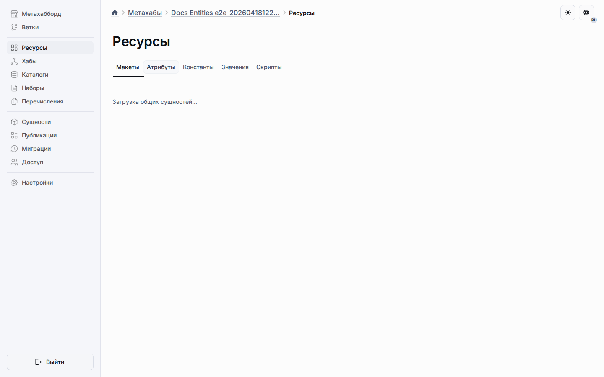

# Схема метахаба

Проектирование метахаба использует разделённую модель: центральные платформенные метаданные, проектные таблицы в области метахаба и плоский рантайм-вывод приложения.
Функция общих сущностей добавляет виртуальные контейнеры и разреженные строки переопределений без появления клонированных целевых данных.

## Проектные слои

- Центральные записи метахаба живут в платформенных схемах для обнаружения, членства и управления публикациями.
- Каждая ветка метахаба владеет проектными таблицами внутри собственной схемы метахаба.
- Общие атрибуты, константы и значения живут в виртуальных общих контейнерах внутри `_mhb_objects`.
- Разреженные различия целевых объектов живут в `_mhb_shared_entity_overrides`.
- Различия виджетов макетов, привязанных к сущностям, живут в `_mhb_layout_widget_overrides`.

## Хранение общих сущностей

- Общие атрибуты каталогов принадлежат `shared-catalog-pool`.
- Общие константы наборов принадлежат `shared-set-pool`.
- Общие значения перечислений принадлежат `shared-enumeration-pool`.
- Базовое общее поведение живёт на общей строке, а состояние целевых объектов остаётся в разреженных строках переопределений.

## Публикация и рантайм

- Экспорт снимка сохраняет общие разделы как полноценные части проектного снимка.
- Восстановление снимка пересоздаёт виртуальные контейнеры и переназначает общие строки переопределений.
- Публикация материализует общие сущности в обычные рантайм-метаданные до синхронизации приложения.
- Приложения сохраняют рантайм-таблицы плоскими, даже когда проектирование остаётся общим.

## Что читать дальше

- [Метахабы](../platform/metahubs.md)
- [Рабочее пространство ресурсов](../platform/metahubs/common-section.md)
- [Переопределения общих сущностей](../api-reference/shared-entity-overrides.md)
