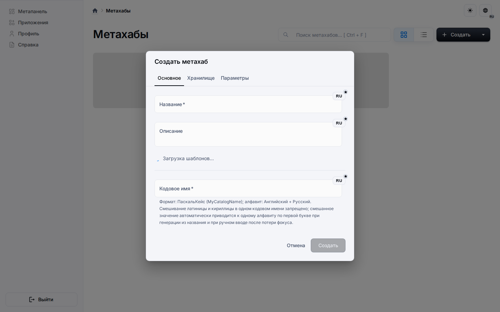

# Быстрый старт

## Рекомендуемый поток

1. Клонируйте репозиторий и выполните `pnpm install` из корня.
2. Добавьте локальные переменные окружения бэкенда.
3. Выполните `pnpm build` из корня.
4. Выполните `pnpm start` из корня.
5. Откройте `http://localhost:3000`.

## Сценарий с локальным Supabase

Используйте этот сценарий, когда удалённый Supabase недоступен или нужна полностью локальная одноразовая база данных и экземпляр Auth:

Предварительное требование: установите Docker Desktop или Docker Engine, запустите Docker daemon и проверьте, что `docker ps` работает в терминале. Supabase CLI управляет локальным стеком, но сами сервисы работают в Docker-контейнерах.

```bash
pnpm install
pnpm build
pnpm start:local-supabase
```

`start:local-supabase` поднимает локальный стек Supabase, генерирует локальный профиль, запускает doctor-проверки и затем стартует приложение.

Для облегчённого локального стека, которого достаточно текущему рантайму приложения, запустите:

```bash
pnpm start:local-supabase:minimal
```

Так останутся доступны Postgres, Auth, REST, service-role Admin API и Studio, но не будут подниматься realtime, storage, imgproxy, edge runtime, logflare и vector.

Supabase Studio -- это локальная веб-консоль. По умолчанию она доступна по адресу `http://127.0.0.1:54323` и даёт доступ к локальной базе данных, Auth, SQL-редактору, API и другим инструментам администрирования Supabase.

Для чистой пересборки с локальным сбросом базы:

```bash
pnpm start:allclean:local-supabase
```

Соответствующий облегчённый сценарий сброса:

```bash
pnpm start:allclean:local-supabase:minimal
```

Локальный сценарий не переписывает обычные `.env` файлы. Он использует сгенерированные, игнорируемые git профили `.env.local-supabase` и явные `UNIVERSO_ENV_FILE`, поэтому возврат к удалённому Supabase остаётся обычной командой `pnpm start`.

Сгенерированный профиль бэкенда создаётся на основе обычного backend `.env`, если он существует, или на основе `.env.example` в противном случае. Генератор сохраняет остальные настройки приложения и заменяет только локальные значения подключения Supabase/PostgreSQL и маркеры локального запуска.

Для браузерных E2E есть отдельный выделенный локальный профиль Supabase:

```bash
pnpm supabase:e2e:start:minimal
pnpm run test:e2e:smoke:local-supabase
```

Этот E2E-профиль использует отдельные тома Docker и порты, не совпадающие с ручной локальной разработкой: API `55321`, Postgres `55322` и Studio `55323`, тогда как Studio для ручной разработки остаётся на `54323`.

## Почему именно так

Корневая сборка валидирует межпакетные зависимости и создаёт артефакты, которые затем ожидает команда запуска.

В репозитории есть и `pnpm dev`, но этот режим ресурсоёмкий и должен использоваться только тогда, когда вам действительно нужны live-серверы разработки.

## Что делать после запуска



После старта переходите к разделу платформы за доменным контекстом или в раздел архитектуры за деталями реализации.
