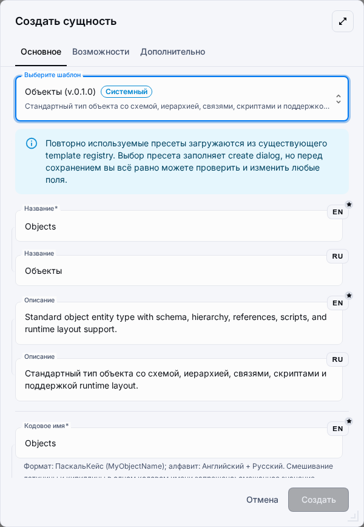

# Пользовательские типы сущностей

Пользовательские типы сущностей позволяют расширять метахаб новыми разделами проектирования и runtime-поведения поверх общего entity-first контура. Сами Хабы, Каталоги, Наборы и Перечисления больше не являются отдельными захардкоженными модулями: это такие же шаблонные типы сущностей, которые поставляются шаблонами метахабов.

## Когда использовать

- Используйте пользовательский тип сущности, когда объект специфичен для конкретного метахаба и не должен становиться новым фиксированным модулем платформы.
- Используйте шаблон сущности, когда хотите переиспользовать одну и ту же форму и набор возможностей в нескольких метахабах.
- Используйте стандартные пресеты Хабов, Каталогов, Наборов и Перечислений, когда нужен уже известный тип метаданных с готовым поведением.

## Типичный сценарий

1. Откройте раздел `Сущности` в боковом меню метахаба.
2. Создайте тип либо из готового пресета, либо с пустого шаблона.
3. Заполните `kind key`, `codename`, имя, состав вкладок и названия вкладок раздела `Ресурсы`, если тип включает общие metadata-capabilities.
4. Включите только те компоненты, которые действительно нужны этому типу.
5. Сохраните тип, откройте страницу его экземпляров и создайте первый экземпляр до перехода к автоматизации.
6. После первого сохранения настройте вкладки `Скрипты`, затем `Действия`, затем `События`.
7. Отмечайте тип как опубликованный только тогда, когда он должен стать видимым в динамическом меню и runtime-секции.

## Стандартные пресеты

- Хабы переиспользуют иерархический authoring-контур и поведение вложенных сущностей.
- Каталоги переиспользуют authoring-поверхность атрибутов, записей, макетов и runtime-поведения.
- Наборы переиспользуют authoring констант и общие automation hooks.
- Перечисления переиспользуют authoring значений и hooks для действий и событий.
- Standard preset definitions записываются в `_mhb_entity_type_definitions`; сервисы не создают synthetic standard definitions, если строка отсутствует.
- Названия resource tabs для атрибутов каталогов, констант наборов и значений перечислений являются localized metadata на resource surface, а не frontend constants.

## Текущий набор компонентов

- `Data schema`, `records`, `tree assignment`, `fixed values` и `option values` покрывают текущий метаданный слой.
- `Actions` и `event bindings` добавляют object-owned автоматизацию.
- `Layout`, `scripting`, `runtime behavior` и `physical table` расширяют публикацию и runtime-контракт.
- Зависимости между компонентами валидируются в builder-е, поэтому неподдерживаемые комбинации должны оставаться выключенными.

## Настройка автоматизации

1. Откройте уже сохранённый экземпляр в режиме редактирования.
2. Во вкладке `Скрипты` создайте или привяжите скрипт, который будет реализовывать нужную логику жизненного цикла.
3. Во вкладке `Действия` создайте action, выберите тип `script` и свяжите его с нужным скриптом.
4. Во вкладке `События` привяжите lifecycle event, например `beforeCreate`, `afterCreate`, `beforeUpdate` или `afterUpdate`, к нужному action.
5. Используйте `priority` и `config` только там, где действительно требуется порядок выполнения или дополнительные параметры.
6. Перед более широким rollout прогоняйте focused browser proof или прямые тесты `EntityAutomationTab`.

## Ограничения и правила

- Для сценариев, где важна полная паритетность поведения, лучше брать готовый пресет, а не собирать тот же manifest вручную.
- Автоматизация на generic custom entity routes подчиняется permission-контракту `manageMetahub`.
- Структура standard kinds защищена. Администраторы могут менять safe presentation fields и localized resource surface titles, но component/config/route changes отклоняются.
- Стандартные metadata-пресеты продолжают использовать свои специализированные authoring surfaces внутри общего entity-owned route tree.
- Публикация влияет на динамическое меню и runtime только после publication sync или application sync.
- Runtime-секции материализуются из опубликованных entity metadata и текущих runtime adapters.
- Расширенная визуальная композиция остаётся вне текущей волны паритета.

## Визуальные примеры

Текущий browser proof и автоматически генерируемые скриншоты используют общее рабочее пространство сущностей и актуальный диалог создания.

Вкладки общих ресурсов теперь задаются конфигурацией типа сущности. Названия, которые видит пользователь, разрешаются из persisted localized titles resource surface.

## Что посмотреть дальше

- Руководство по REST API для generic entity и automation endpoints.
- Руководство по Metahub scripting для `@OnEvent(...)` и возможностей скриптов.

## Чеклист проверки

- Подтвердите, что тип сохраняется с ожидаемым component manifest.
- Подтвердите, что страница экземпляров открывается из динамического меню.
- Подтвердите, что publication sync материализует ожидаемые runtime sections из опубликованных entity metadata.
- Подтвердите, что целевой shipped path покрыт focused tests или browser flows.
