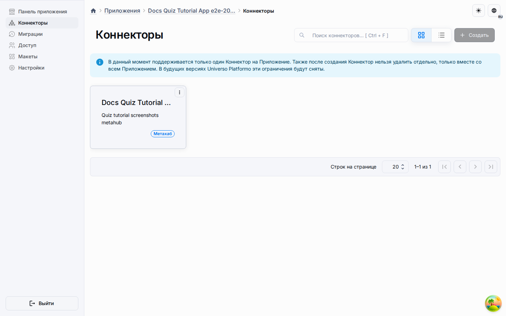

# Макеты, привязанные к сущностям

Макеты, привязанные к сущностям, относятся к конкретному авторизованному типу
сущности Page или Object. У них есть два явных варианта композиции:

-   **Overlay** — точечный макет того же шаблона, который ссылается на корректную
    глобальную базу и хранит только переопределения унаследованных виджетов.
-   **Independent** — самодостаточный макет, который может использовать другой
    шаблон. Он не наследует несовместимые виджеты и физические зоны; `baseLayoutId`
    явно равен `null`.

Runtime приложения выбирает активный scoped default раньше активного глобального
макета для указанной цели. После публикации/материализации он не обращается к
метахабу как к скрытому fallback.

## Модель композиции

-   overlay-виджеты остаются связаны с базовым общим макетом;
-   independent-макет содержит собственную композицию и не наследует виджеты из
    глобального макета другого шаблона;
-   виджеты, принадлежащие конкретной сущности, живут только внутри её scoped-макета;
-   точечные переопределения хранят изменения видимости, расположения и конфигурации унаследованных виджетов;
-   унаследованные виджеты при материализации в приложение сохраняют связь `source_base_widget_id`;
-   сохранённые runtime-виджеты получают настоящие UUID v7.

## Создание первого scoped-макета

1. Откройте целевой metahub.
2. Перейдите в Ресурсы -> Макеты для глобального контекста или откройте
   экземпляр сущности, тип которой поддерживает собственные макеты.
3. Создайте макет, привязанный к сущности, и выберите базовый глобальный макет.
4. Для overlay при необходимости переставьте, настройте или отключите унаследованные
   виджеты. Для independent добавляйте виджеты собственной композиции выбранного шаблона.

## Видимость виджетов

Глобальный макет остаётся переиспользуемой базой. Scoped-макет создаётся там,
где runtime-поверхности нужна другая композиция виджетов или другой shell-шаблон.
Для LMS-конфигурации это означает, что графики главной страницы остаются на странице
«Главная», а разделы «Объекты», «Знания», «Развитие» и «Отчёты» используют тот же shell
приложения без наследования виджетов, предназначенных только для главной страницы.

Для Object-подобных типов сущностей scoped-макет также может владеть runtime-поведением:
видимостью кнопки создания, режимом поиска и поверхностью создания/редактирования/копирования.
Для других типов сущностей применяется та же overlay-модель для композиции виджетов и поведения, которое явно открыто компонентным контрактом этого типа.

## Публикация и рантайм

Публикация уплощает эффективный scoped-макет в обычные runtime-строки макета
и виджета. Приложения не вычисляют metahub overlay-логику на лету, а
используют уже материализованное состояние с проверенным lineage. При overlay
унаследованные виджеты сохраняют связь с базой, а independent-макет сохраняет
только provenance исходного макета.

Runtime приложения запрашивает target-aware endpoint для Page/Object. Если есть
активный scoped default, он имеет приоритет; иначе используется активный
глобальный default. Повреждённая, некорректная или неоднозначная материализация
даёт типизированную ошибку, а не незаметный глобальный fallback.

## Что читать дальше

-   [Рабочее пространство ресурсов](general-section.md)
-   [Метахабы](../platform/metahubs.md)
-   [Приложения](../platform/applications.md)
