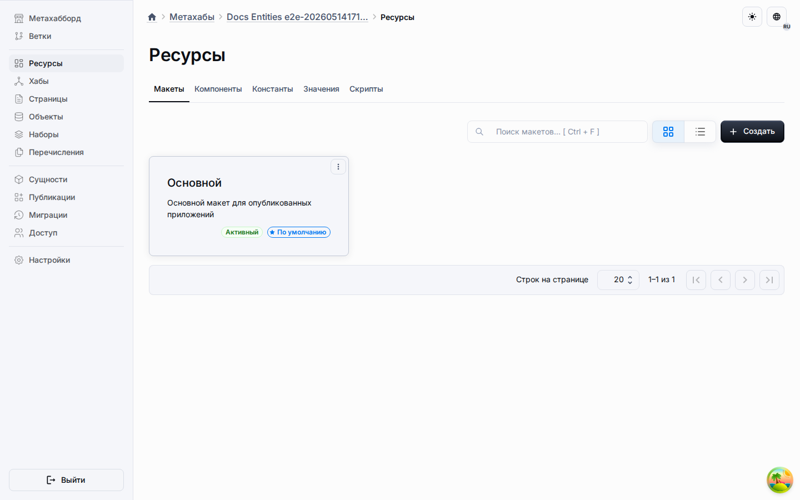

# Рабочее пространство ресурсов

Страница Ресурсов является реальной точкой входа для настройки макетов, переиспользуемых ресурсов метаданных и общих библиотечных скриптов внутри метахаба.
Живая навигация ведёт прямо на `/resources`, и это руководство описывает этот канонический маршрут.

## Что находится здесь

- общие макеты, которые формируют переиспользуемую рантайм-композицию;
- общие пулы компонентов, констант и значений, которые могут наследоваться совместимыми типами сущностей;
- навигация к макетам конкретных сущностей и разреженным переопределениям;
- скрипты resources/library, которые отдают переиспользуемые helpers через `@shared/<codename>`;
- общее поведение представления, которое должно жить рядом с настройкой макета, а не в отдельных настройках администрирования.

## Навигационный контракт

1. Откройте метахаб.
2. Используйте элемент боковой панели «Ресурсы».
3. Переключайтесь между вкладками «Макеты», «Компоненты», «Константы», «Значения» и «Скрипты» в зависимости от нужного общего ресурса.
4. Откройте целевую сущность и перейдите на её собственный маршрут, когда нужно проверить объединённые унаследованные строки или поведение макета конкретной сущности.

## Поток работы с общими ресурсами

1. Создавайте общие компоненты, константы или значения на соответствующей вкладке «Ресурсы».
2. Используйте вкладки Presentation и Exclusions в диалоге, когда нужны блокировки поведения или исключения для целевых объектов.
3. Откройте целевую сущность, чтобы проверить объединённые унаследованные строки и read-only ограничение действий.
4. Публикуйте и синхронизируйте связанное приложение, когда рантайм должен материализовать общие строки.

## Поток работы с общими скриптами

1. Откройте «Ресурсы» -> «Скрипты», чтобы писать переиспользуемые библиотечные helper-модули.
2. Импортируйте эти helpers из потребляющих скриптов через `@shared/<codename>`.
3. Держите библиотеки чистыми: они компилируются для разрешения зависимостей, а не как прямые рантайм-точки входа.
4. Публикуйте версию и проверяйте потребляющий виджет или модуль на `/a/:applicationId`.

## Fail-closed правила ресурсов

- общие строки остаются read-only в списках целевых сущностей, а переопределения для целевых объектов нужно настраивать через вкладки «Представление» и «Исключения» в ресурсах;
- «Ресурсы» -> «Скрипты» принимает только проектирование переиспользуемых библиотек, поэтому общие helper-модули нельзя создавать как черновики с ролями widget, module или lifecycle;
- удаление общей библиотеки или смена её `codename` завершаются закрыто, пока потребляющие скрипты всё ещё импортируют `@shared/<codename>`;
- циклы `@shared/*` отклоняются уже во время проектирования, поэтому публикация не отгружает неоднозначные общие зависимости.

## Почему рабочее пространство ресурсов продолжает расти

Платформа теперь держит сквозную настройку метахаба внутри одной выделенной поверхности Ресурсов.
Это удерживает работу с макетами, общими ресурсами и общими библиотеками за одним предсказуемым входом.

## Что читать дальше

- [Макеты, привязанные к сущностям](entity-scoped-layouts.md)
- [Скрипты метахаба](metahub-scripting.md)
- [Настройки отображения шаблона приложения](app-template-views.md)
- [Метахабы](../platform/metahubs.md)
