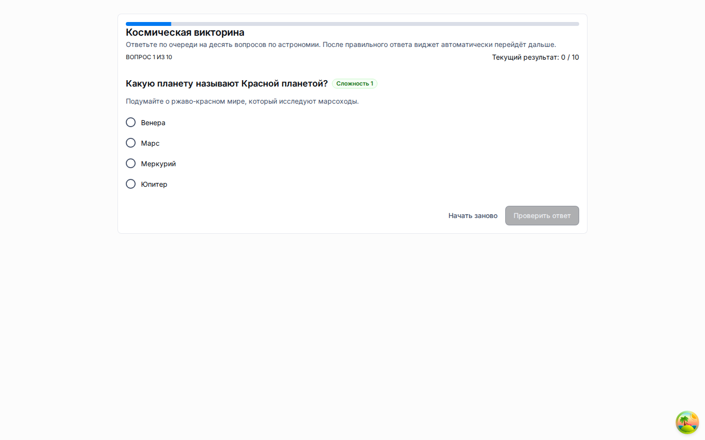

# Обзор LMS

Текущая LMS-поверхность в Universo Platformo реализована как конфигурация метахаба плюс общие рантайм-возможности приложений.
Это не захардкоженный вертикальный модуль внутри `packages/apps-template-mui`; поставляемый fixture хранит LMS-поведение в сущностях, макетах и публичных учебных ссылках, а не в глобальных demo-виджетах.

## Что покрывает MVP

- классы и каталог студентов как обычные сущности метахаба;
- учебные модули как runtime-строки со структурированными элементами контента;
- каталоги тестов и фиксацию ответов;
- совместную работу преподавателей и операторов внутри одного приложения с изоляцией по рабочим пространствам;
- публичные ссылки, позволяющие гостю ввести имя, открыть модуль или тест и отправлять прогресс без регистрации;
- выверенную основную навигацию, где ключевые продуктовые разделы видны сразу в левом меню.

## Что пока вне рамок MVP

- ИИ-тьютор и генерация контента;
- полноценные пакеты аналитики и отчётности;
- сложные правила оценивания, сертификаты и расписания;
- отдельные LMS-only фронтенд-пакеты вне общего MUI-шаблона.

## Базовые строительные блоки

1. Встроенный шаблон метахаба `lms` определяет каноническую структуру сущностей: классы, студенты, модули, тесты, ссылки доступа, прогресс, записи и вспомогательные перечисления.
2. Бэкенд приложений управляет рабочими пространствами и публичной рантайм-поверхностью для гостевого доступа.
3. Общий MUI-шаблон использует те же dashboard-примитивы, что и другие опубликованные приложения: меню, шапку, заголовок деталей, таблицу деталей, columns container и переключение рабочих пространств.
4. Коммитнутые генератор и контракт снимка поставляют двуязычный набор данных с несколькими классами, модулями, тестами, заполненным прогрессом и двумя маршрутами гостевого доступа.
5. Глобальные виджеты `moduleViewerWidget`, `statsViewerWidget` и `qrCodeWidget` намеренно отсутствуют в стандартном LMS layout; контекстное обучение доступно через runtime-строки и публичные ссылки.

## Runtime-модель

Аутентифицированные пользователи работают в обычном рантайме приложения по адресу `/a/:applicationId`.
Гости используют публичный маршрут `/public/a/:applicationId/links/:slug`, вводят отображаемое имя, получают гостевой session token и продолжают работу без логина в платформе.
Если у приложения включены рабочие пространства, публичные приложения по умолчанию получают только личное рабочее пространство владельца `Main` (`Основное`).
Публичный рантайм привязывает данные к рабочему пространству ссылки доступа или текущей гостевой сессии, не создавая отдельное автоматическое общее рабочее пространство.
Состояние гостевой сессии хранится в session storage текущей вкладки или браузерной сессии, а не в долговечном local storage общего устройства.

## Проверенное браузерное покрытие

Поставляемый LMS-набор браузерных тестов покрывает управление рабочими пространствами, негативные сценарии публичных ссылок, чистый dashboard без legacy-глобальных виджетов, EN guest journey и RU guest route с локализованными текстами модулей, тестов и ссылок доступа.

## Дополнительно

- [Настройка LMS](lms-setup.md)
- [Гостевой доступ LMS](lms-guest-access.md)
- [Управление рабочими пространствами](workspace-management.md)
- [Сущности LMS](../architecture/lms-entities.md)
