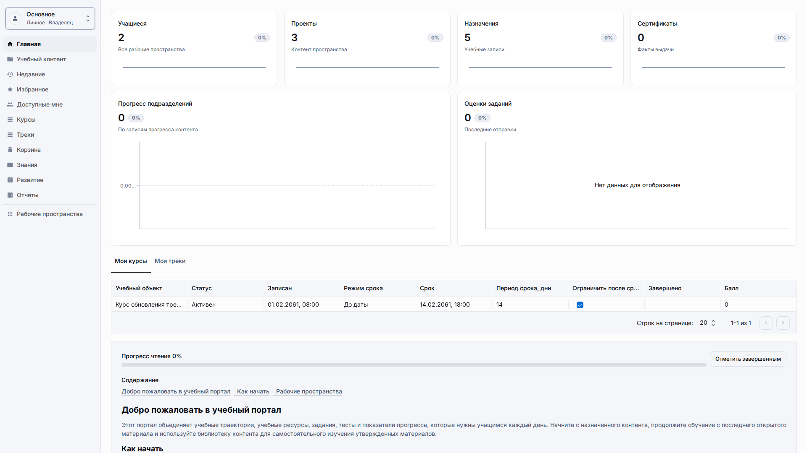
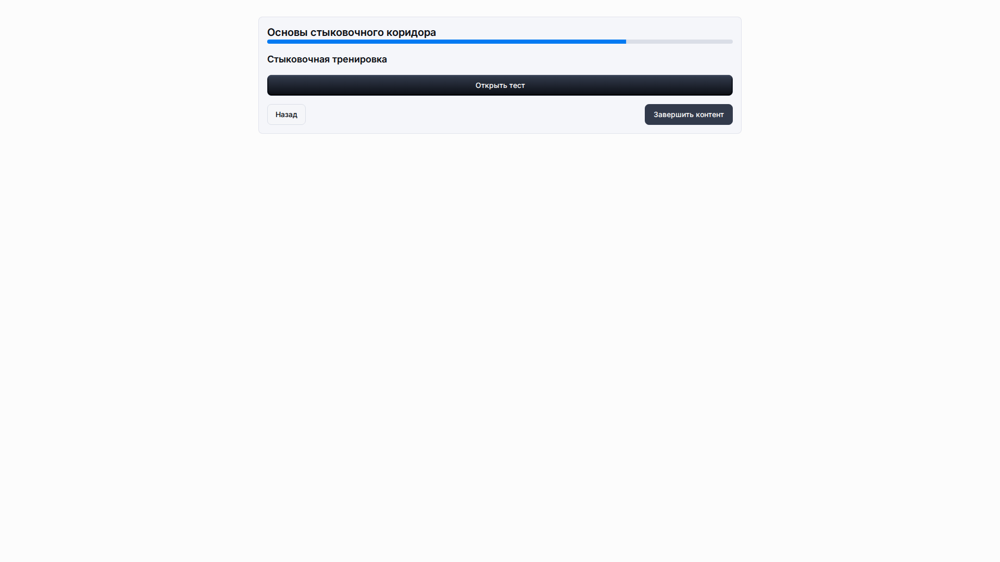

# Обзор LMS

Текущая LMS-поверхность в Universo Platformo реализована как конфигурация метахаба плюс общие рантайм-возможности приложений.
Это не захардкоженный вертикальный модуль внутри `packages/universo-react-apps-template-mui`; поставляемый fixture хранит LMS-поведение в сущностях, макетах и публичных учебных ссылках, а не в глобальных demo-виджетах.

## Что покрывает MVP

-   классы, подразделения и объект студентов как обычные сущности метахаба;
-   Learning Content Projects, standalone resources, courses, course sections, course items, learning tracks, track stages и track steps как Object-backed метаданные;
-   объекты тестов, попытки, ответы и фиксацию прогресса;
-   отправку и проверку заданий, посещаемость мероприятий, сертификаты, закладки базы знаний и планы развития;
-   Object-backed определения отчётов в `Reports`, выполняемые через generic runtime datasource descriptors;
-   совместную работу преподавателей и операторов внутри одного приложения с изоляцией по рабочим пространствам;
-   публичные ссылки, позволяющие гостю ввести имя, открыть учебный контент или тест и отправлять прогресс без регистрации;
-   выверенную основную навигацию, где ключевые продуктовые разделы видны сразу в левом меню.

## Что пока вне рамок MVP

-   ИИ-тьютор и генерация контента;
-   полноценное извлечение/проигрывание SCORM-пакетов и прямые storage upload pipelines;
-   enterprise-аналитика за пределами generic records/list и ledger projections;
-   внешние интеграции доставки уведомлений;
-   отдельные LMS-only фронтенд-пакеты вне общего MUI-шаблона.

## Базовые строительные блоки

1. Встроенный шаблон метахаба `lms` определяет каноническую структуру сущностей: классы, студенты, content projects, resources, courses, course sections, course items, tracks, track stages, track steps, content resources, quizzes, assignments, events, certificates, reports, knowledge spaces, development plans, access links, progress, enrollments и supporting enumerations.
2. Бэкенд приложений управляет рабочими пространствами и публичной рантайм-поверхностью для гостевого доступа.
3. Общий MUI-шаблон использует те же dashboard-примитивы, что и другие опубликованные приложения: меню, шапку, заголовок деталей, таблицу деталей, columns container и переключение рабочих пространств.
4. Коммитнутые генератор и контракт снимка поставляют двуязычный набор данных с несколькими классами, курсами, ресурсами, учебным контентом, тестами, заполненным прогрессом, записями знаний/развития, определениями отчётов и двумя маршрутами гостевого доступа.
5. Глобальные виджеты `moduleViewerWidget`, `statsViewerWidget`, `qrCodeWidget`, `brandSelector`, `productTree` и `usersByCountryChart` намеренно отсутствуют в стандартном LMS layout; контекстное обучение доступно через runtime-строки и публичные ссылки.

## Runtime-модель

Аутентифицированные пользователи работают в обычном рантайме приложения по адресу `/a/:applicationId`.
Гости используют публичный маршрут `/public/a/:applicationId/links/:slug`, вводят отображаемое имя, получают гостевой session token и продолжают работу без логина в платформе.
Если у приложения включены рабочие пространства, публичные приложения по умолчанию получают только личное рабочее пространство владельца `Main` (`Основное`).
Публичный рантайм привязывает данные к рабочему пространству ссылки доступа или текущей гостевой сессии, не создавая отдельное автоматическое общее рабочее пространство.
Состояние гостевой сессии хранится в session storage текущей вкладки или браузерной сессии, а не в долговечном local storage общего устройства.

## Проверенное браузерное покрытие

Поставляемый LMS-набор браузерных тестов покрывает управление рабочими пространствами, негативные сценарии публичных ссылок, чистый dashboard без legacy-глобальных виджетов, EN guest journey и RU guest route с локализованными текстами учебного контента, тестов и ссылок доступа.

## Ссылка на пользовательское руководство

Для повседневной работы внутри опубликованного LMS-приложения используйте [Руководство пользователя LMS](../lms/README.md).

## Дополнительно

-   [Настройка LMS](lms-setup.md)
-   [Учебный контент LMS](lms-learning-content.md)
-   [Модель ресурсов LMS](lms-resource-model.md)
-   [Отчёты LMS](lms-reports.md)
-   [Гостевой доступ LMS](lms-guest-access.md)
-   [Управление рабочими пространствами](workspace-management.md)
-   [Сущности LMS](../architecture/lms-entities.md)
