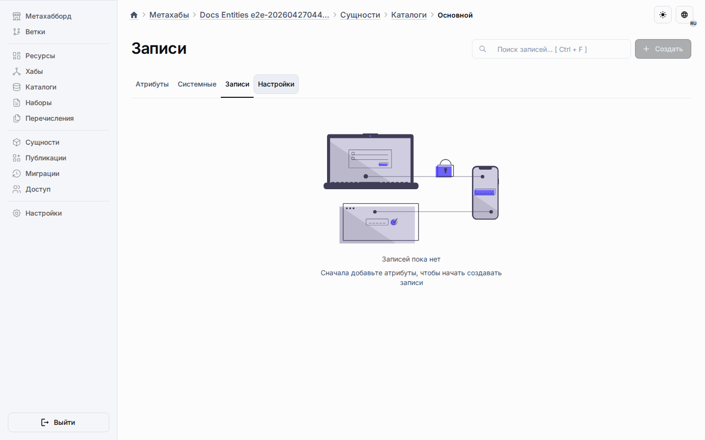

# Отчёты LMS

Отчёты LMS являются конфигурационными записями в существующем Object `Reports`.
В V1 платформа не добавляет отдельный report-only widget и не создаёт LMS-specific таблицу отчётов.

## Структура определения

Каждая запись отчёта хранит:

- локализованное название,
- тип отчёта,
- generic runtime datasource descriptor,
- колонки,
- фильтры,
- агрегации,
- сохранённые наборы фильтров.

Текущий fixture содержит определения `LearnerProgress` и `CourseProgress`.
Оба используют datasources `records.list`, поэтому могут отображаться существующими `detailsTable`, chart и overview-card widgets.

## Безопасный runner

Backend report runner валидирует определение отчёта shared-схемами из `@universo/types`.
Runtime API calls не передают raw report definition.
Они передают ровно одну ссылку на сохранённый отчёт: `reportId` или `reportCodename`, а backend загружает JSON `Definition` из опубликованного Object `Reports` в текущем workspace.

Имена таблиц и колонок runner получает только из разрешённых published metadata.
API payload может ссылаться на сохранённые записи отчётов, но не должен передавать raw SQL identifiers или inline datasource definitions.

SQL values параметризуются, dynamic identifiers проходят через identifier helpers, неизвестные поля fail closed, а JSON/TABLE поля не используются в SQL для фильтров, сортировки и колонок отчёта.
Registrar-only ledger Objects исключаются из поиска target для отчётов, поэтому отчёты работают с обычными runtime record Objects, а не с внутренними fact ledgers.
Настроенные aggregations выполняются через ту же безопасную карту полей и возвращаются в объекте `aggregations` с alias из definition отчёта.
