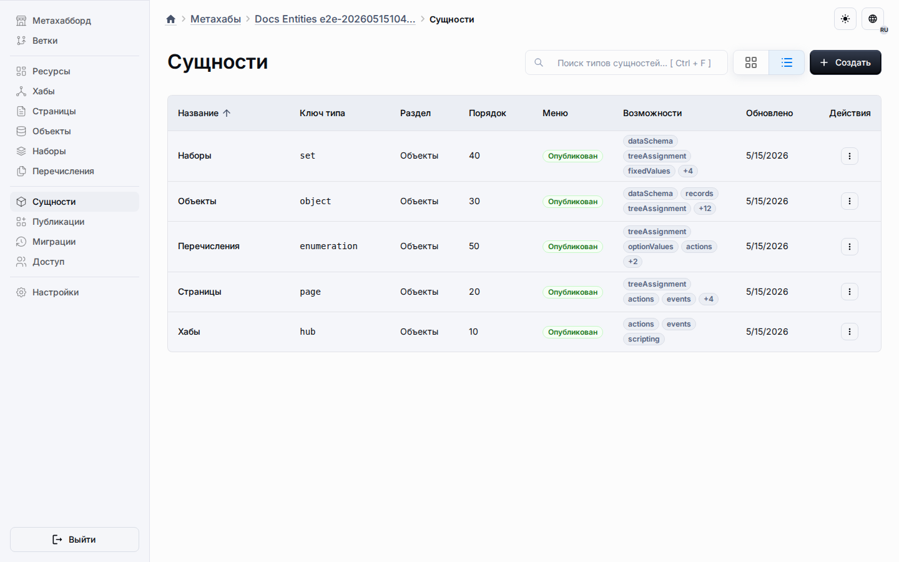

# Тип Сущности Страницы

Тип сущности Страницы предоставляет возможности создания богатого контента через интеграцию с Editor.js. Страницы идеально подходят для создания структурированного контента, такого как документация, целевые страницы, учебные материалы и информационные разделы.

## Обзор

Страницы — это специальный тип сущности, который хранит контент в виде структурированных блоков, а не традиционных полей базы данных. Каждая Страница может содержать несколько блоков контента (абзацы, заголовки, списки, изображения и т.д.) и поддерживает многоязычный контент через варианты для конкретных локалей.

## Ключевые Возможности

- **Редактирование Богатого Контента**: Встроенная интеграция с Editor.js для интуитивного блочного редактирования
- **Структурированные Блоки**: Контент хранится в виде семантических блоков (абзац, заголовок, список и т.д.)
- **Многоязычная Поддержка**: Создавайте контент на нескольких языках с вариантами для конкретных локалей
- **Безопасный Контент**: Бэкенд проверяет и нормализует весь контент перед сохранением
- **Рендеринг в Рантайме**: Опубликованные приложения отображают Страницы без включения Editor.js

## Создание Страницы

1. Перейдите в рабочее пространство **Сущности** вашего Метахаба
2. Нажмите **Создать Сущность** и выберите **Страница** в качестве типа сущности
3. Введите кодовое имя Страницы и детали представления
4. Нажмите **Создать**

Новая Страница появится в вашем списке Сущностей со значком документа.

## Редактирование Контента Страницы

### Редактор Контента

Страницы используют блочный редактор Editor.js для создания контента:

1. Откройте сущность Страницы из списка Сущностей
2. Перейдите на вкладку **Контент**
3. Используйте блочный редактор для добавления и упорядочивания блоков контента


*Рабочее пространство сущностей, показывающее все типы сущностей, включая Страницы*

### Поддерживаемые Типы Блоков

Платформа поддерживает следующие типы блоков Editor.js:

| Тип Блока | Назначение | Пример Использования |
|-----------|------------|----------------------|
| **Paragraph** | Обычный текстовый контент | Основной текст, описания |
| **Header** | Заголовки разделов (H1-H6) | Заголовки страниц, заголовки разделов |
| **List** | Упорядоченные или неупорядоченные списки | Списки функций, шаги, маркированные списки |
| **Quote** | Цитаты | Цитирования, выделенный текст |
| **Code** | Фрагменты кода | Технические примеры, конфигурация |
| **Delimiter** | Визуальный разделитель | Разрывы разделов |
| **Warning** | Блоки предупреждений | Важные уведомления, предупреждения |
| **Checklist** | Интерактивные чекбоксы | Списки задач, требования |
| **Table** | Таблицы данных | Структурированные данные, сравнения |
| **Link Tool** | Расширенные превью ссылок | Внешние ссылки |
| **Image** | Встроенные изображения | Скриншоты, диаграммы, фотографии |

### Добавление Блоков

1. Нажмите кнопку **+** в редакторе
2. Выберите тип блока из меню
3. Введите ваш контент
4. Используйте маркер перетаскивания (⋮⋮) для изменения порядка блоков

### Действия с Блоками

Каждый блок поддерживает:

- **Перемещение**: Перетащите маркер (⋮⋮) для изменения порядка
- **Удаление**: Нажмите значок удаления
- **Настройки**: Нажмите значок настроек для опций конкретного блока

## Многоязычный Контент

Страницы поддерживают контент на нескольких языках:

### Добавление Вариантов Локалей

1. Откройте вкладку **Контент** Страницы
2. Нажмите кнопку **+ Добавить Локаль**
3. Выберите целевую локаль (например, Русский, Испанский)
4. Создайте контент на выбранной локали

### Переключение Между Локалями

Используйте вкладки локалей в верхней части редактора контента для переключения между языковыми вариантами. Каждая локаль поддерживает свой независимый контент.

### Управление Локалями

- **Основная Локаль**: Обычно Английский (en), служит по умолчанию
- **Дополнительные Локали**: Добавляйте столько локалей, сколько необходимо
- **Независимый Контент**: Каждая локаль имеет полностью отдельный контент
- **Поведение Отката**: Приложения в рантайме возвращаются к основной локали, если запрошенная локаль отсутствует

## Валидация Контента

Бэкенд проверяет весь контент Страницы перед сохранением:

### Проверки Безопасности

- **Валидация Типа Блока**: Принимаются только поддерживаемые типы блоков
- **Санитизация Контента**: HTML и скрипты удаляются из текстового контента
- **Валидация URL**: Внешние URL проверяются на безопасность
- **Валидация Структуры**: Структура блока должна соответствовать ожидаемой схеме

### Ошибки Валидации

Если валидация не удалась, вы увидите сообщение об ошибке с описанием проблемы:

- **Неподдерживаемый Блок**: Тип блока не разрешён
- **Недопустимый Контент**: Контент содержит небезопасные элементы
- **Недопустимый URL**: URL не прошёл валидацию
- **Ошибка Структуры**: Структура блока неправильная

## Варианты Использования

### Контент LMS

Страницы используются в шаблоне LMS для сущности **LearnerHome**:

- Приветственные сообщения
- Обзоры курсов
- Цели обучения
- Ссылки на ресурсы

### Документация

Создавайте структурированную документацию с:

- Заголовками для организации
- Блоками кода для примеров
- Списками для шагов
- Таблицами для справочных данных

### Целевые Страницы

Создавайте информационные страницы с:

- Богатым текстовым контентом
- Изображениями и медиа
- Разделами призыва к действию
- Выделением функций

### Управление Контентом

Используйте Страницы для:

- Справочных статей
- Разделов FAQ
- Документов политики
- Объявлений

## Поведение в Рантайме

### Опубликованные Приложения

Когда Метахаб публикуется:

1. Контент Страницы экспортируется в снимок
2. Контент синхронизируется с базой данных приложения
3. Рантайм отображает Страницы, используя канонические компоненты блоков
4. Editor.js **не** включается в опубликованные приложения

### Производительность

- **Лёгкий Рендеринг**: Рантайм использует оптимизированные рендереры блоков
- **Без Накладных Расходов Редактора**: Editor.js загружается только во время проектирования
- **Эффективное Хранение**: Контент хранится в виде нормализованного JSON

## Лучшие Практики

### Организация Контента

- **Используйте Заголовки**: Структурируйте контент с чёткими заголовками разделов
- **Держите Блоки Сфокусированными**: Каждый блок должен иметь одну цель
- **Используйте Списки**: Используйте списки для сканируемого контента
- **Добавляйте Визуальные Разрывы**: Используйте разделители для отделения основных разделов

### Многоязычный Контент

- **Сначала Создайте Основной**: Завершите основную локаль перед добавлением переводов
- **Поддерживайте Паритет**: Сохраняйте структуру согласованной между локалями
- **Тестируйте Все Локали**: Проверяйте, что контент правильно отображается на каждой локали

### Безопасность Контента

- **Избегайте Встроенного HTML**: Используйте поддерживаемые типы блоков вместо этого
- **Валидируйте URL**: Убедитесь, что внешние ссылки безопасны и доступны
- **Тестируйте Перед Публикацией**: Просмотрите контент перед созданием публикаций

### Производительность

- **Оптимизируйте Изображения**: Сжимайте изображения перед встраиванием
- **Ограничьте Количество Блоков**: Очень длинные Страницы могут влиять на производительность
- **Используйте Пагинацию**: Для длинного контента рассмотрите разделение на несколько Страниц

## Технические Детали

### Формат Хранения

Контент Страницы хранится в виде нормализованного JSON в таблице `_mhb_entities`:

```json
{
  "content": {
    "en": {
      "blocks": [
        {
          "type": "paragraph",
          "data": {
            "text": "Добро пожаловать на нашу платформу."
          }
        }
      ]
    }
  }
}
```

### Интеграция с Editor.js

Платформа использует:

- **Компонент**: `EditorJsBlockEditor` из `@universo/template-mui`
- **Валидация Бэкенда**: `PageBlockContentSchema` из `@universo/types`
- **Рендеринг в Рантайме**: Универсальные рендереры блоков в `@universo/apps-template-mui`

### Возможности

Страницы включаются через возможность `blockContent` в определении типа сущности:

```typescript
capabilities: {
  blockContent: {
    enabled: true,
    allowedBlockTypes: ['paragraph', 'header', 'list', ...]
  }
}
```

## Связанная Документация

- [Архитектура Сущностей LMS](../architecture/lms-entities.md) - Технические детали Страниц в LMS
- [Архитектура Системы Сущностей](../architecture/entity-systems.md) - Обзор системы типов сущностей
- [Пользовательские Типы Сущностей](custom-entity-types.md) - Создание пользовательских типов сущностей
- [Скрипты Метахаба](metahub-scripting.md) - Добавление скриптов к Страницам

## Устранение Неполадок

### Контент Не Сохраняется

**Проблема**: Изменения контента Страницы не сохраняются.

**Решения**:
- Проверьте наличие ошибок валидации в редакторе
- Убедитесь, что у вас есть права на редактирование Метахаба
- Убедитесь, что сущность Страницы не заблокирована

### Блоки Не Отображаются

**Проблема**: Некоторые блоки не появляются в опубликованных приложениях.

**Решения**:
- Проверьте, что тип блока поддерживается
- Убедитесь, что контент был синхронизирован с приложением
- Убедитесь, что рантайм имеет последнюю схему

### Локаль Не Отображается

**Проблема**: Контент на конкретной локали не виден.

**Решения**:
- Проверьте, что локаль была добавлена к Странице
- Убедитесь, что контент был создан для этой локали
- Убедитесь, что приложение поддерживает запрошенную локаль

### Проблемы с Загрузкой Редактора

**Проблема**: Интерфейс Editor.js не загружается.

**Решения**:
- Проверьте консоль браузера на наличие ошибок JavaScript
- Убедитесь, что зависимости Editor.js установлены
- Очистите кэш браузера и перезагрузите

## Резюме

Тип сущности Страницы предоставляет мощные возможности создания богатого контента через интеграцию с Editor.js. Используйте Страницы для документации, целевых страниц, контента LMS и любого сценария, требующего структурированного многоязычного контента. Платформа обеспечивает безопасность контента через валидацию, предоставляя при этом интуитивный опыт редактирования.
