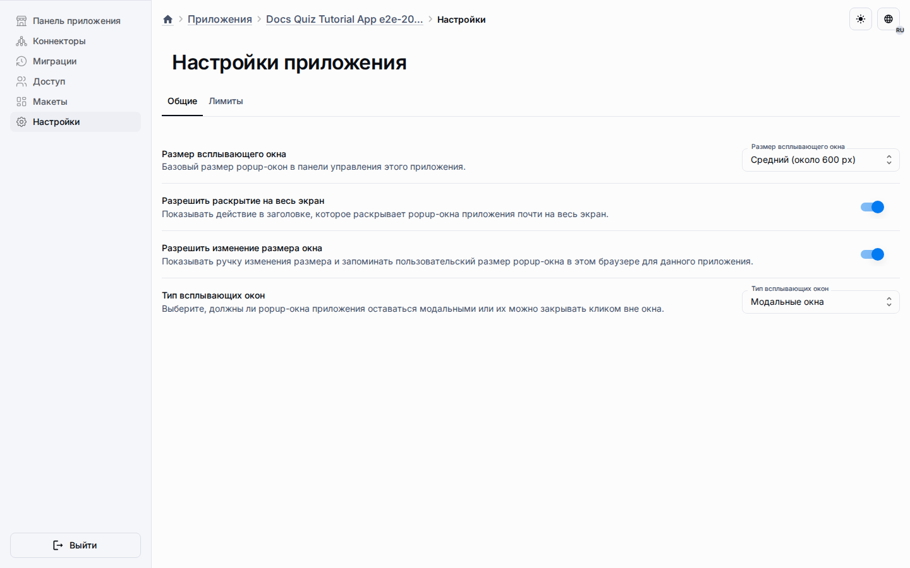

# Руководство по приложению-квизу

Это руководство повторяет реальный сценарий в браузере, который используется в Playwright-покрытии репозитория.
В конце у вас будет скрипт виджета квиза в метахабе, макет с этим виджетом, связанное приложение и проверенное выполнение квиза.

Приложение-квиз намеренно остаётся независимым от шаблона LMS.
В LMS MVP тот же виджет квиза может встраиваться из элемента содержимого модуля, но сохранённая fixture квиза и это руководство по-прежнему описывают отдельный сценарий квиза на скриптах.

## Перед началом

- Используйте окружение, где метахабы, публикации и приложения уже доступны.
- Войдите пользователем, который может управлять целевым метахабом и связанным приложением.
- Учитывайте текущий контракт скриптов: поддерживаются только встроенные скрипты и `sdkApiVersion = 1.0.0`.

## Шаг 1: Откройте или создайте метахаб

1. Откройте целевой метахаб из основного списка.
2. Убедитесь, что у вас есть доступ к Ресурсам и Публикациям, а затем используйте вкладку Макеты внутри Ресурсов.
3. Если вы стартуете с нуля, сначала создайте метахаб и оставьте его ветку по умолчанию активной.

## Шаг 2: Создайте скрипт виджета квиза

1. Откройте диалог редактирования метахаба и переключитесь на вкладку Scripts.
2. Создайте новый скрипт с ролью `widget`.
3. Используйте `quiz-widget` как codename.
4. Оставьте тип источника значением Embedded.
5. Сохраните скрипт после вставки исходника виджета квиза или после адаптации стартового шаблона.

Сценарий Playwright в браузере использует этот шаг, чтобы подтвердить, что скрипт квиза виден в реальной области Scripts на уровне метахаба.

## Шаг 3: Подключите виджет к макету

1. Откройте Resources -> Layouts и выберите макет, который должен содержать квиз.
2. Добавьте или отредактируйте виджет `quizWidget` в центральной зоне.
3. Установите `scriptCodename` в `quiz-widget`.
4. Сохраните макет и убедитесь, что виджет остаётся видимым на странице деталей макета.

В текущем контракте квиза виджет расположен по центру, чтобы рантайм был сосредоточен на ходе вопросов, а не на боковых панелях.

## Шаг 4: Опубликуйте метахаб и создайте приложение

1. Создайте или обновите публикацию из подготовленного состояния метахаба.
2. Дождитесь, пока публикация получит готовую активную версию.
3. Создайте связанное приложение из этой публикации или обновите уже существующее связанное приложение.
4. Запустите создание схемы или синхронизацию, если приложению всё ещё нужны рантайм-таблицы.

Именно в этой точке данные публикации, макета и бандлы скриптов переходят со стороны метахаба на сторону приложения.

## Шаг 5: Настройте параметры приложения

1. Откройте панель управления приложением по адресу `/a/:applicationId/admin`.
2. Перейдите в «Настройки».
3. Используйте вкладку «Общие», чтобы выбрать предпочитаемый размер окна, полноэкранный режим, возможность изменения размера и способ закрытия.
4. Сохраните параметры и подтвердите, что следующие диалоги панели управления используют тот же контракт представления.

Эти параметры влияют только на панель управления приложением.
Они не меняют содержимое квиза или макет, которыми владеет публикация метахаба.

## Шаг 6: Проверьте рантайм квиза

1. Откройте публичный рантайм по адресу `/a/:applicationId`.
2. Дождитесь, пока виджет загрузит первый вопрос.
3. Отправьте ответ и убедитесь, что виджет переходит к следующему шагу сценария.
4. Завершите квиз и проверьте итоговую сводку результатов.

Текущий стартовый шаблон ожидает клиентский метод `mount()` и серверный метод `submit()`, поэтому рабочий рантайм одновременно подтверждает и клиентский, и серверный путь выполнения скрипта.

## Диагностика проблем

- Если скрипт сохраняется, но не появляется в рантайме, заново опубликуйте метахаб и пересинхронизируйте приложение.
- Если виджет рендерится без данных, проверьте, что `scriptCodename` виджета в макете точно совпадает с сохранённым кодом скрипта.
- Если вызовы рантайм RPC падают, проверьте, что роль скрипта и возможность по-прежнему открывают клиентский RPC-путь.
- Если диалоги панели управления игнорируют предпочитаемый размер, проверьте, что вы меняли именно параметры приложения, а не метахаба или администрирования.
- Если нужен эталонный пример, посмотрите `tools/testing/e2e/specs/generators/metahubs-quiz-app-export.spec.ts` и сохранённую fixture `tools/fixtures/metahubs-quiz-app-snapshot.json`.

## Дополнительное чтение

- [Обзор LMS](lms-overview.md)
- [Скрипты метахаба](metahub-scripting.md)
- [Метахабы](../platform/metahubs.md)
- [Приложения](../platform/applications.md)
- [Администрирование](../platform/admin.md)
