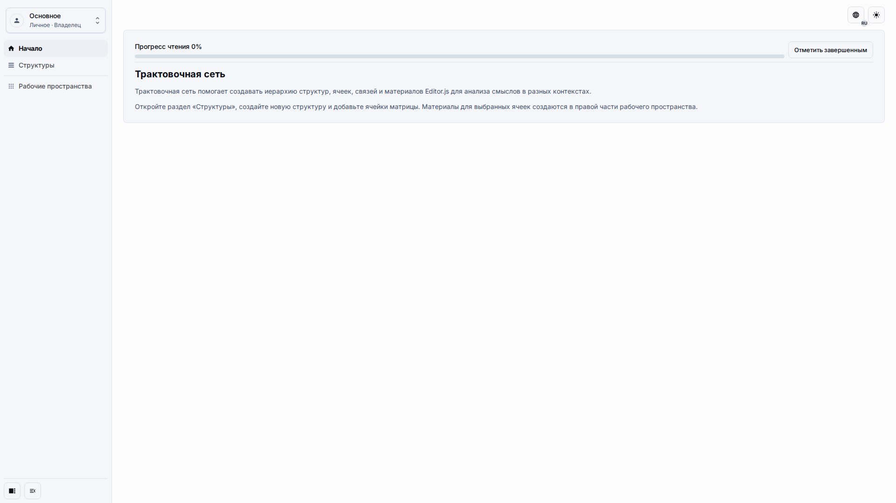
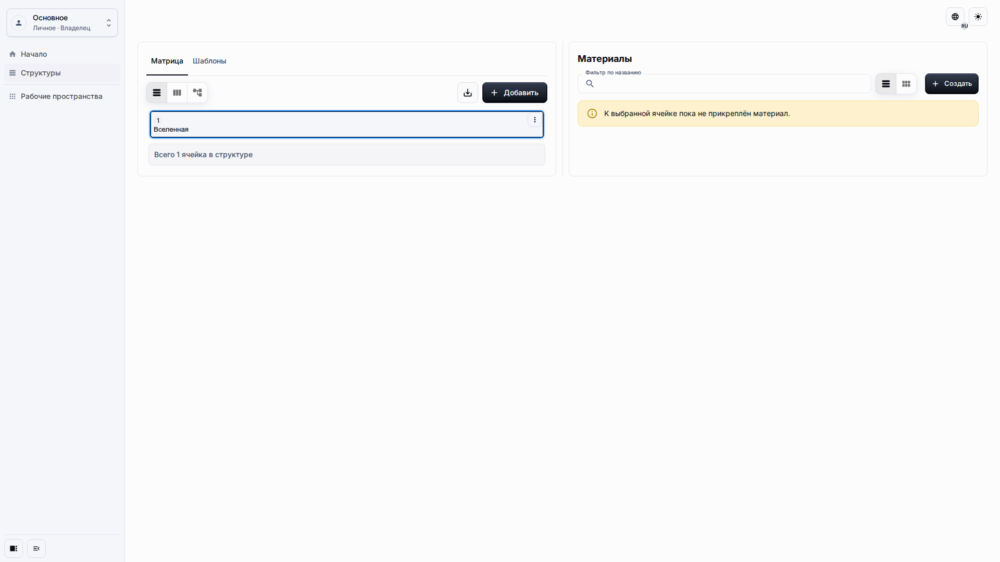

# Руководство пользователя трактовочной сети

Трактовочная сеть помогает строить иерархию понятий, сравнивать трактовки и прикреплять материалы к ячейкам, которые объясняют каждое понятие. Используйте это руководство, когда нужно рабочее приложение, а не только техническое описание модели данных.

## Роль и цель

Страница предназначена для владельца или редактора приложения, которому нужно открыть опубликованное приложение, найти рабочее пространство Матрицы и понять, где начинаются основные рабочие сценарии.

## Предварительные условия

-   Вы можете войти в Universo Platformo.
-   У вас есть доступ к приложению, созданному из шаблона трактовочной сети или из демонстрационного снимка.
-   Ваша роль разрешает редактирование содержимого, если нужно создавать ячейки, материалы или шаблоны.

## Порядок работы

1. Откройте опубликованное приложение и проверьте левую навигацию.

2. Откройте **Структуры**. В стандартной настройке одной системной структуры Матрица открывается сразу, а корневая ячейка готова к выбору.

## Ожидаемый результат

Вы видите обычную оболочку приложения, пункты **Старт**, **Структуры** и **Рабочие пространства**, а также рабочее пространство Матрицы с вкладками **Матрица** и **Шаблоны**. После выбора ячейки рядом с Матрицей доступна панель Материалов.

## Что проверить

-   Страница использует ту же оболочку приложения, что и другие опубликованные приложения.
-   Матрица показывает понятные подписи ячеек.
-   Приложение не просит копировать технические идентификаторы или редактировать скрытые поля размещения.

## Связанные страницы

-   [Начало работы](getting-started.md)
-   [Рабочее пространство и Матрица](workspace-and-matrix.md)
-   [Ячейки и Материалы](cells-and-materials.md)
-   [Модель данных трактовочной сети](../architecture/interpretation-network-data-model.md)
