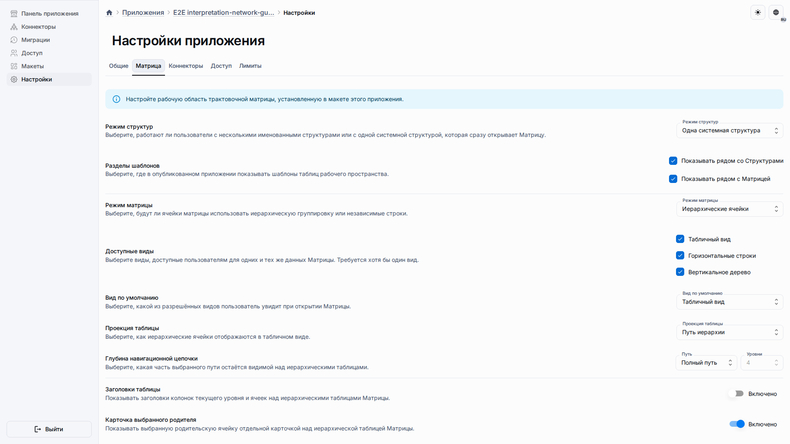
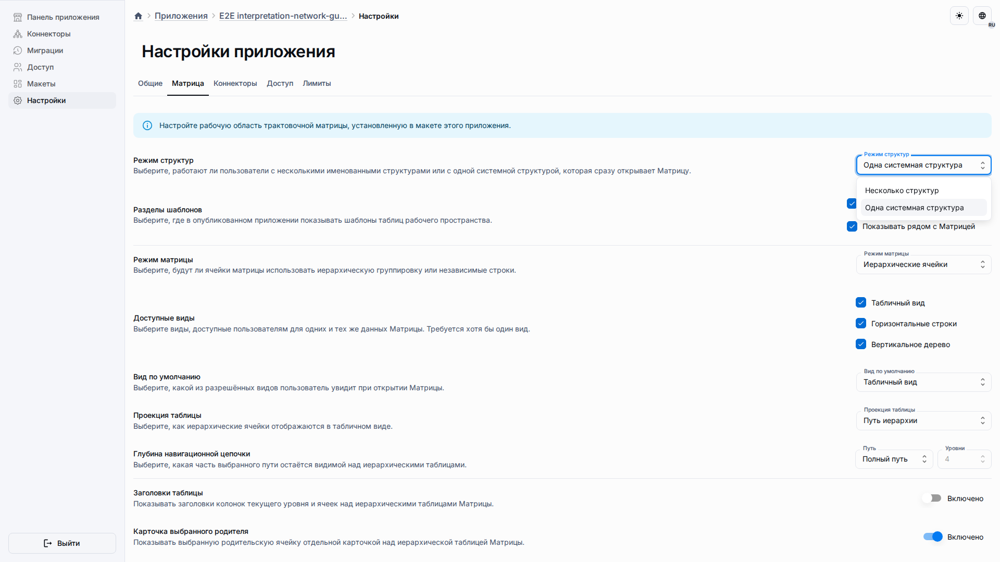

# Настройки приложения

Настройки приложения позволяют владельцу изменить поведение Матрицы для одного развёрнутого приложения, не меняя исходный метахаб.

## Роль и цель

Страница предназначена для владельца или администратора приложения, который управляет режимом Структур, доступными представлениями Матрицы, размещением шаблонов и изменением ширины панелей.

## Предварительные условия

-   Вы можете открыть область администрирования приложения.
-   Приложение связано с публикацией трактовочной сети.
-   Вы понимаете, должны ли пользователи работать в одной общей системной Матрице или в нескольких именованных Структурах.

## Порядок работы

1. Откройте **Настройки приложения** и выберите вкладку **Матрица**.

2. Выберите режим Структур и представления Матрицы, которые должны быть доступны пользователям.

3. Сохраните переопределение или сбросьте настройки Матрицы к исходной публикации, когда приложение должно вернуться к настройкам шаблона.

## Ожидаемый результат

Опубликованное приложение применяет сохранённые настройки. В режиме одной системы пользователи сразу переходят к Матрице. В режиме нескольких Структур пользователи сначала выбирают или создают Структуру.

## Что проверить

-   Вкладка Матрицы показывает продуктовые элементы управления, а не документы конфигурации.
-   Представление по умолчанию входит в список разрешённых.
-   Размещение шаблонов соответствует нужному авторскому сценарию.
-   Сброс доступен только тогда, когда в приложении есть переопределение.

## Связанные страницы

-   [Рабочее пространство и Матрица](workspace-and-matrix.md)
-   [Шаблоны](templates.md)
-   [Настройки отображения шаблона приложения](../guides/app-template-views.md)
