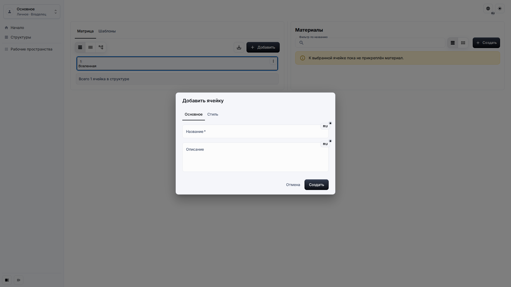
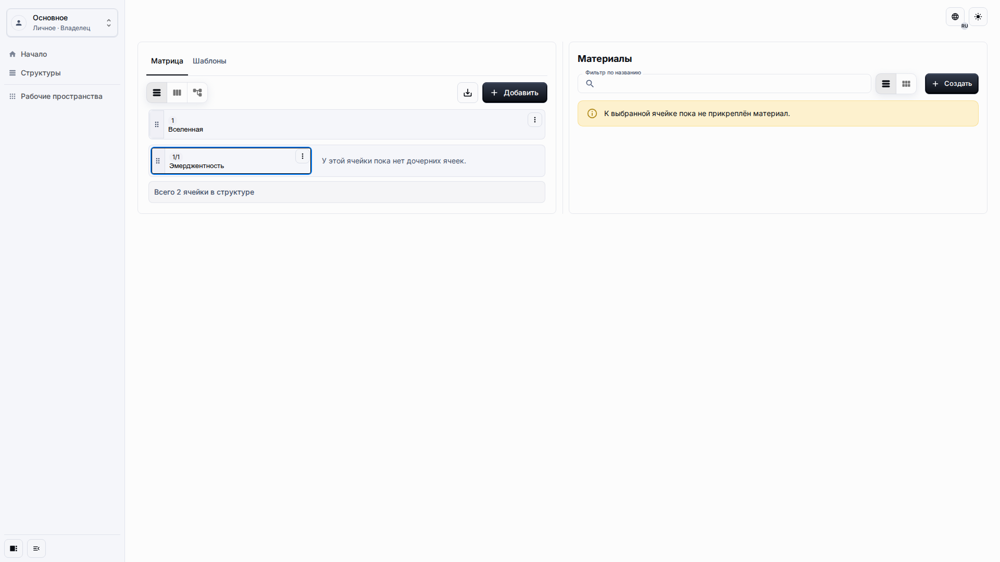
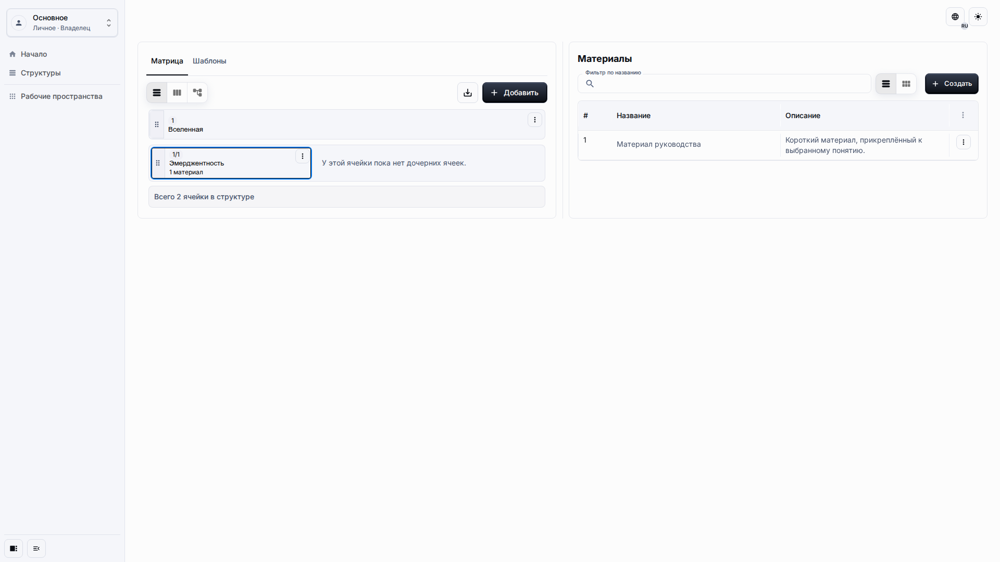
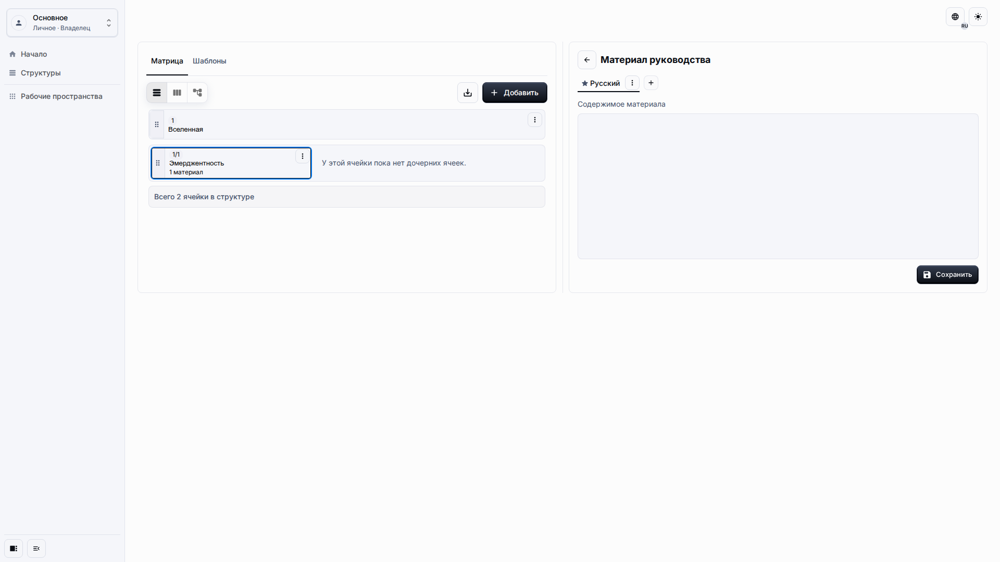

# Ячейки и Материалы

Ячейки описывают понятия или трактовки. Материалы добавляют заметки и источники к выбранной ячейке.

## Роль и цель

Страница предназначена для редактора, который создаёт дочерние ячейки, задаёт их стиль и прикрепляет Материалы без работы со служебным размещением.

## Предварительные условия

-   Вы можете открыть Матрицу.
-   Ваша роль разрешает создание и изменение содержимого.
-   Выбрана ячейка, к которой нужно добавить дочернюю ячейку или Материал.

## Порядок работы

1. Выберите родительскую ячейку и нажмите **Добавить**, чтобы открыть диалог дочерней ячейки.

2. Введите Название и необязательное многострочное Описание, затем сохраните ячейку.

3. На панели Материалов нажмите **Создать**, чтобы прикрепить Материал к выбранной ячейке.

4. Откройте редактор Материала, когда нужно написать более длинное блочное содержимое.

## Ожидаемый результат

Новая дочерняя ячейка появляется под выбранным родителем, а Материал отображается в панели Материалов этой ячейки. Содержимое Материала редактируется через блочный редактор и не показывается техническим текстом в таблицах или карточках.

## Что проверить

-   Поля Описания многострочные.
-   Поля размещения не видны в диалоге.
-   Материалы показывают названия и описания, а не сохранённые блочные данные.
-   Сообщения валидации локализованы для активного языка.

## Связанные страницы

-   [Рабочее пространство и Матрица](workspace-and-matrix.md)
-   [Шаблоны](templates.md)
-   [Модель данных трактовочной сети](../architecture/interpretation-network-data-model.md)
