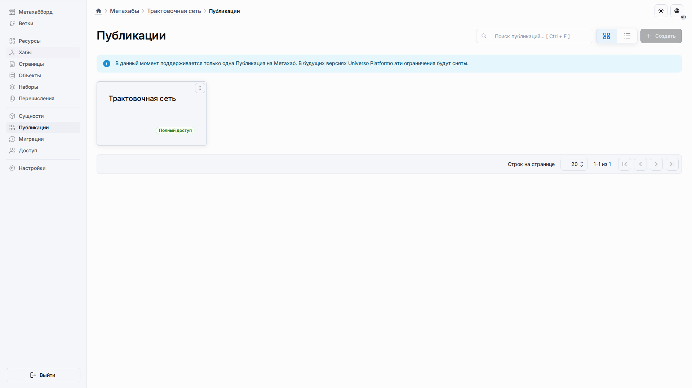
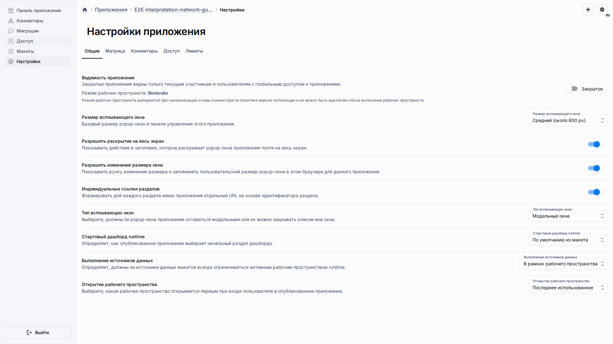
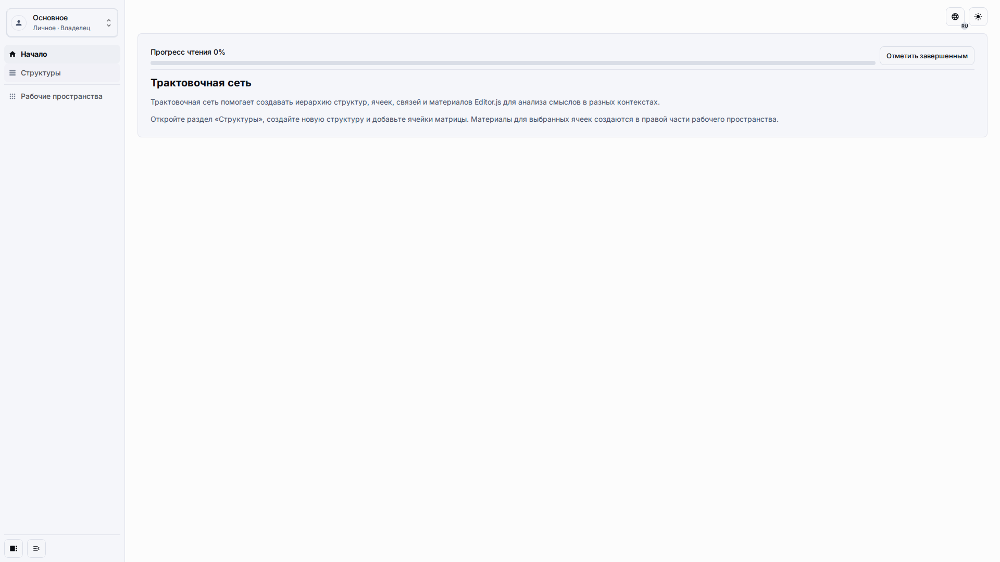

# Создание и публикация

Используйте этот сценарий, чтобы создать стабильное MVP-приложение, которое редакторы открывают тем же маршрутом, что и обычные пользователи.

## Роль и цель

Страница предназначена для владельца, который готовит оболочку приложения, синхронизирует схему и публикует первое рабочее пространство.

## Предварительные условия

-   Вы можете создавать метахабы и приложения.
-   Вы знаете, начинаете ли с встроенного шаблона или с подготовленного демонстрационного снимка.
-   Вы можете выдать пользователям членство в приложении для редактирования содержимого.

## Порядок работы

1. Создайте метахаб из шаблона трактовочной сети или импортируйте подготовленный демонстрационный снимок, если нужен точный проверочный эталон.

2. Создайте связанное приложение из публикации, откройте его настройки из списка приложений и проверьте готовность приложения.

3. Перед приглашением редакторов убедитесь, что видны стартовая страница, выбор рабочего пространства и пункт **Структуры**.

## Ожидаемый результат

Редакторы открывают один адрес приложения, выбирают рабочее пространство и работают в Матрице. Исходная конфигурация остаётся частью шаблона и публикации, а пользовательское содержимое создаётся в рабочем пространстве приложения.

## Что проверить

-   Приложение открывается через обычный маршрут опубликованного приложения.
-   Пункт **Структуры** ведёт в рабочее пространство Матрицы.
-   Экран настройки не просит редакторов менять техническую конфигурацию.

## Связанные страницы

-   [Настройки приложения](application-settings.md)
-   [Макеты приложения](../guides/application-layouts.md)
-   [Экспорт и импорт снимков](../guides/snapshot-export-import.md)
