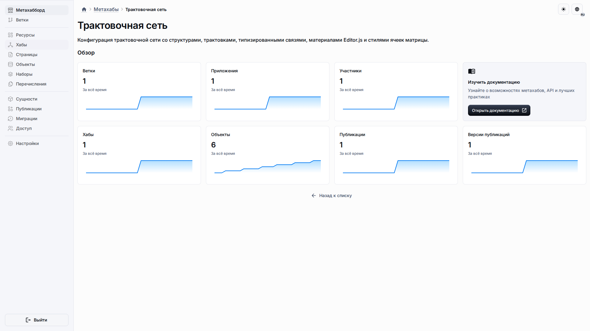

# Начало работы

Начните здесь, если нужно подтвердить, что шаблон, публикация, связанное приложение и опубликованное рабочее пространство соединены.

## Роль и цель

Страница предназначена для владельца, который готовит первое рабочее приложение, и для редактора, который получает к нему доступ.

## Предварительные условия

-   Шаблон трактовочной сети доступен в каталоге метахабов.
-   Вы можете создать или импортировать метахаб и создать связанное приложение из его публикации.
-   Для демонстрационного пути используйте подготовленный файл снимка из репозитория.

## Порядок работы

1. Создайте или импортируйте метахаб трактовочной сети и откройте его после завершения импорта.

2. Откройте связанное приложение и дождитесь загрузки выбора рабочего пространства и навигации.

## Ожидаемый результат

Опубликованное приложение открывается со стартовой страницей и пунктом **Структуры**. Приложение учитывает рабочие пространства, поэтому пользователи работают в активном пространстве, выбранном в заголовке приложения.

## Что проверить

-   Название импортированного метахаба соответствует шаблону трактовочной сети.
-   Связанное приложение открывается без отдельного сервера разработки.
-   Пользователи видят только обычную навигацию продукта и локализованные подписи.

## Связанные страницы

-   [Создание и публикация](create-and-publish.md)
-   [Экспорт и импорт снимков](../guides/snapshot-export-import.md)
-   [Создание приложений](../guides/creating-application.md)
