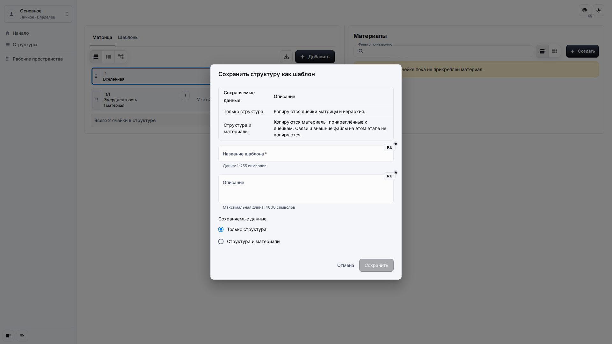
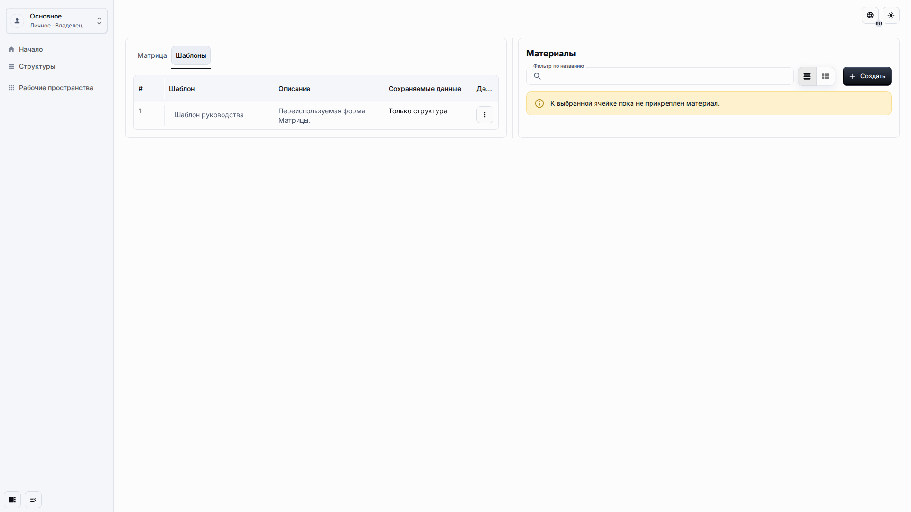
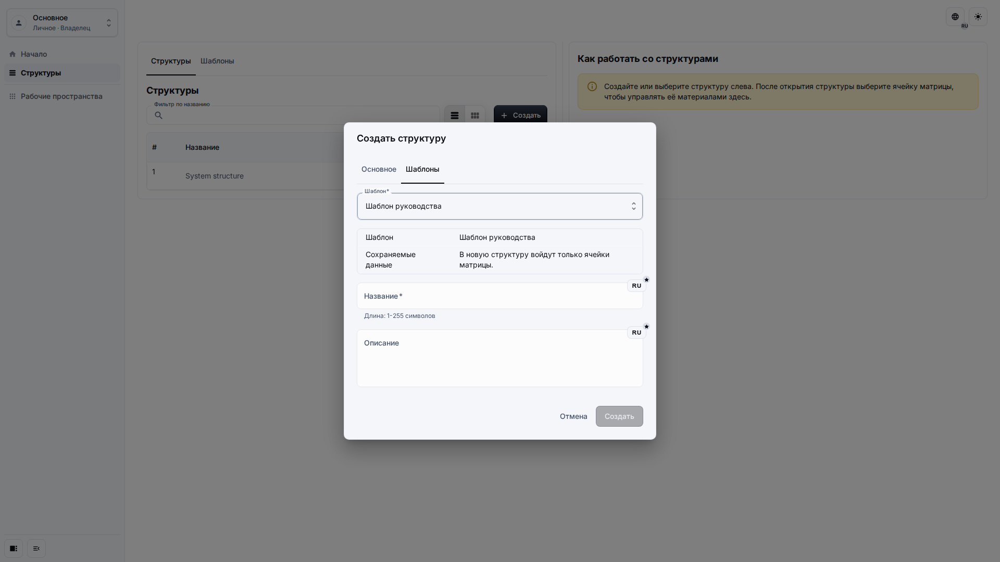

# Шаблоны

Шаблоны позволяют редакторам повторно использовать структуру Матрицы внутри того же рабочего пространства приложения. Шаблон может скопировать только структуру или структуру вместе с Материалами.

## Роль и цель

Страница предназначена для редактора, которому нужно сохранить полезную форму Матрицы и позже создать из неё другую Структуру.

## Предварительные условия

-   Вы можете редактировать Матрицу, которую нужно превратить в шаблон.
-   Панели шаблонов включены в Настройках приложения.
-   Ваша роль разрешает и создание, и изменение содержимого.

## Порядок работы

1. Откройте Матрицу и нажмите **Сохранить как шаблон**.

2. Откройте вкладку **Шаблоны**, чтобы просмотреть доступные шаблоны и политику сохранённых данных.

3. В режиме нескольких Структур создайте Структуру и выберите вкладку **Шаблоны** в диалоге создания.

## Ожидаемый результат

Сохранённый шаблон доступен только в текущем рабочем пространстве приложения. Создание Структуры из него создаёт новую видимую Структуру и не меняет исходную Матрицу или сохранённый шаблон.

## Что проверить

-   Политика сохранённых данных соответствует вашему намерению.
-   Список шаблонов показывает понятные названия и описания.
-   Режим одной системы скрывает создание дополнительной Структуры из шаблона, но оставляет сохранение текущей Матрицы как шаблона.

## Связанные страницы

-   [Настройки приложения](application-settings.md)
-   [Рабочее пространство и Матрица](workspace-and-matrix.md)
-   [Ячейки и Материалы](cells-and-materials.md)
