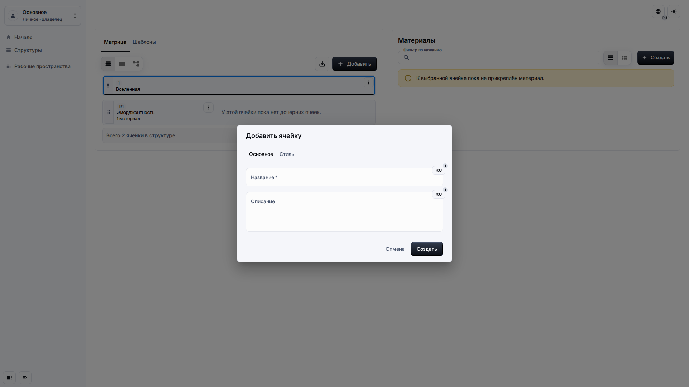
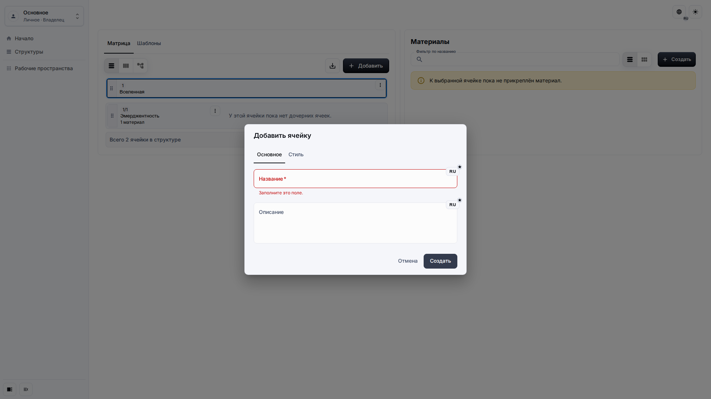
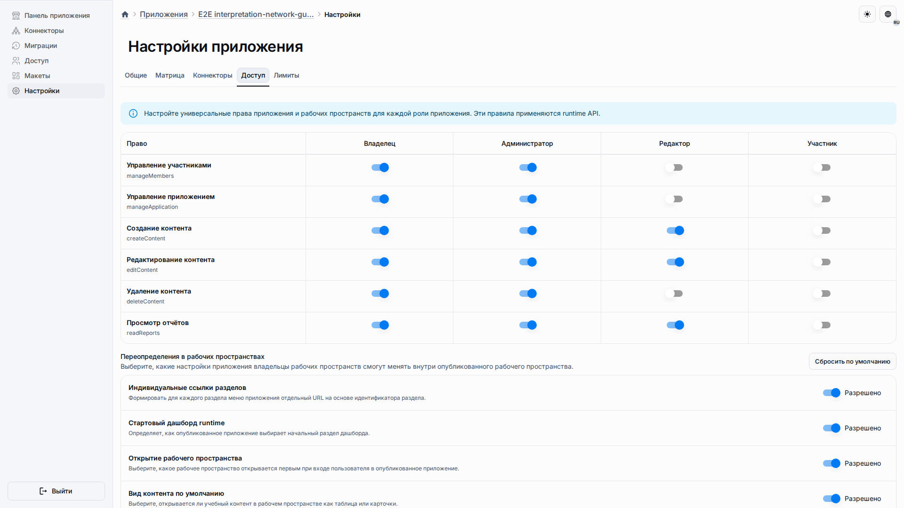
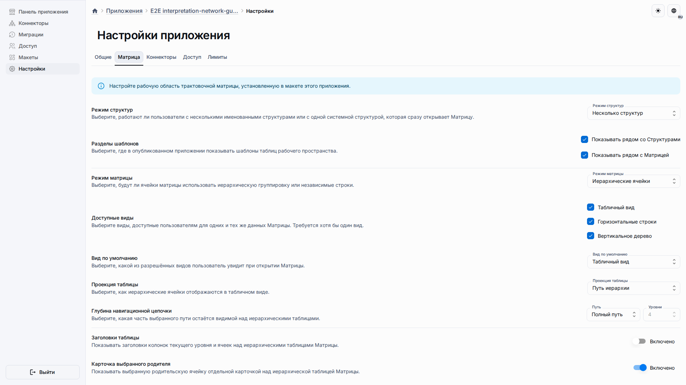

# Решение проблем

Большинство проблем трактовочной сети решается проверкой прав, активного рабочего пространства и того, были ли настройки приложения переопределены относительно исходной публикации.

## Роль и цель

Страница предназначена для владельцев и редакторов, которым нужно понять причину неудачного сохранения, отсутствующего действия, скрытой панели шаблонов или конфликта сброса настроек.

## Предварительные условия

-   Вы знаете, какое рабочее пространство активно.
-   Вы знаете роль пользователя в приложении.
-   Вы можете открыть Настройки приложения, если проблема связана с настройками.

## Порядок работы

1. Если форма не сохраняется, прочитайте локализованное сообщение валидации и исправьте видимое поле.

2. Если действие отсутствует, проверьте, включает ли роль создание, изменение или удаление содержимого в активном рабочем пространстве.

3. Если Матрица выглядит не так, как ожидалось, откройте Настройки приложения и проверьте, были ли настройки Матрицы изменены или требуют сброса.

## Ожидаемый результат

Пользователь может понять, относится ли проблема к видимой валидации, правам доступа или настройкам развёртывания. Ошибки должны оставаться пользовательскими и не требовать знания внутренних названий полей.

## Что проверить

-   Активно то рабочее пространство, где создавалось содержимое.
-   Роль пользователя разрешает действие, которое он пытается выполнить.
-   Настройки Матрицы показывают ожидаемый режим Структур и размещение шаблонов.
-   Конфликт сброса устранён перед повторной попыткой сброса.

## Связанные страницы

-   [Настройки приложения](application-settings.md)
-   [Ячейки и Материалы](cells-and-materials.md)
-   [Контроль качества Runtime UI UX](../contributing/runtime-ui-ux-quality-gate.md)
