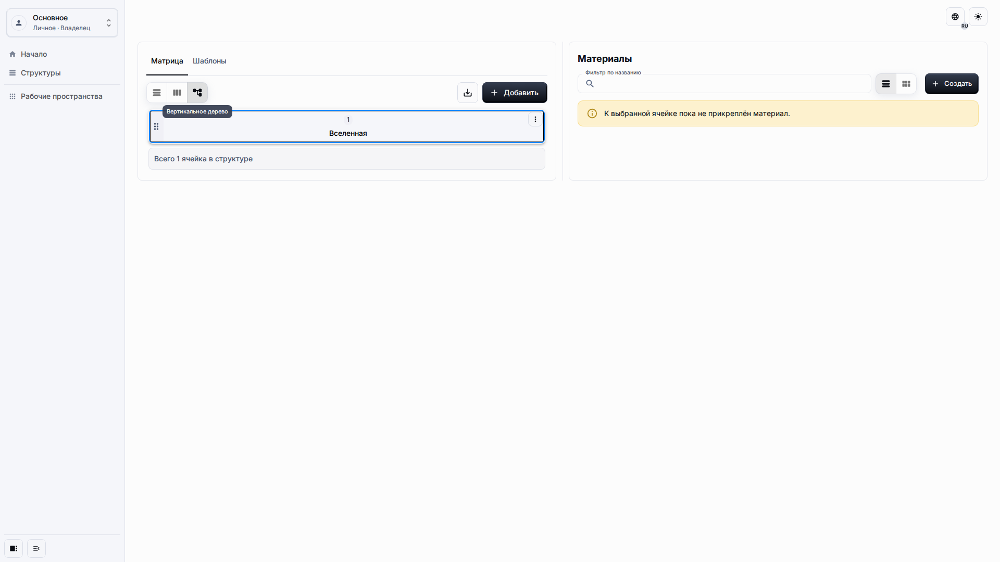

# Рабочее пространство и Матрица

Матрица является основной поверхностью редактирования. Она начинается с корневой ячейки **Вселенная** и позволяет переходить между уровнями иерархии, сохраняя Материалы рядом с выбранной ячейкой.

## Роль и цель

Страница предназначена для редактора, которому нужно перемещаться по Матрице, выбирать ячейки и переключать представления без изменения самих данных.

## Предварительные условия

-   Опубликованное приложение открыто.
-   Вы находитесь в рабочем пространстве, где можете читать Матрицу.
-   Если нужно редактировать содержимое, ваша роль разрешает создание и изменение.

## Порядок работы

1. Откройте **Структуры**. В режиме одной системы Матрица открывается сразу.

2. Выберите корневую или другую видимую ячейку, чтобы сфокусировать панель Материалов и включить действия дочерних ячеек.

3. Переключайтесь между доступными представлениями Матрицы, когда нужна таблица, горизонтальная иерархия или вертикальная иерархия.

## Ожидаемый результат

Выбранная ячейка остаётся видимой, панель Материалов следует за выбором, а смена представления не создаёт отдельные копии Матрицы.

## Что проверить

-   Названия ячеек читаемы, ячейки можно выбирать с клавиатуры.
-   Горизонтальная прокрутка, если она нужна, остаётся внутри области Матрицы.
-   Сама страница не получает боковую прокрутку на настольной, планшетной и мобильной ширине.

## Связанные страницы

-   [Ячейки и Материалы](cells-and-materials.md)
-   [Настройки приложения](application-settings.md)
-   [Контроль качества Runtime UI UX](../contributing/runtime-ui-ux-quality-gate.md)
