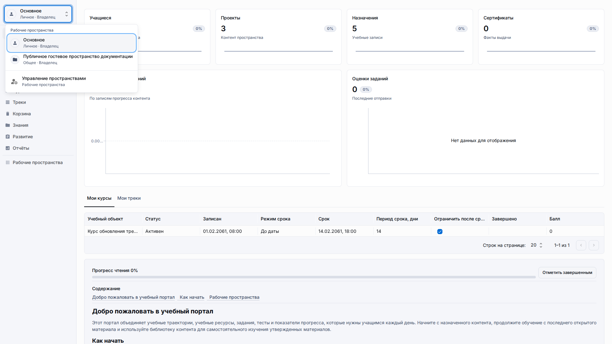
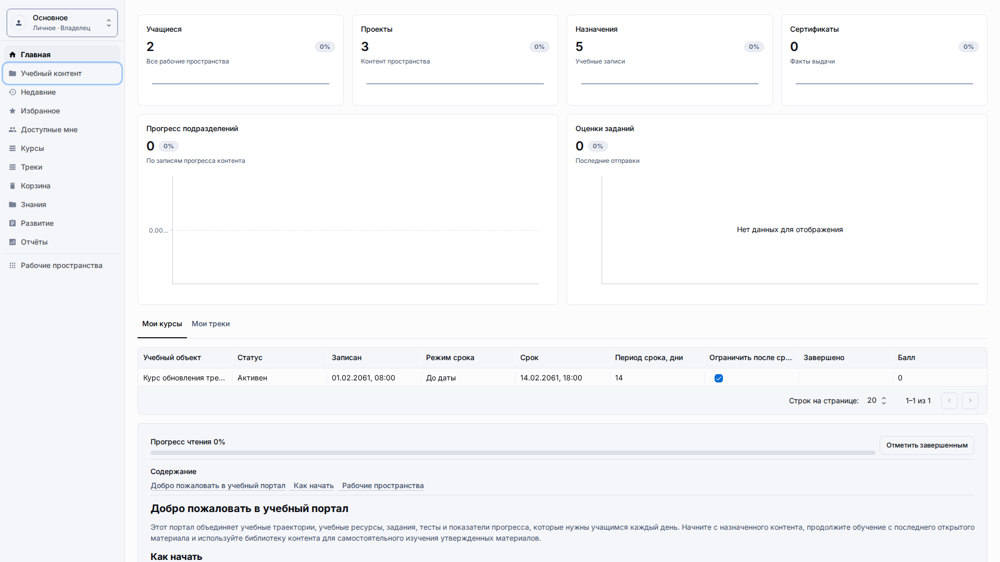
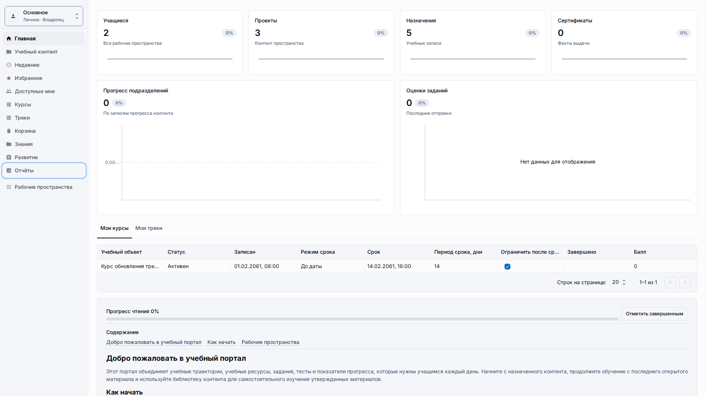

# Руководство пользователя LMS

**Роль:** Владелец рабочего пространства, преподаватель, учащийся или гость в зависимости от задачи.

**Цель:** Понять, где выполняется повседневная работа LMS и какую страницу руководства открыть дальше.

## Что нужно

-   Откройте опубликованное LMS-приложение, подготовленное администратором.
-   Выберите рабочее пространство, где ваша роль разрешает нужное действие.
-   Используйте боковое меню приложения, а не экраны настройки, для повседневной работы LMS.

## Рабочий процесс

1. Откройте LMS-приложение и проверьте, что в левом меню видны Главная, Учебный контент, Курсы, Треки, Знания, Развитие, Отчёты и Рабочие пространства.
   
2. Перед созданием или редактированием контента проверьте выбранное рабочее пространство в верхней части бокового меню.
   
3. Откройте страницу под свою задачу: Учебный контент для авторинга, Курсы или Треки для конструкторов, Отчёты для анализа или Гостевой доступ для публичных ссылок.
   
4. Используйте связанные страницы в конце разделов, когда нужен более подробный сценарий.
   

## Детали экрана

| Область                     | Как использовать                                                                                                                                                                                                                             |
| --------------------------- | -------------------------------------------------------------------------------------------------------------------------------------------------------------------------------------------------------------------------------------------- |
| Показатели главной страницы | Используйте карточки главной страницы как быструю проверку состояния перед переходом в подробный раздел. Карточки считают учащихся, проекты, назначения, сертификаты, записи прогресса и оценки заданий для активного рабочего пространства. |
| Выбор рабочего пространства | Меню рабочего пространства в боковой панели определяет, где создаются новые записи и откуда читаются отчёты. Меняйте его до авторинга, если команда использует отдельные рабочие пространства.                                               |
| Разделы боковой панели      | Главная, Учебный контент, Курсы, Треки, Знания, Развитие, Отчёты и Рабочие пространства являются основными точками входа. Открывайте раздел, который соответствует задаче, а не редактируйте записи из случайных списков.                    |
| Проверка качества           | Если страница показывает непонятные технические значения или даты в неправильном формате, обрезанные элементы управления или неожиданный язык, остановитесь и зафиксируйте видимый экран до изменения рабочего контента.                     |

## Результат

Вы понимаете, что настройки LMS подготовлены отдельно, а авторы и учащиеся работают внутри рабочих пространств приложения.

## Что проверить

Для обычной работы с учебным контентом не должны требоваться технические значения, служебные настройки или административные экраны.

## Связанные страницы

-   [Навигация](getting-around.md)
-   [Библиотека учебного контента](learning-content-library.md)
-   [Курсы](courses.md)
-   [Отчёты](reports.md)
