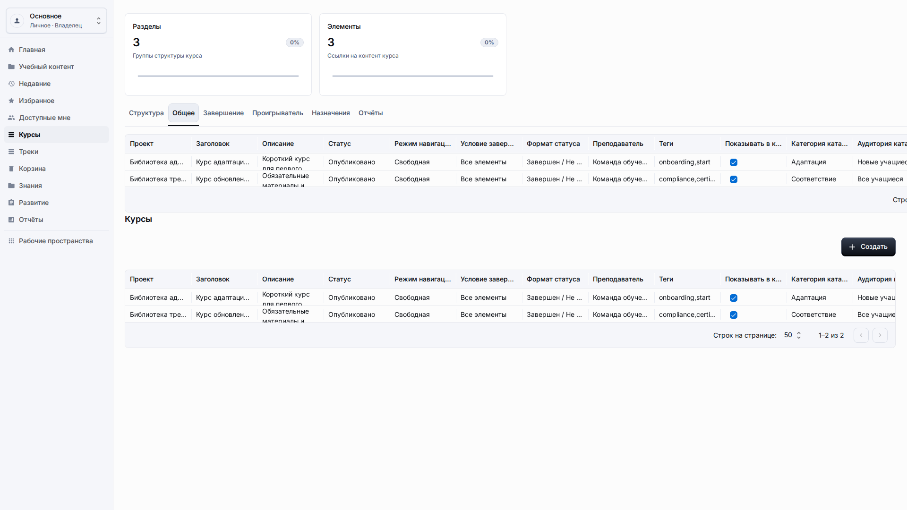
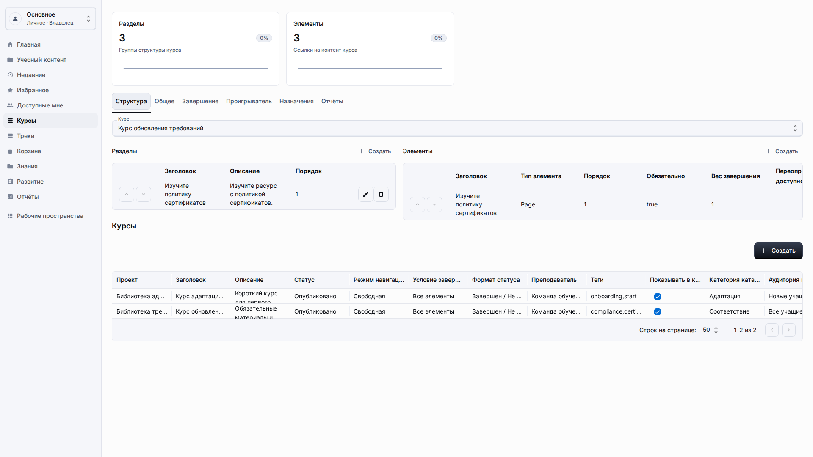
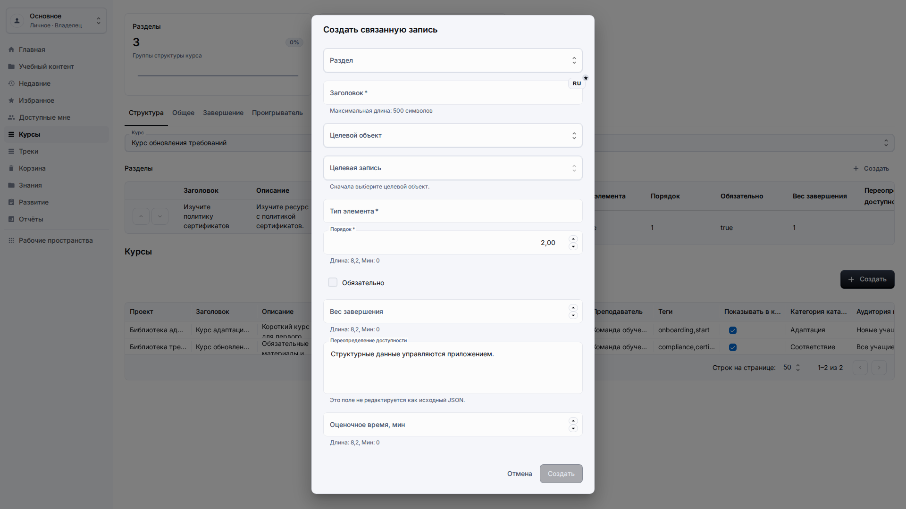
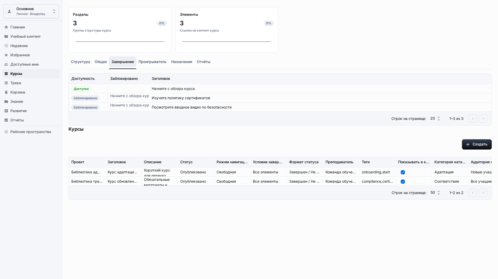
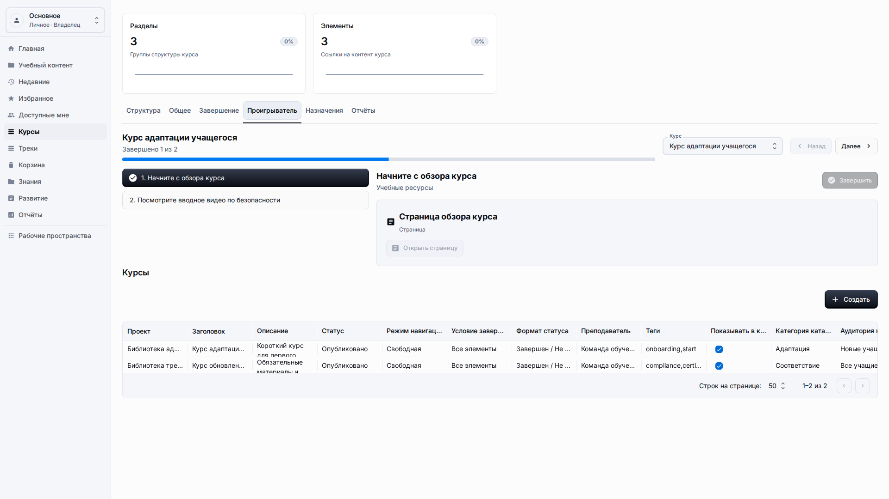

# Курсы

**Роль:** Преподаватель, автор контента или владелец рабочего пространства.

**Цель:** Собрать структуру курса из существующего контента и проверить, как его откроют учащиеся.

## Что нужно

-   Создайте или найдите страницы и ссылки, которые должны войти в курс.
-   Откройте Курсы в боковом меню или создайте курс из Учебного контента.
-   Проверьте, что у вас есть права редактировать записи структуры курса в рабочем пространстве.

## Рабочий процесс

1. Откройте Курсы, выберите существующий курс и проверьте основные настройки: заголовок, описание, преподавателя, статус публикации и поведение сроков.
   
2. Откройте Структуру, проверьте порядок разделов для учащегося и используйте действие Создать у разделов, если нужен новый блок структуры.
   
3. Добавьте элемент из области Элементы, выберите целевой раздел и укажите учебный ресурс по видимому названию, а не по внутреннему идентификатору.
   
4. Откройте Завершение и подтвердите правила прохождения курса: обязательные элементы, требования к баллам и ограничения по срокам.
   
5. Откройте Проигрыватель, запустите предпросмотр для учащегося, перейдите по первому элементу и проверьте понятность прогресса и действия завершения.
   

## Детали экрана

| Область           | Как использовать                                                                                                                                         |
| ----------------- | -------------------------------------------------------------------------------------------------------------------------------------------------------- |
| Карточка курса    | Карточка курса хранит заголовок, описание, статус, преподавателя и настройки плеера. Проверьте эти поля перед добавлением элементов структуры.           |
| Порядок структуры | Разделы и элементы должны повторять путь учащегося. Размещайте предварительные материалы перед практикой или проверкой знаний.                           |
| Связи             | Поля выбора связанных записей должны показывать понятные заголовки контента. Если видны только сырые идентификаторы, остановитесь и сообщите о проблеме. |
| Завершение        | Настройки завершения определяют, когда курс считается пройденным. Проверьте сроки и требования к баллам перед публикацией.                               |
| Предпросмотр      | Используйте предпросмотр для учащегося после крупных изменений. Проверьте первый элемент, навигацию, вход в тест и итоговое сообщение о завершении.      |

## Результат

Структура курса хранится как контент рабочего пространства. Учащийся должен увидеть тот же порядок элементов, который автор проверил в Структуре, а пользователь с достаточными правами может вернуться к курсу и изменить разделы, элементы, правила завершения или настройки проигрывателя.

## Что проверить

Конструкторы курсов должны сохранять выравнивание панели действий и не создавать горизонтальную прокрутку всей страницы.

## Связанные страницы

-   [Страницы и ссылки](resources-pages-links.md)
-   [Опыт учащегося](learner-experience.md)
-   [Отчёты](reports.md)
