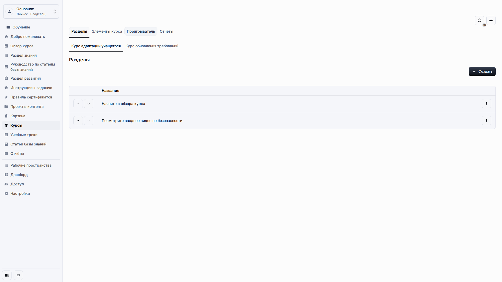
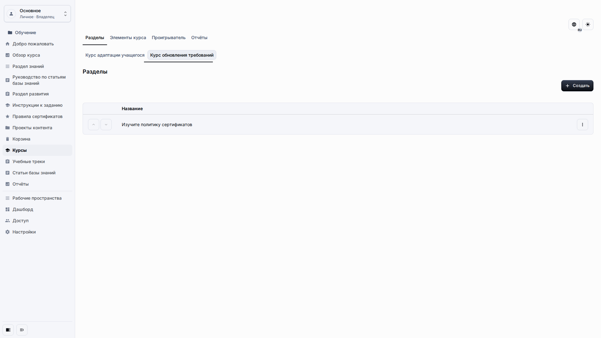
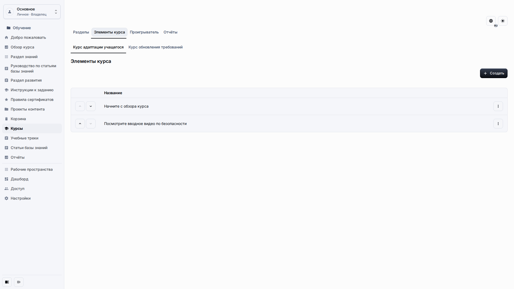
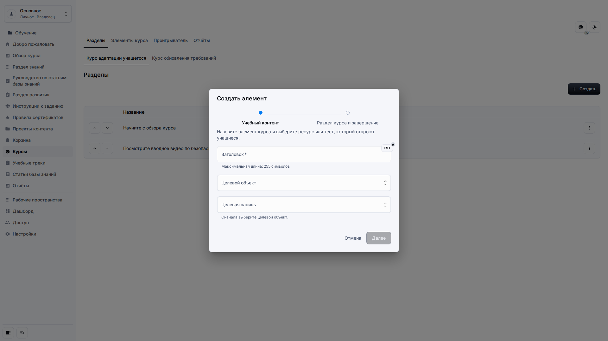
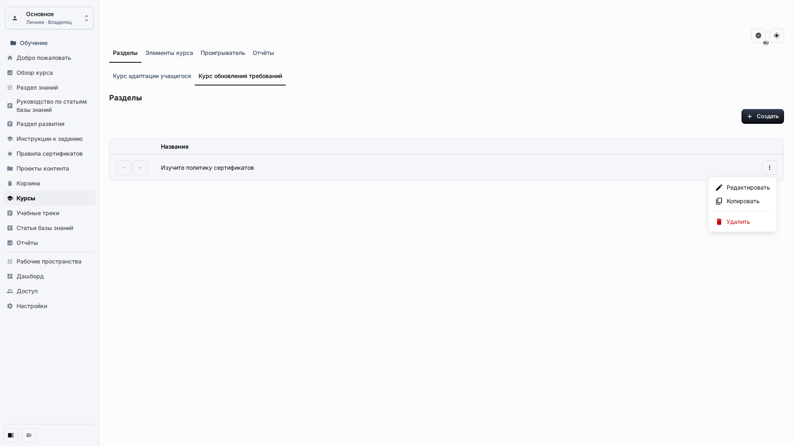
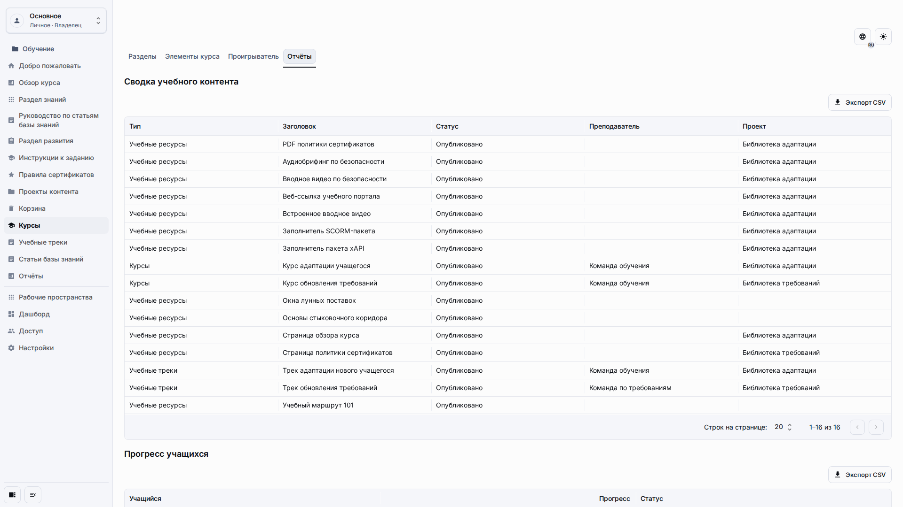

# Курсы

**Роль:** Преподаватель, автор контента или владелец рабочего пространства.

**Цель:** Собрать структуру курса из существующего контента и проверить, как его откроют учащиеся.

## Что нужно

-   Создайте или найдите страницы и ссылки, которые должны войти в курс.
-   Откройте «Курсы» в боковом меню или создайте курс из проекта контента.
-   Проверьте, что у вас есть права редактировать записи структуры курса в рабочем пространстве.

## Рабочий процесс

1. Откройте «Курсы», выберите «Курс обновления требований» и проверьте, что появился раздел о политике сертификатов.
   
2. Откройте вкладку «Элементы курса», чтобы просмотреть элементы выбранного курса.
   
3. Нажмите «Создать» на вкладке «Элементы курса», чтобы открыть форму. Выбирайте связанный контент по понятному названию; если вы только проверяете поля, отмените создание.
   
4. На вкладке «Разделы» откройте меню раздела и ознакомьтесь с вариантами, не меняя курс.
   
5. Откройте «Отчёты», чтобы просмотреть активность выбранного курса.
   

## Детали экрана

| Область                | Как использовать                                                                                                                                 |
| ---------------------- | ------------------------------------------------------------------------------------------------------------------------------------------------ |
| Выбор курса            | Выбранный курс определяет связанные разделы и элементы, показанные в конструкторе. Проверяйте контекст по его понятному названию.                |
| Разделы                | Проверяйте порядок разделов и используйте доступные действия для настройки структуры курса.                                                      |
| Элементы курса         | Просматривайте или создавайте элементы выбранного курса. Связанные записи должны отображаться по названиям, а не по техническим идентификаторам. |
| Проигрыватель и отчёты | Используйте «Проигрыватель» для проверки опыта учащегося, а «Отчёты» — для просмотра доступной активности курса.                                 |

## Результат

Разделы и элементы курса хранятся как контент рабочего пространства. Конструктор показывает связанные записи выбранного курса, проигрыватель для учащегося и доступные отчёты на отдельных вкладках.

## Что проверить

Конструкторы курсов должны сохранять выравнивание панели действий и не создавать горизонтальную прокрутку всей страницы.

## Связанные страницы

-   [Страницы и ссылки](resources-pages-links.md)
-   [Опыт учащегося](learner-experience.md)
-   [Отчёты](reports.md)
