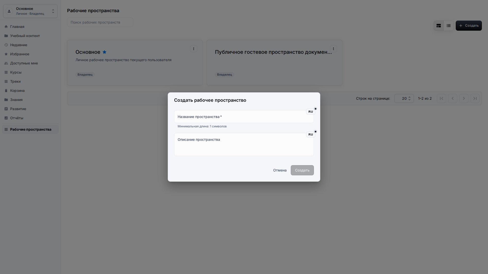
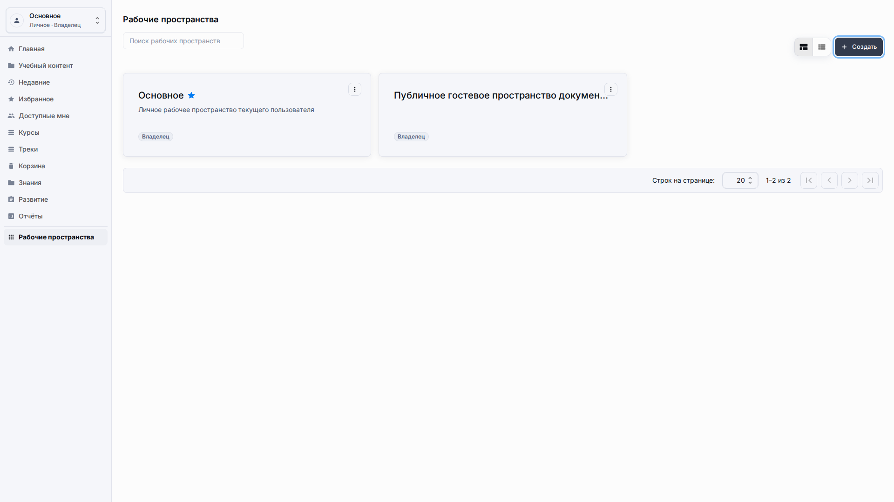
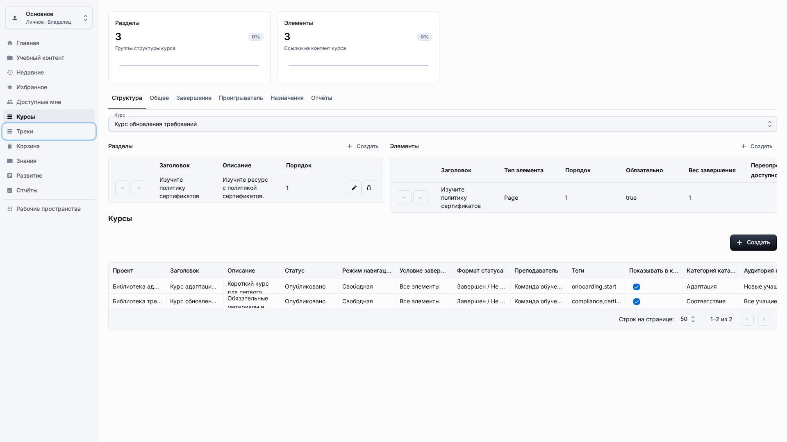
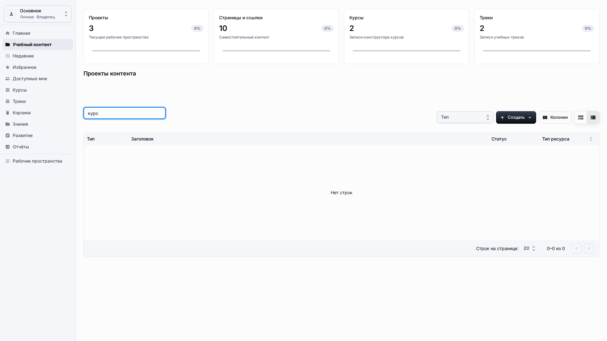
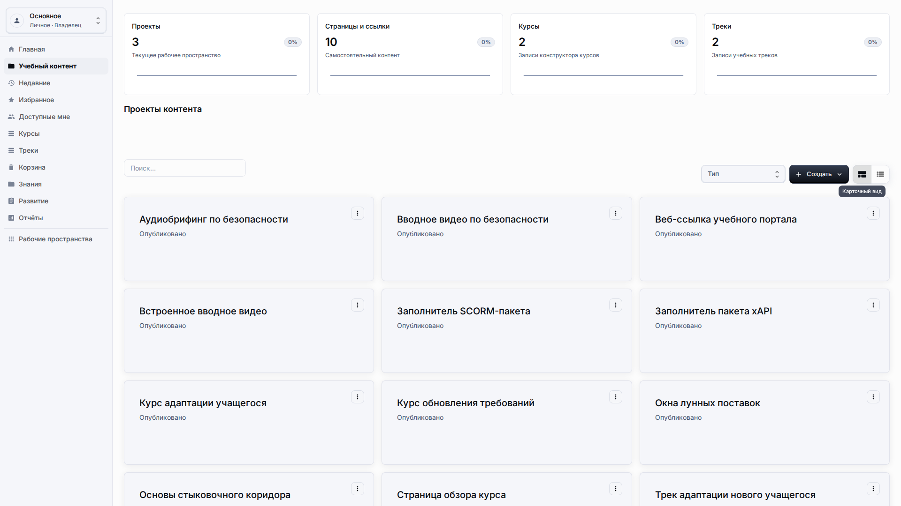
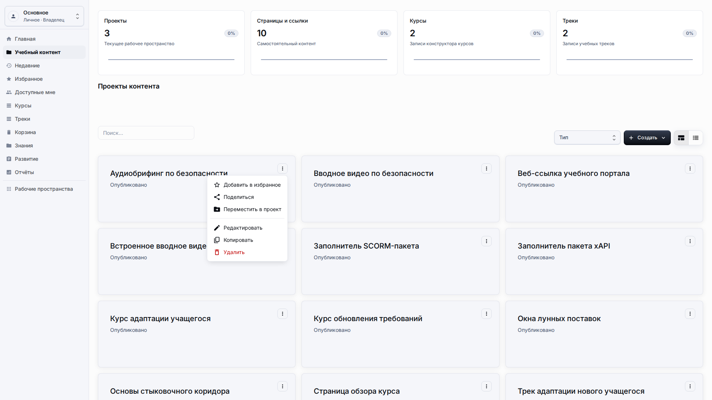

# Навигация

**Роль:** Любой авторизованный пользователь LMS.

**Цель:** Найти нужный раздел, рабочее пространство, элементы списка и режим отображения перед началом задачи.

## Что нужно

-   Вы вошли в систему и видите боковое меню LMS.
-   Браузер использует язык, на котором вы хотите работать или проверять интерфейс.
-   Выбрано рабочее пространство, где должны изменяться данные.

## Рабочий процесс

1. Используйте меню рабочего пространства, чтобы подтвердить текущий контекст перед созданием, редактированием, удалением или восстановлением записей.
   
2. Используйте пункты бокового меню для перехода между Главной, Учебным контентом, Курсами, Треками, Знаниями, Развитием, Отчётами и Рабочими пространствами.
   
3. Используйте поиск и фильтр типа перед настройкой колонок, когда в таблице много строк.
   
4. Используйте переключатель таблицы и карточек для перехода между плотным просмотром и визуальным обзором.
   
5. Открывайте меню действий элемента через кнопку в конце строки, когда нужны Редактировать, Копировать, Поделиться, Переместить, Удалить или Восстановить.
   

## Детали экрана

| Область                      | Как использовать                                                                                                                                                                                                      |
| ---------------------------- | --------------------------------------------------------------------------------------------------------------------------------------------------------------------------------------------------------------------- |
| Сначала рабочее пространство | Всегда проверяйте рабочее пространство перед изменением строк. Один и тот же заголовок контента может существовать в разных рабочих пространствах с разными правилами доступа и отчётности.                           |
| Шаблон навигации             | Используйте боковую панель для основных переходов, а кнопку назад в браузере только для возврата на предыдущий экран. Так контекст авторинга остаётся предсказуемым.                                                  |
| Поиск и фильтры              | Поиск должен использовать видимый рабочий заголовок. Фильтр типа безопаснее изменения колонок, когда нужно быстро сузить большой список.                                                                              |
| Виды и действия              | Табличный вид удобен для просмотра большого числа записей. Карточный вид подходит для визуальной проверки. Меню элемента открывает редактирование, копирование, общий доступ, перемещение, удаление и восстановление. |
| Проверка адаптивности        | На узких экранах элементы управления должны переноситься, а не создавать горизонтальную прокрутку всей страницы. Если такая прокрутка появляется, это дефект.                                                         |

## Результат

Вы можете открыть каждый раздел LMS, не выходя из опубликованного приложения.

## Что проверить

Названия навигации, сообщения проверки и ячейки таблиц должны быть локализованными и понятными пользователю.

## Связанные страницы

-   [Библиотека учебного контента](learning-content-library.md)
-   [Общий доступ, недавнее, избранное и корзина](sharing-recent-favorites-trash.md)
-   [Решение проблем](troubleshooting.md)
