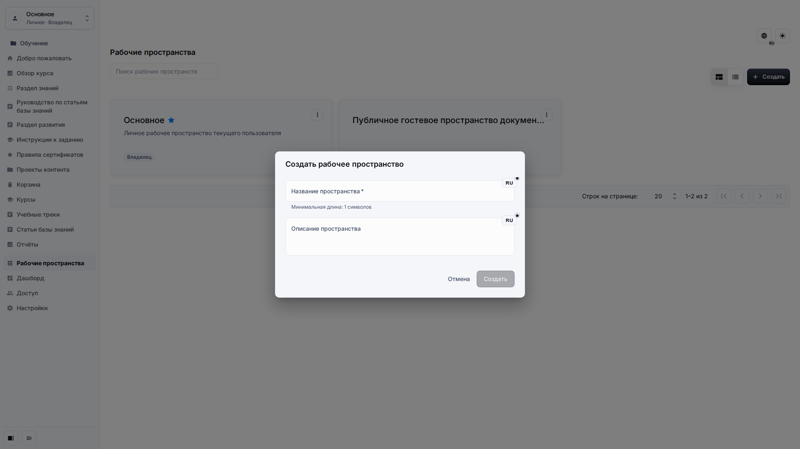
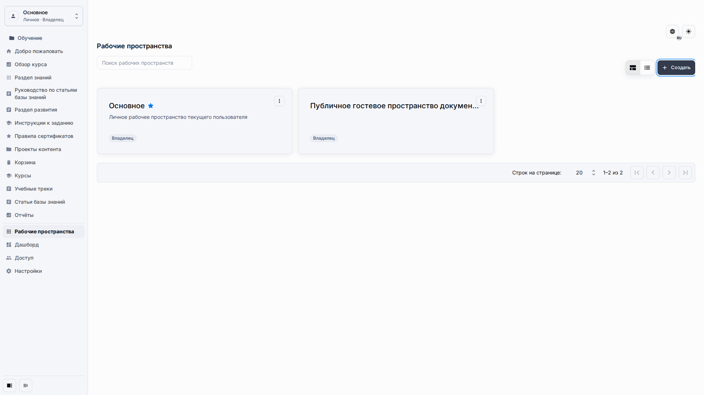
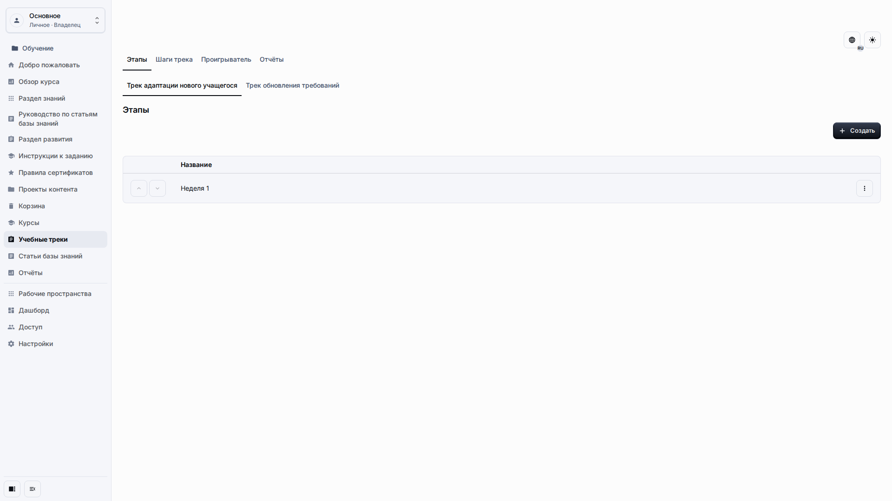
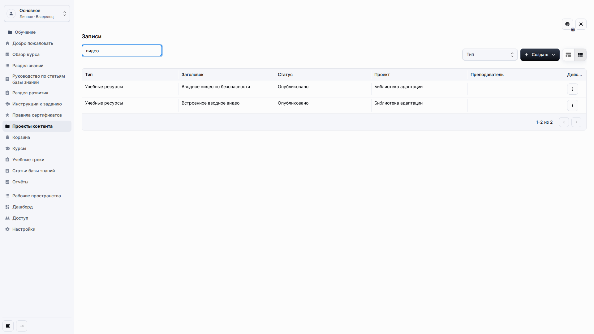
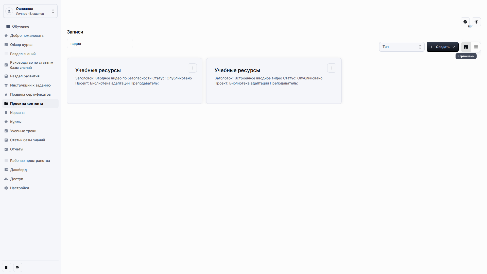
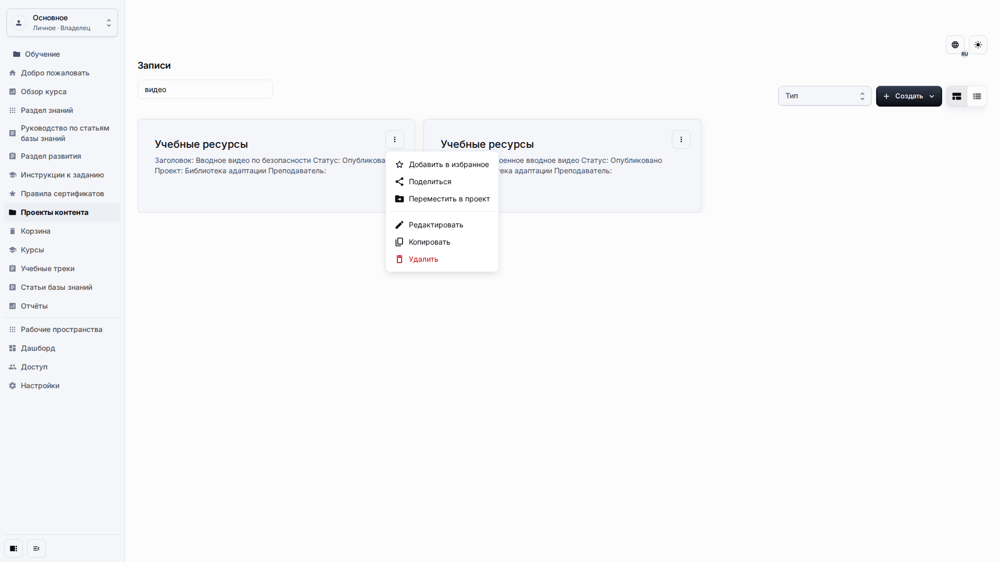

# Навигация

**Роль:** Любой авторизованный пользователь LMS.

**Цель:** Найти нужный раздел, рабочее пространство, элементы списка и режим отображения перед началом задачи.

## Что нужно

-   Вы вошли в систему и видите боковое меню LMS.
-   Браузер использует язык, на котором вы хотите работать или проверять интерфейс.
-   Выбрано рабочее пространство, где должны изменяться данные.

## Рабочий процесс

1. Используйте меню рабочего пространства, чтобы подтвердить текущий контекст перед созданием, редактированием, удалением или восстановлением записей.
   
2. Откройте в боковом меню «Курсы» и «Учебные треки». В конструкторах доступны вкладки «Разделы» и «Элементы курса» либо «Этапы» и «Шаги трека», а также «Проигрыватель» и «Отчёты».
   
3. Откройте «Проекты контента» и найдите `видео` по названию, прежде чем менять столбцы в длинном списке.
   
4. Не очищая поиск по видео, переключитесь на карточный вид, чтобы просмотреть найденные материалы.
   
5. Открывайте меню действий элемента через кнопку в конце строки, когда нужны Редактировать, Копировать, Поделиться, Переместить, Удалить или Восстановить.
   

## Детали экрана

| Область                      | Как использовать                                                                                                                                                                                                      |
| ---------------------------- | --------------------------------------------------------------------------------------------------------------------------------------------------------------------------------------------------------------------- |
| Сначала рабочее пространство | Всегда проверяйте рабочее пространство перед изменением строк. Один и тот же заголовок контента может существовать в разных рабочих пространствах с разными правилами доступа и отчётности.                           |
| Шаблон навигации             | Используйте пункты «Проекты контента», «Курсы», «Учебные треки», «Отчёты» и «Рабочие пространства» для перехода между основными разделами, а кнопку назад — для возврата на предыдущий экран.                         |
| Поиск и фильтры              | Поиск должен использовать видимый рабочий заголовок. Фильтр типа безопаснее изменения колонок, когда нужно быстро сузить большой список.                                                                              |
| Виды и действия              | Табличный вид удобен для просмотра большого числа записей. Карточный вид подходит для визуальной проверки. Меню элемента открывает редактирование, копирование, общий доступ, перемещение, удаление и восстановление. |
| Проверка адаптивности        | На узких экранах элементы управления должны переноситься, а не создавать горизонтальную прокрутку всей страницы. Если такая прокрутка появляется, это дефект.                                                         |

## Результат

Вы можете открыть каждый раздел LMS, не выходя из опубликованного приложения.

## Что проверить

Названия навигации, сообщения проверки и ячейки таблиц должны быть локализованными и понятными пользователю.

## Связанные страницы

-   [Библиотека учебного контента](learning-content-library.md)
-   [Общий доступ, недавнее, избранное и корзина](sharing-recent-favorites-trash.md)
-   [Решение проблем](troubleshooting.md)
