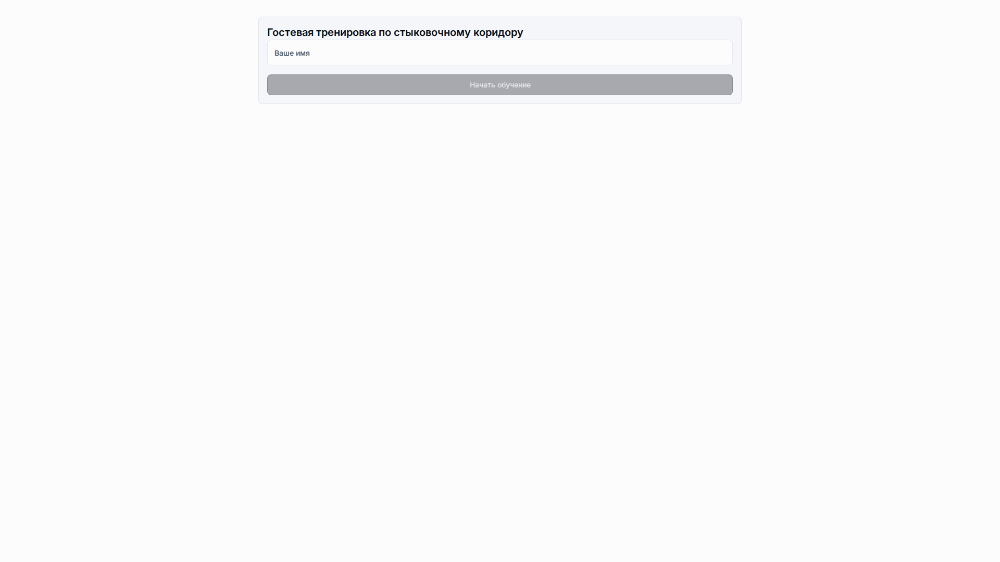
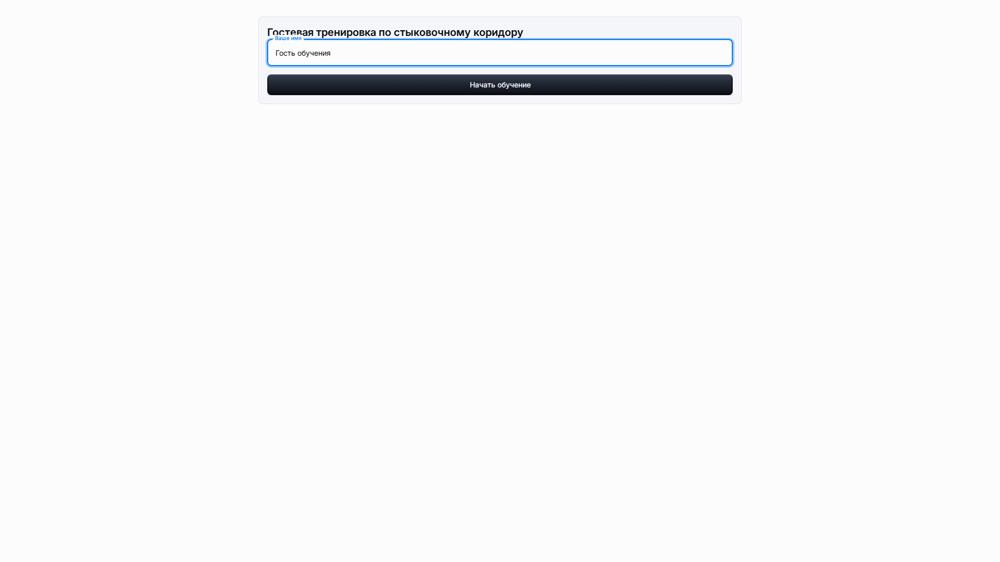
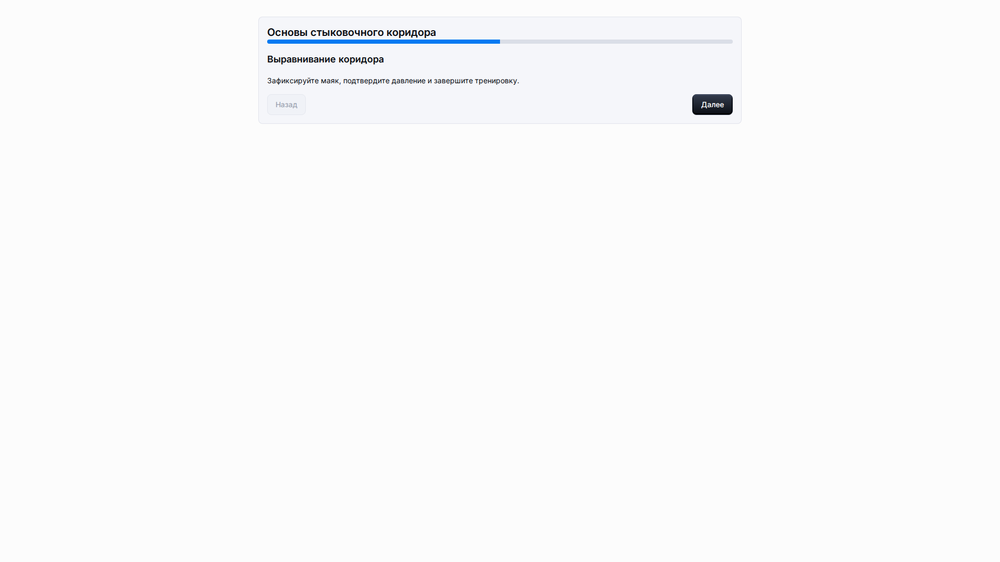
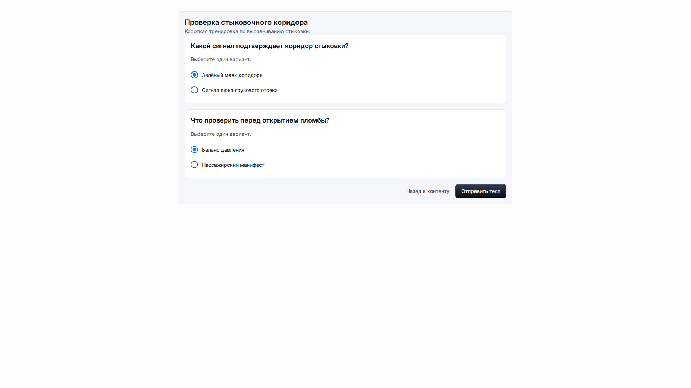
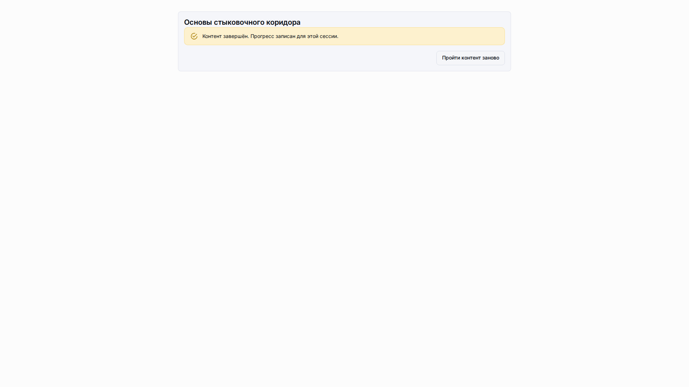

# Гостевой доступ

**Роль:** Гость-учащийся или преподаватель, проверяющий публичную ссылку.

**Цель:** Начать публичную учебную сессию без аккаунта платформы и безопасно записать завершение.

## Что нужно

-   Откройте публичную ссылку доступа LMS, которую предоставил преподаватель или администратор.
-   Используйте языковую настройку или языковую часть адреса, когда нужен локализованный гостевой путь.
-   Введите понятное отображаемое имя гостя.

## Рабочий процесс

1. Откройте публичную ссылку и введите отображаемое имя.
   
2. Выберите Начать обучение, чтобы создать гостевую сессию для вкладки браузера.
   
3. Прочитайте каждый элемент контента и используйте Далее для перехода по последовательности.
   
4. Откройте и отправьте тест, если он включён в контент.
   
5. Выберите Завершить контент и проверьте, что завершение записано.
   

## Детали экрана

| Область               | Как использовать                                                                                                                        |
| --------------------- | --------------------------------------------------------------------------------------------------------------------------------------- |
| Отображаемое имя      | Имя гостя помогает отличить прогресс текущей публичной сессии. При проверке с преподавателем используйте настоящее учебное имя.         |
| Начало сессии         | Кнопка начала обучения создаёт гостевую сессию для вкладки браузера. Не передавайте ссылку сессии после запуска.                        |
| Навигация по контенту | Используйте кнопку Далее только после просмотра текущего элемента. Следующий элемент должен показывать понятный заголовок и содержимое. |
| Отправка теста        | Ответьте на все видимые вопросы перед отправкой. Экран результата должен показать локализованный итог баллов.                           |
| Завершение            | Завершение контента записывает прогресс для этой сессии. Итоговое сообщение должно подтвердить сохранение прогресса.                    |

## Результат

Гость может завершить назначенный путь без входа как пользователь платформы.

## Что проверить

Гостевые страницы должны показывать только публичный учебный путь, прогресс учащегося и понятные сообщения о завершении.

## Связанные страницы

-   [Опыт учащегося](learner-experience.md)
-   [Решение проблем](troubleshooting.md)
