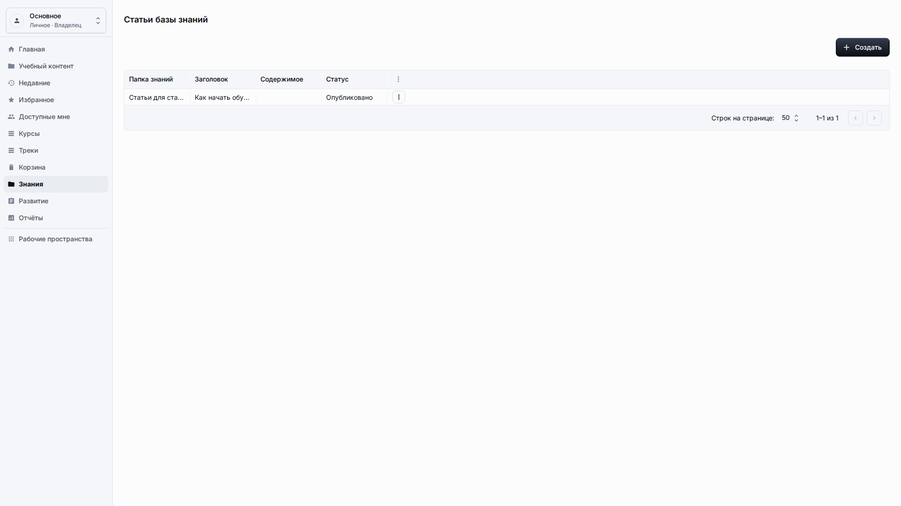
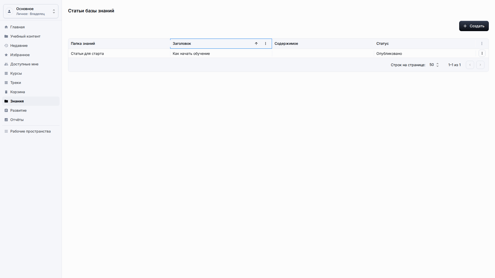
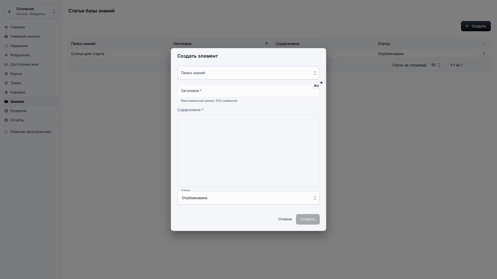
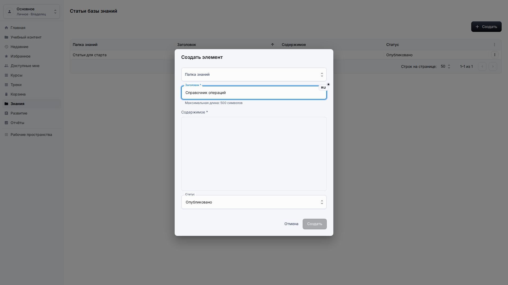
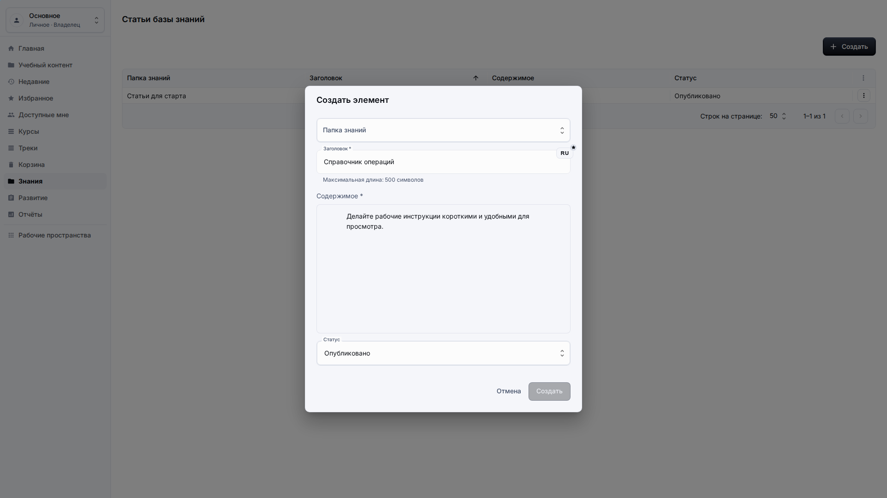
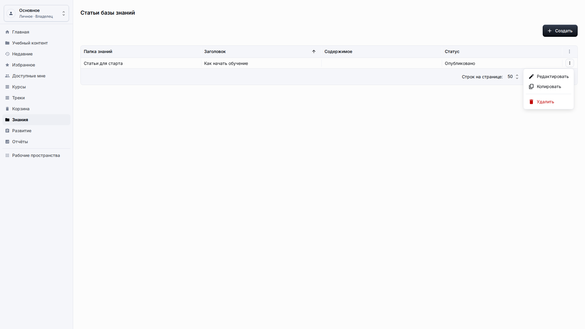

# Знания

**Роль:** Преподаватель, автор базы знаний или владелец рабочего пространства.

**Цель:** Создавать и поддерживать статьи базы знаний, которые помогают курсам и трекам.

## Что нужно

-   Откройте Знания в боковом меню.
-   Выберите папку, к которой относится статья.
-   Подготовьте название статьи и содержимое.

## Рабочий процесс

1. Откройте Знания и отсортируйте или просмотрите существующие папки и статьи по понятному заголовку.
   
2. Выберите Создать, когда нужна новая статья.
   
3. Выберите папку по понятному названию и введите локализованное название.
   
4. Напишите содержимое в блочном редакторе и сохраните статью.
   
5. Используйте Редактировать, когда статью нужно обновить после публикации.
   

## Детали экрана

| Область           | Как использовать                                                                                                                               |
| ----------------- | ---------------------------------------------------------------------------------------------------------------------------------------------- |
| Область знаний    | Используйте раздел знаний для справочных статей, которые помогают обучению, но не обязательно входят в формальный курс.                        |
| Создание статьи   | Создавайте статьи с локализованным заголовком, папкой и содержимым для учащегося. Не выводите внутренние технические заметки в видимый текст.  |
| Папки             | Папки должны называться по теме или аудитории. Выбирайте их по видимому имени и не делайте структуру слишком глубокой.                         |
| Редактирование    | Используйте редактирование для исправлений, обновления правил и актуализации контента. Проверьте, что статью всё ещё легко найти по заголовку. |
| Проверка качества | Страницы знаний не должны показывать непонятные технические значения, служебные названия или данные редактора в опубликованном виде.           |

## Результат

Статьи базы знаний становятся контентом рабочего пространства для адаптации, соответствия требованиям и справочных сценариев.

## Что проверить

Поля содержимого статьи должны использовать блочный редактор и не показывать непонятные технические значения блоков в обычных списках.
Опубликованная статья должна читаться как материал поддержки учащегося: с понятными абзацами, видимым размещением в папке и названием, по которому другие авторы смогут найти её при обновлении связанных курсов.

## Связанные страницы

-   [Страницы и ссылки](resources-pages-links.md)
-   [Библиотека учебного контента](learning-content-library.md)
