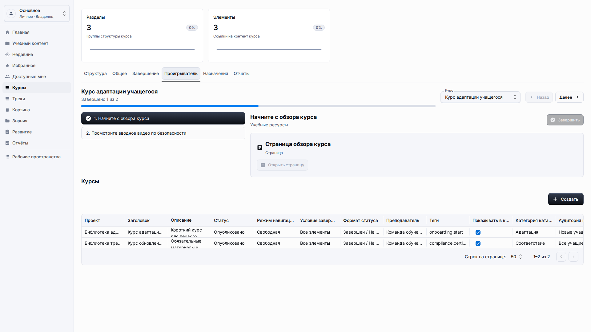
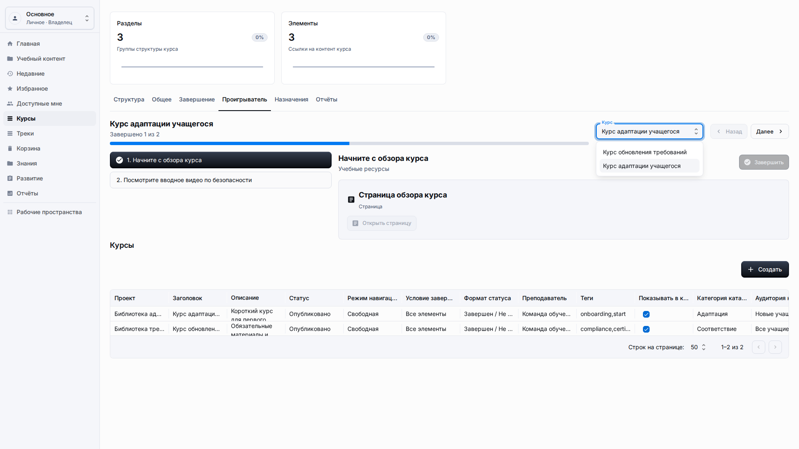
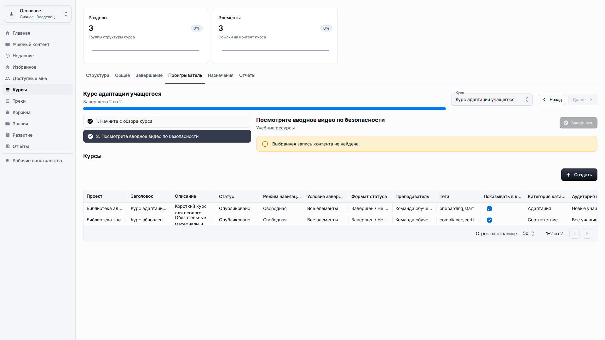
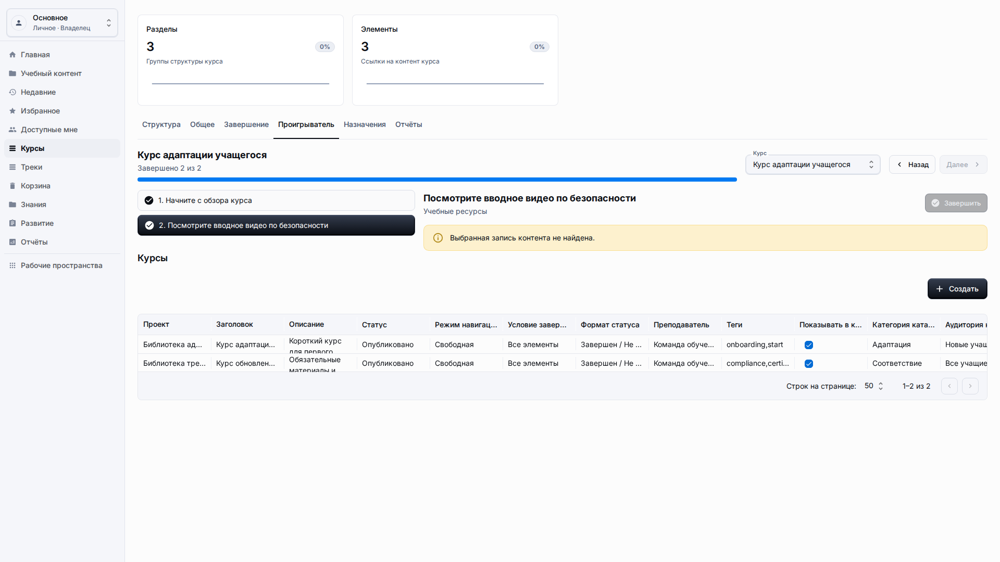
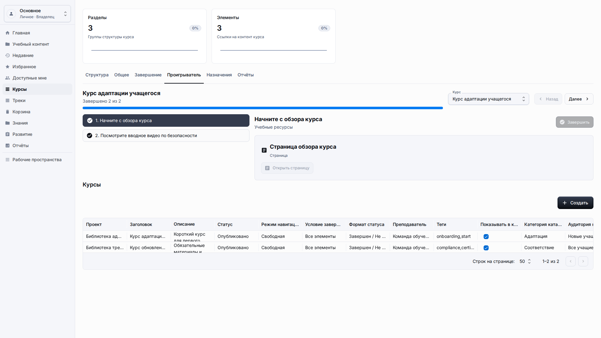

# Опыт учащегося

**Роль:** Учащийся или преподаватель, проверяющий путь учащегося.

**Цель:** Открыть назначенный контент и проверить прогресс без авторских элементов управления.

## Что нужно

-   Откройте приложение пользователем, который может просматривать контент.
-   Выберите правильное рабочее пространство или перейдите по назначенной ссылке.
-   Используйте элементы управления плеера, а не изменение авторской версии контента.

## Рабочий процесс

1. Откройте Курсы и выберите вкладку Проигрыватель для назначенного курса.
   
2. Прочитайте выбранный элемент контента и используйте оглавление, если плеер его показывает.
   
3. Выберите Завершить для текущего элемента, когда учащийся закончил его.
   
4. Используйте Далее или оглавление, чтобы перейти к следующему доступному элементу.
   
5. Перезагрузите страницу и проверьте, что прогресс остался видимым.
   

## Детали экрана

| Область              | Как использовать                                                                                                                                      |
| -------------------- | ----------------------------------------------------------------------------------------------------------------------------------------------------- |
| Точки входа          | Учащиеся могут начинать с главной страницы, учебного контента, курсов, треков, недавнего или публичной ссылки в зависимости от доступа.               |
| Содержимое плеера    | Плеер должен показывать заголовок текущего элемента, содержимое и понятную навигацию без скрытых знаний о платформе.                                  |
| Прогресс             | Прогресс должен обновляться после значимых действий: перехода к следующему элементу, отправки теста или завершения контента.                          |
| Действие завершения  | Используйте видимую кнопку завершения только после просмотра обязательного элемента. Подтверждающее сообщение должно быть понятным.                   |
| Сохранение состояния | Перезагрузите страницу или вернитесь через недавнее при проверке сохранения. Завершение должно оставаться видимым для той же сессии или пользователя. |

## Результат

Прогресс учащегося записывается приложением, а не вводится учащимся вручную.

## Что проверить

Страницы учащегося должны показывать прогресс и названия контента, а не скрытые значения рабочего пространства или служебные детали хранения.

## Связанные страницы

-   [Курсы](courses.md)
-   [Учебные треки](learning-tracks.md)
-   [Гостевой доступ](guest-access.md)
