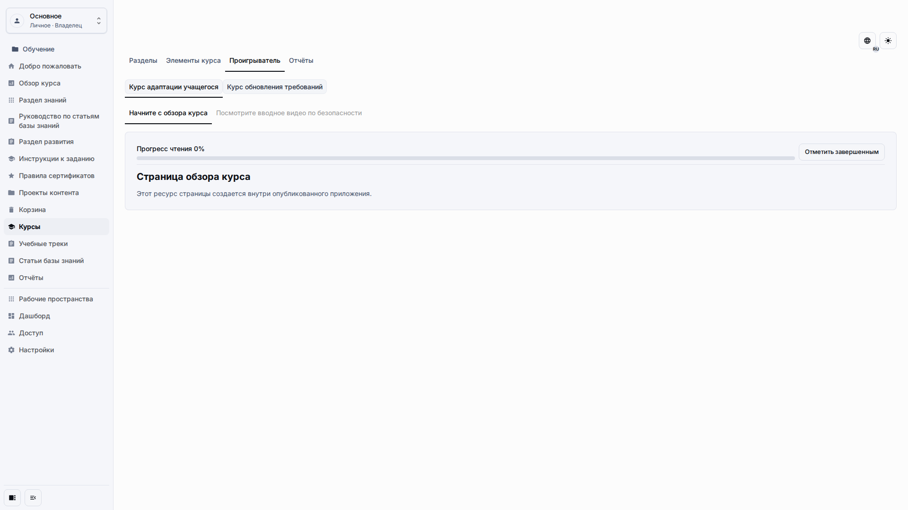
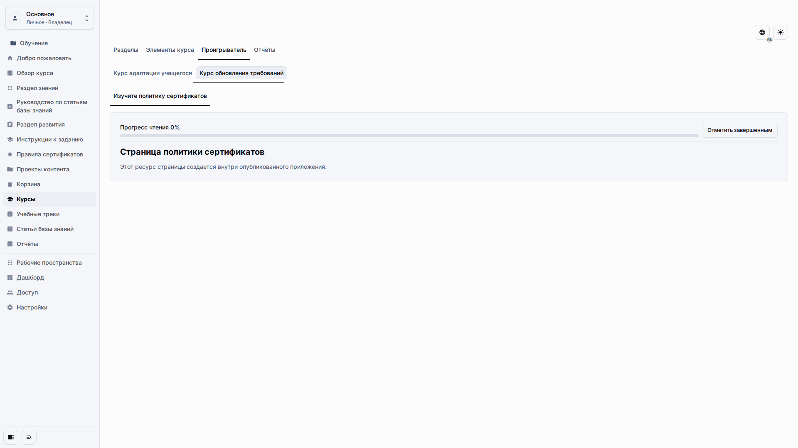
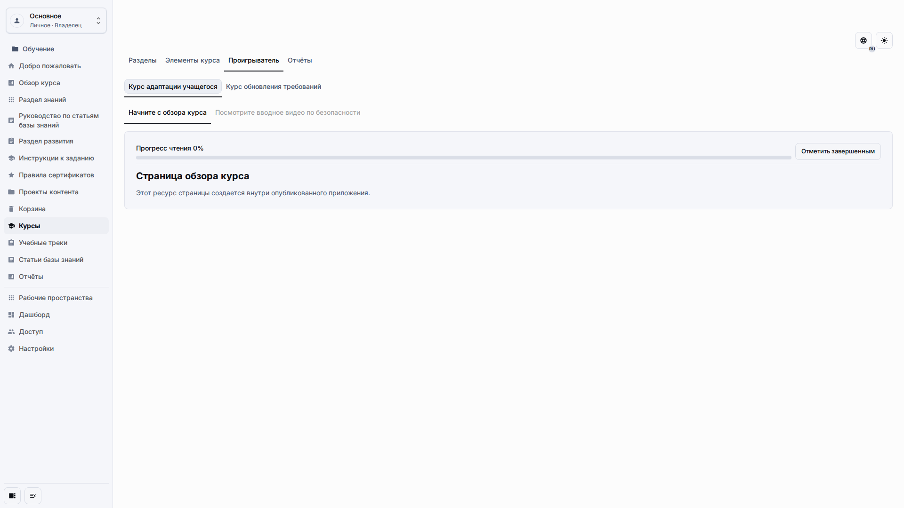
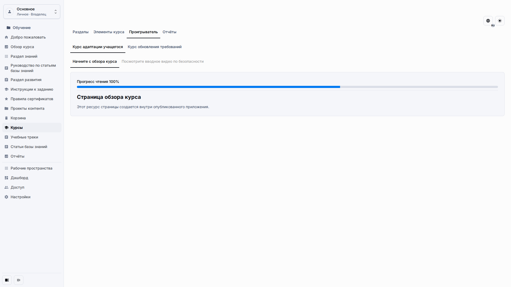
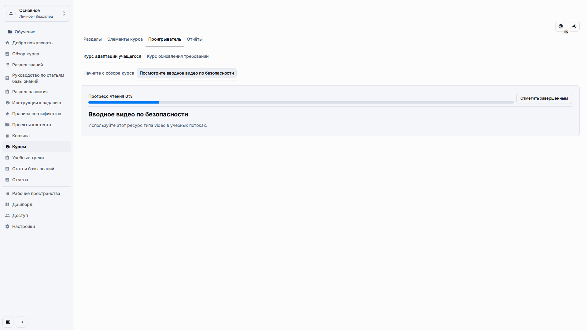
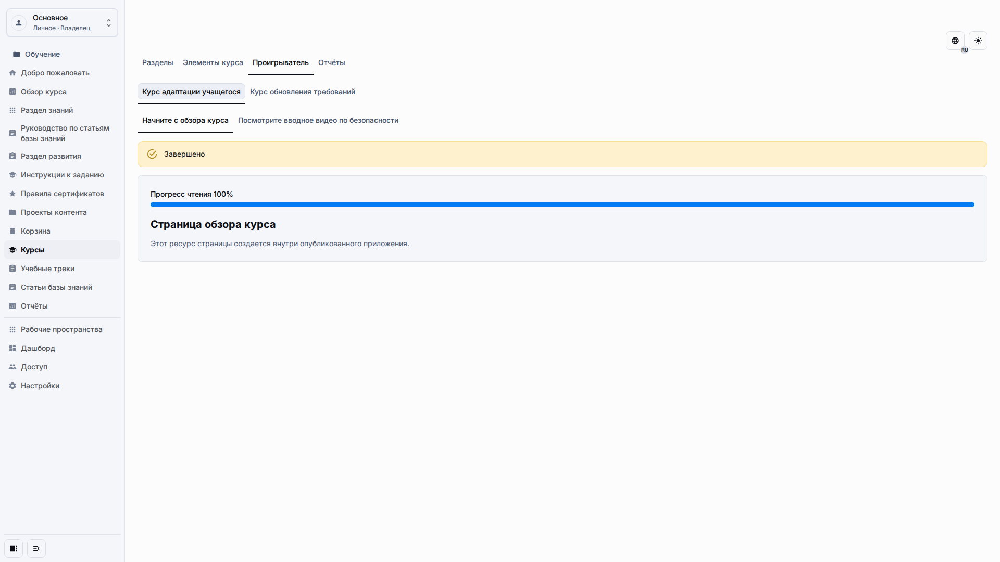

# Опыт учащегося

**Роль:** Учащийся или преподаватель, проверяющий путь учащегося.

**Цель:** Открыть назначенный контент и проверить прогресс без авторских элементов управления.

## Что нужно

-   Откройте приложение пользователем, который может просматривать контент.
-   Выберите правильное рабочее пространство или перейдите по назначенной ссылке.
-   Используйте элементы управления плеера, а не изменение авторской версии контента.

## Перед началом

-   Убедитесь, что курс доступен во вкладках плеера. Если курса нет, попросите владельца проверить ваши права доступа.
-   Учебные материалы могут иметь предварительные условия. Неактивная следующая вкладка означает, что сначала нужно завершить обязательный предыдущий материал.
-   Дождитесь обновления статуса прогресса перед перезагрузкой страницы или выходом из неё.

## Рабочий процесс

1. Откройте «Курсы», выберите «Проигрыватель» и просмотрите доступный курс во вкладках плеера.
   
2. Выберите назначенный «Курс адаптации учащегося». Убедитесь, что первый материал доступен, а следующий останется заблокированным до завершения обязательного шага.
   
3. После чтения материала нажмите «Отметить завершенным».
   
4. Снова откройте «Проигрыватель» и выберите следующий ставший доступным учебный материал.
   
5. Перезагрузите страницу и проверьте, что прогресс остался видимым.
   

## Детали экрана

| Область              | Как использовать                                                                                                |
| -------------------- | --------------------------------------------------------------------------------------------------------------- |
| Точки входа          | Учащиеся могут открыть назначенные курсы или треки либо перейти по доступной публичной ссылке.                  |
| Содержимое плеера    | Плеер показывает выбранный курс или трек, его учебные материалы и содержимое текущего материала.                |
| Прогресс             | Завершение обязательного материала обновляет прогресс и при необходимости открывает следующий материал.         |
| Действие завершения  | Нажимайте «Отметить завершенным» после просмотра обязательного материала. Видимый прогресс должен достичь 100%. |
| Сохранение состояния | Перезагрузите плеер и проверьте, что статус завершения сохранился, а следующий обязательный материал доступен.  |

## Результат

Прогресс учащегося записывается приложением, а не вводится учащимся вручную.

## Что проверить

Страницы учащегося должны показывать прогресс и названия контента, а не скрытые значения рабочего пространства или служебные детали хранения.

## Связанные страницы

-   [Курсы](courses.md)
-   [Учебные треки](learning-tracks.md)
-   [Гостевой доступ](guest-access.md)
