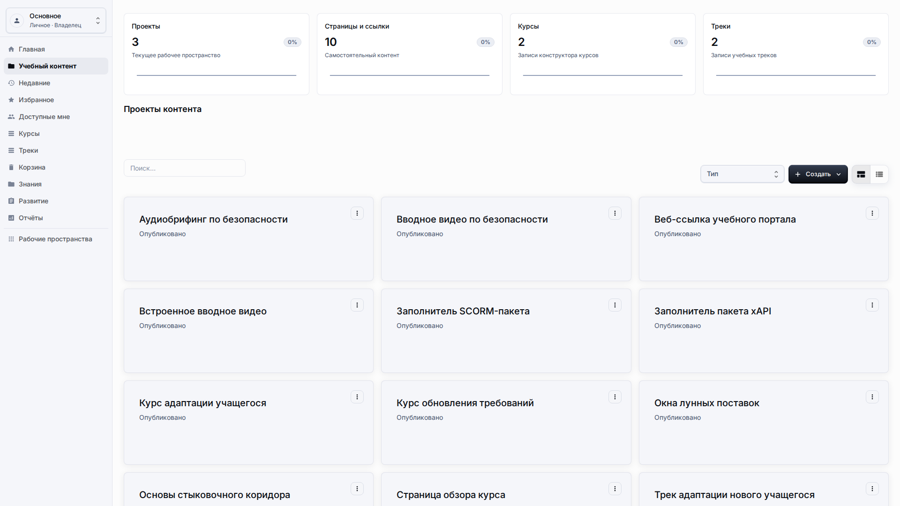
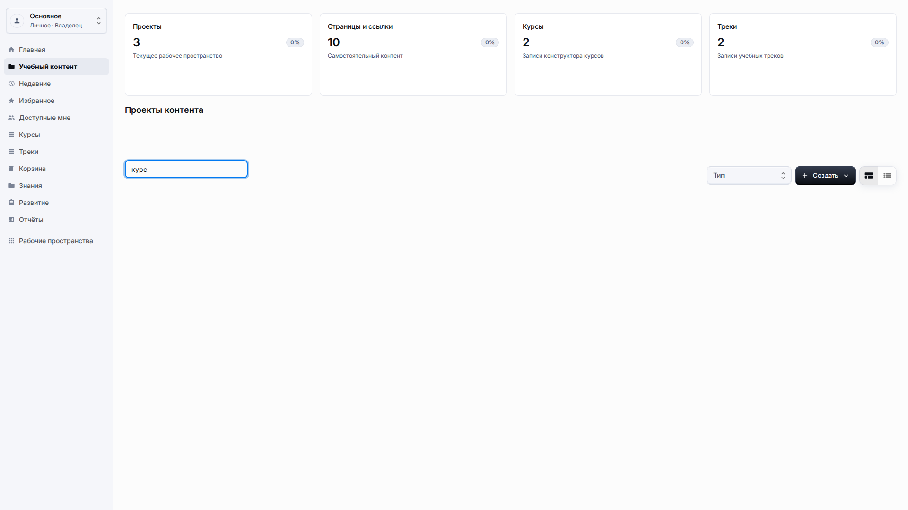
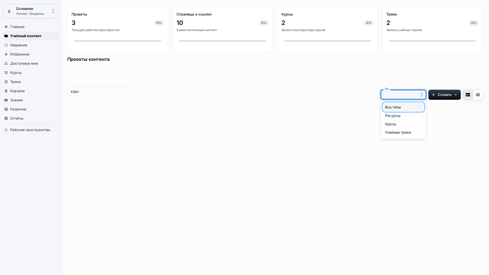
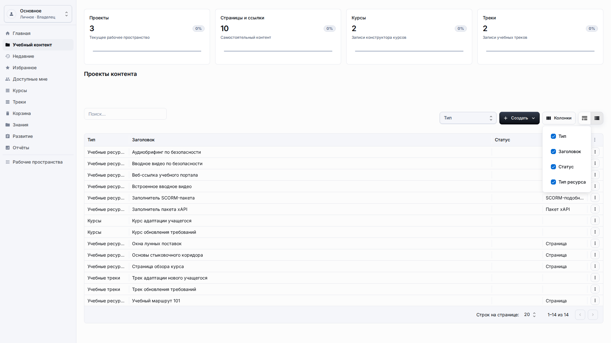
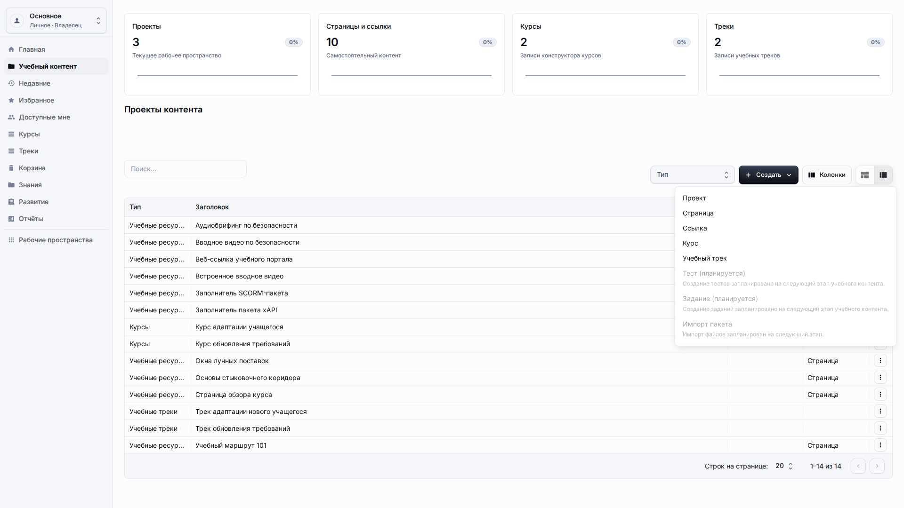
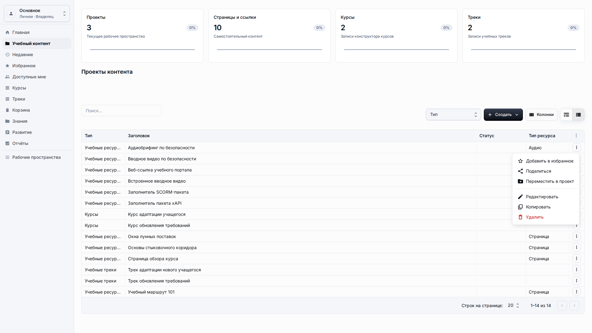

# Библиотека учебного контента

**Роль:** Преподаватель, автор контента или владелец рабочего пространства.

**Цель:** Находить, фильтровать, создавать и управлять ресурсами, курсами и учебными треками из единой библиотеки.

## Что нужно

-   Откройте раздел Учебный контент в боковом меню.
-   Проверьте, что выбрано рабочее пространство, где должен находиться контент.
-   Убедитесь, что у вас есть права на создание и редактирование контента.

## Рабочий процесс

1. Используйте Поиск, чтобы найти ресурс, курс, трек или проект по видимому названию.
   
2. Используйте фильтр Тип, чтобы сузить общий список до ресурсов, курсов или учебных треков.
   
3. Используйте Колонки, когда нужно показать или скрыть пользовательские бизнес-поля.
   
4. Используйте Создать, чтобы добавить проект, страницу, ссылку, курс или учебный трек из одной панели.
   
5. Используйте меню действий элемента для редактирования, копирования, общего доступа, перемещения в проект, удаления или восстановления.
   

## Детали экрана

| Область                 | Как использовать                                                                                                                                                                                                  |
| ----------------------- | ----------------------------------------------------------------------------------------------------------------------------------------------------------------------------------------------------------------- |
| Единый список           | Библиотека объединяет проекты, самостоятельные ресурсы, курсы и учебные треки в одном рабочем списке. Используйте тип и заголовок вместе, чтобы не открыть неправильную запись.                                   |
| Поведение поиска        | Поиск рассчитан на видимые заголовки, а не на внутренние коды. Очистите поиск перед созданием нового элемента, чтобы убедиться, что сохранённая строка появилась в списке.                                        |
| Колонки                 | Настройки колонок должны показывать только рабочие поля. Скрывайте лишние колонки для текущей задачи вместо горизонтального перетаскивания всей страницы.                                                         |
| Меню создания           | Кнопка создания открывает доступные типы контента для текущего рабочего пространства. Сначала выберите тип, затем заполните локализованные поля в диалоге.                                                        |
| Жизненный цикл элемента | Меню элемента используется для редактирования, копирования, общего доступа, перемещения в проект, удаления и восстановления. Каждое действие должно сохранять видимые названия и не требовать служебных значений. |

## Результат

Библиотека становится основным рабочим местом авторов учебного контента.

## Что проверить

Таблица должна показывать названия и метки, а не непонятные технические значения, даты в неправильном формате или внутренние имена полей.

## Связанные страницы

-   [Проекты](projects.md)
-   [Страницы и ссылки](resources-pages-links.md)
-   [Курсы](courses.md)
-   [Учебные треки](learning-tracks.md)
