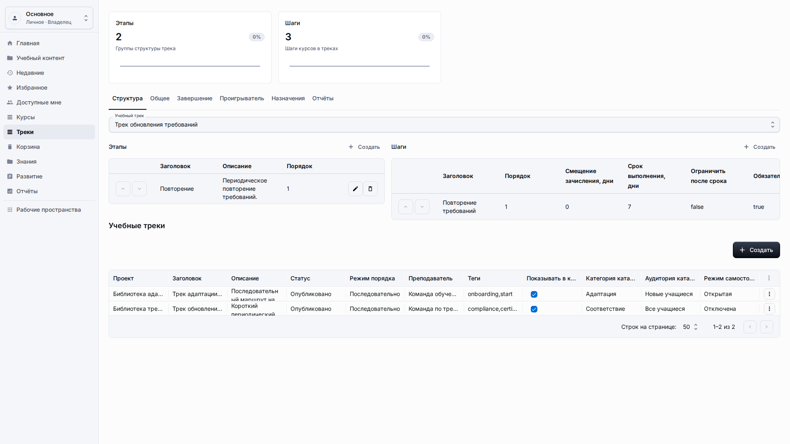
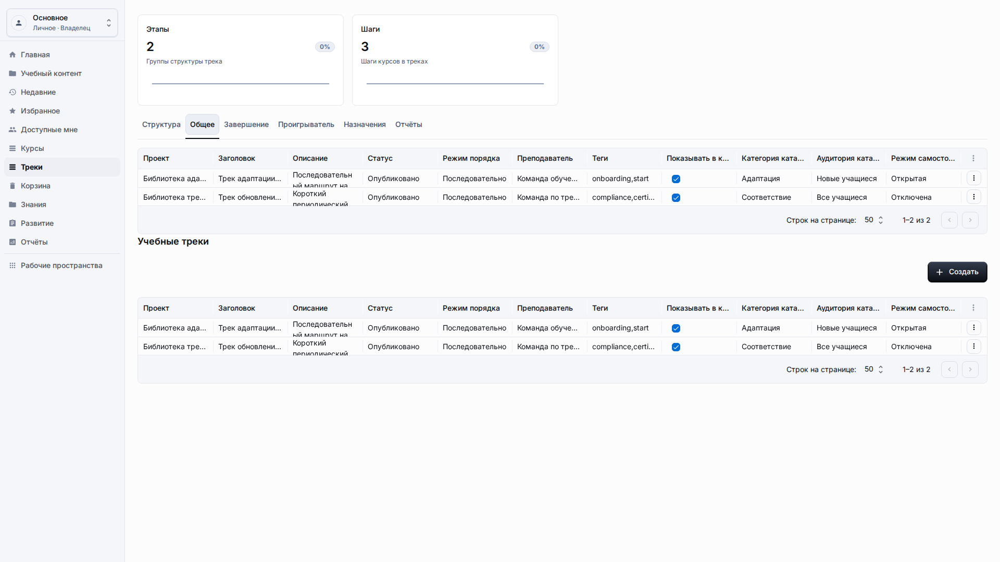
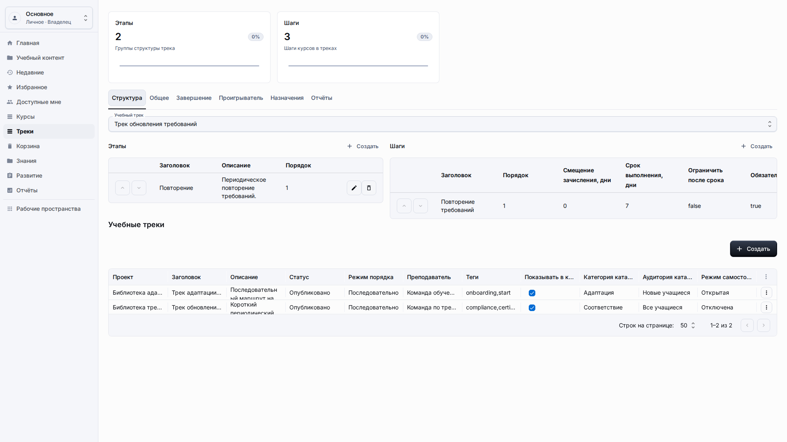
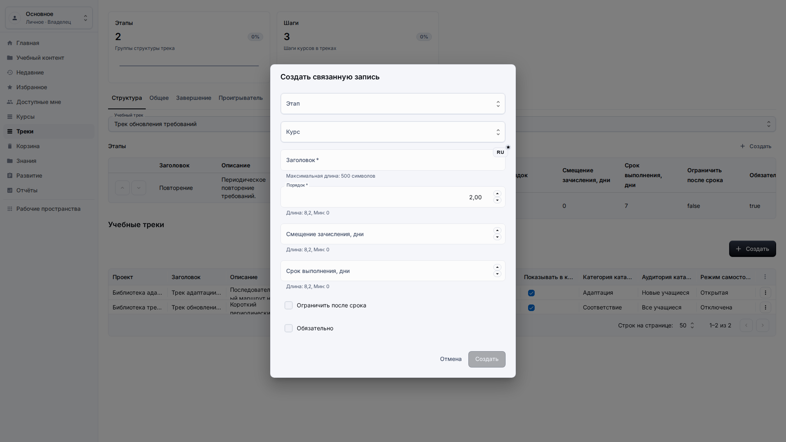
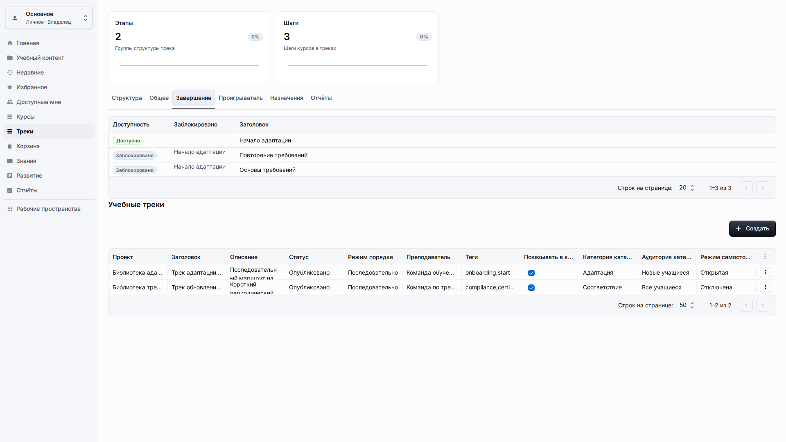
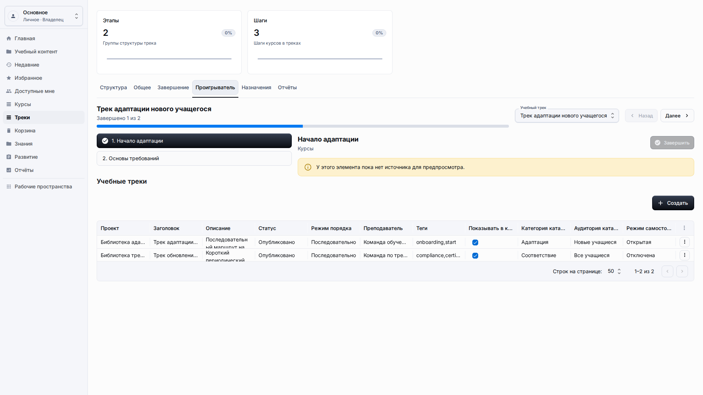

# Учебные треки

**Роль:** Преподаватель, автор контента или владелец рабочего пространства.

**Цель:** Создать упорядоченный путь обучения со стадиями, шагами и прогрессом учащегося.

## Что нужно

-   Подготовьте курсы или ресурсы, которые войдут в трек.
-   Откройте Треки в боковом меню или создайте трек из Учебного контента.
-   Выберите, проходят ли учащиеся трек в фиксированном или гибком порядке.

## Рабочий процесс

1. Откройте Треки, выберите трек и проверьте основные настройки: заголовок, описание, статус, владельца и фиксированный или гибкий порядок прохождения.
   
2. Откройте Структуру и создайте этапы для основных вех, понятных учащимся: адаптация, практика и итоговая проверка.
   
3. Добавьте шаги внутри выбранного этапа, укажите тип контента и выберите курс или ресурс по видимому названию.
   
4. Откройте Завершение и проверьте правила, по которым весь трек считается пройденным, включая обязательные шаги и требования к баллам.
   
5. Откройте Проигрыватель, запустите вид учащегося и убедитесь, что названия этапов, порядок шагов, прогресс и финальное завершение понятны.
   

## Детали экрана

| Область            | Как использовать                                                                                                                                      |
| ------------------ | ----------------------------------------------------------------------------------------------------------------------------------------------------- |
| Карточка трека     | Трек описывает более длинный путь из нескольких учебных элементов. Делайте заголовок ориентированным на результат, чтобы учащийся понимал назначение. |
| Этапы              | Этапы группируют шаги в контрольные точки. Используйте их для адаптации, обязательного обучения или уровней навыков.                                  |
| Шаги               | Каждый шаг должен ссылаться на контент по заголовку и находиться в нужном порядке. Проверяйте список после изменения порядка.                         |
| Правила завершения | Настройки завершения должны соответствовать логике пути. Не публикуйте трек, пока обязательные шаги и баллы не определены ясно.                       |
| Проверка учащегося | Откройте вид для учащегося и убедитесь, что названия этапов, порядок шагов и показатели прогресса понятны.                                            |

## Результат

Учебный трек проводит учащихся по многошаговому пути внутри текущего рабочего пространства. Авторы могут вернуться к тому же треку, изменить порядок этапов, заменить шаги или обновить правила завершения до начала обучения.

## Что проверить

Списки выбора шагов трека должны показывать названия и статусы, а не ID связей.

## Связанные страницы

-   [Курсы](courses.md)
-   [Опыт учащегося](learner-experience.md)
-   [Отчёты](reports.md)
