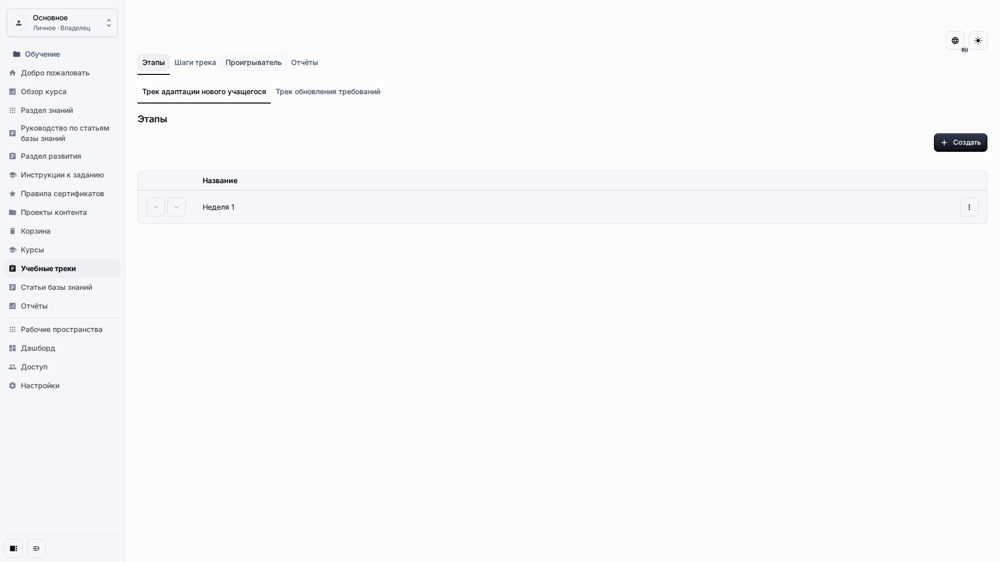
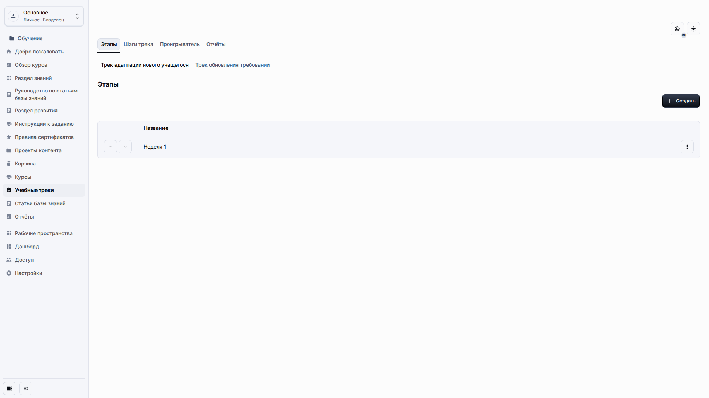
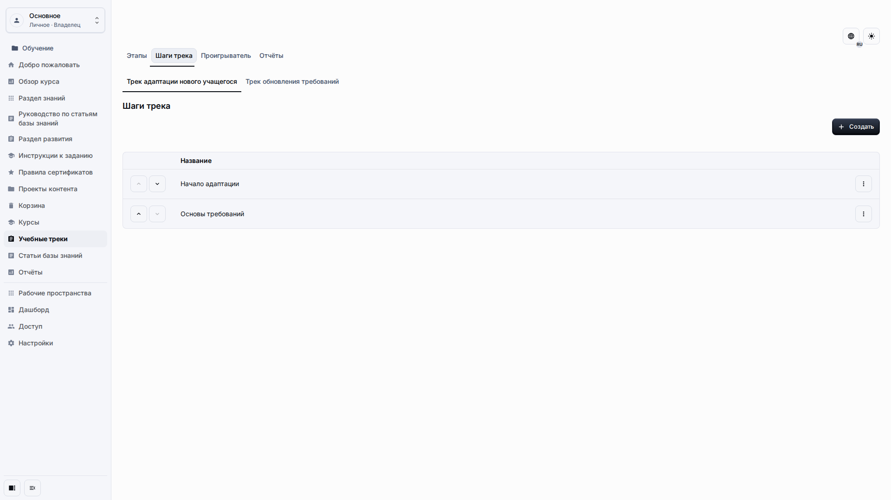
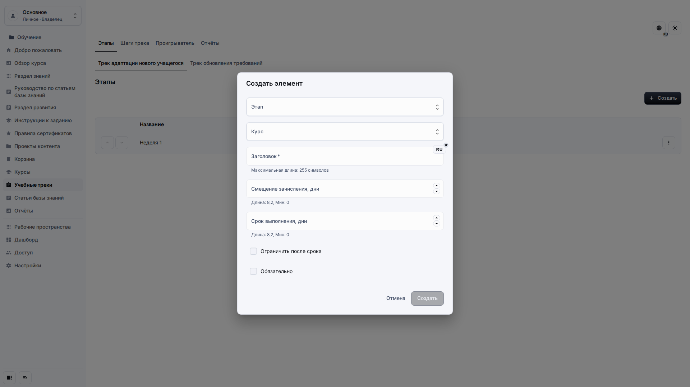
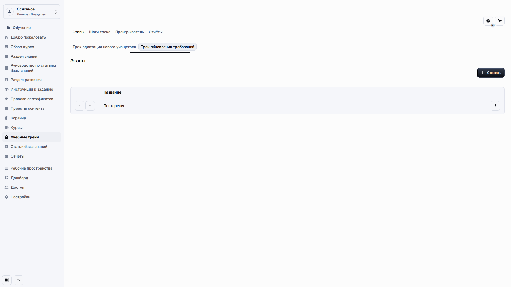
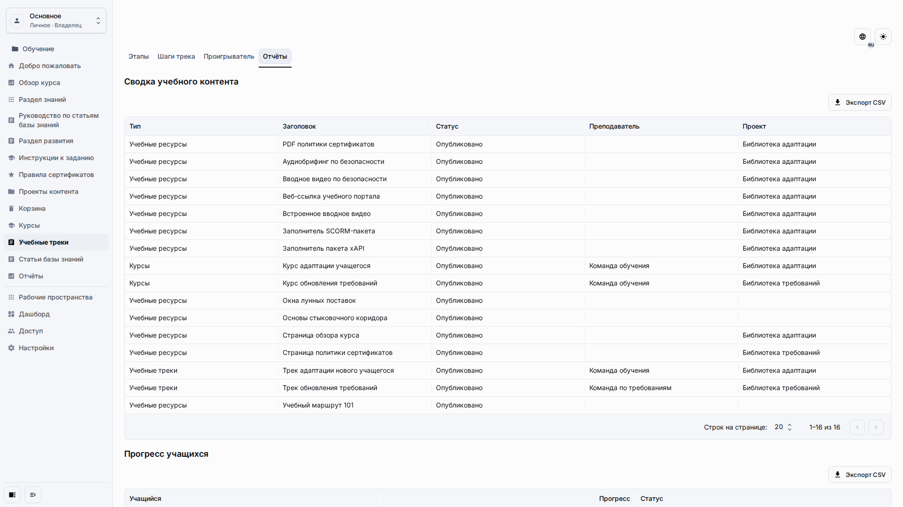

# Учебные треки

**Роль:** Преподаватель, автор контента или владелец рабочего пространства.

**Цель:** Создать упорядоченный путь обучения со стадиями, шагами и прогрессом учащегося.

## Что нужно

-   Подготовьте курсы или ресурсы, которые войдут в трек.
-   Откройте «Учебные треки» в боковом меню или создайте трек из проекта контента.
-   Выберите, проходят ли учащиеся трек в фиксированном или гибком порядке.

## Рабочий процесс

1. Откройте «Учебные треки» и выберите трек. На вкладке «Этапы» показан выбранный трек и упорядоченные этапы.
   
2. Откройте вкладку «Шаги трека», чтобы просмотреть шаги выбранного трека.
   
3. Нажмите «Создать» на вкладке «Шаги трека», чтобы открыть форму шага. Выбирайте связанный контент по понятному названию; если вы только проверяете поля, отмените создание.
   
4. Выберите другой трек по его названию, чтобы просмотреть его этапы или шаги, не покидая конструктор.
   
5. Откройте «Отчёты», чтобы просмотреть активность выбранного трека.
   

## Детали экрана

| Область                | Как использовать                                                                                                                             |
| ---------------------- | -------------------------------------------------------------------------------------------------------------------------------------------- |
| Выбор трека            | Выбранный трек определяет связанные этапы и шаги, показанные в конструкторе. Проверяйте контекст по его понятному названию.                  |
| Этапы                  | Проверяйте порядок этапов и используйте доступные действия для настройки учебного маршрута.                                                  |
| Шаги трека             | Просматривайте или создавайте шаги выбранного трека. Связанные записи должны отображаться по названиям, а не по техническим идентификаторам. |
| Проигрыватель и отчёты | Используйте «Проигрыватель» для проверки опыта учащегося, а «Отчёты» — для просмотра доступной активности трека.                             |

## Результат

Этапы и шаги трека хранятся как контент рабочего пространства. Конструктор показывает связанные записи выбранного трека, проигрыватель для учащегося и доступные отчёты на отдельных вкладках.

## Что проверить

Списки выбора шагов трека должны показывать названия и статусы, а не ID связей.

## Связанные страницы

-   [Курсы](courses.md)
-   [Опыт учащегося](learner-experience.md)
-   [Отчёты](reports.md)
