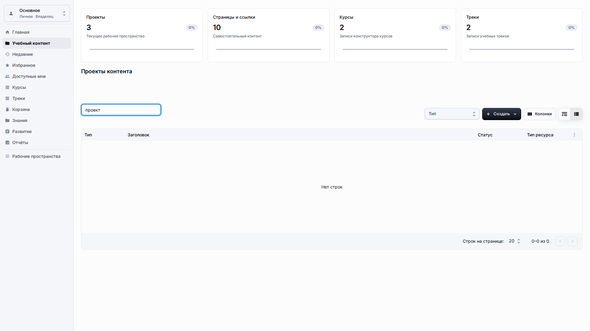
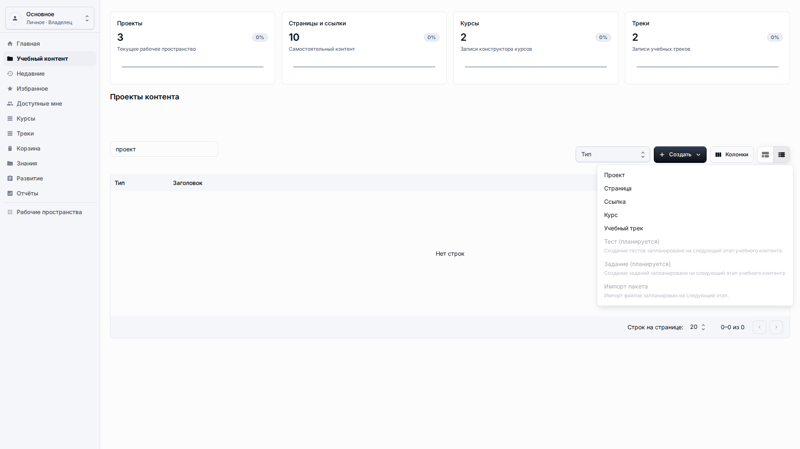
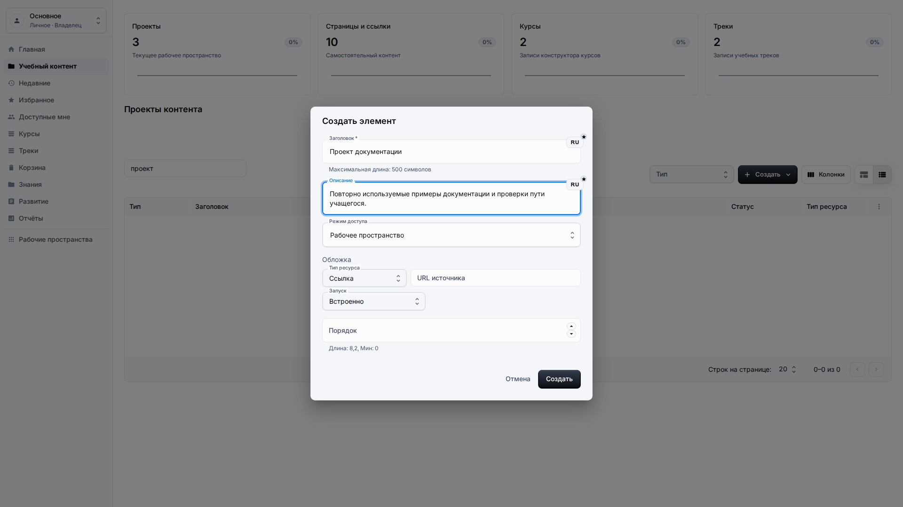
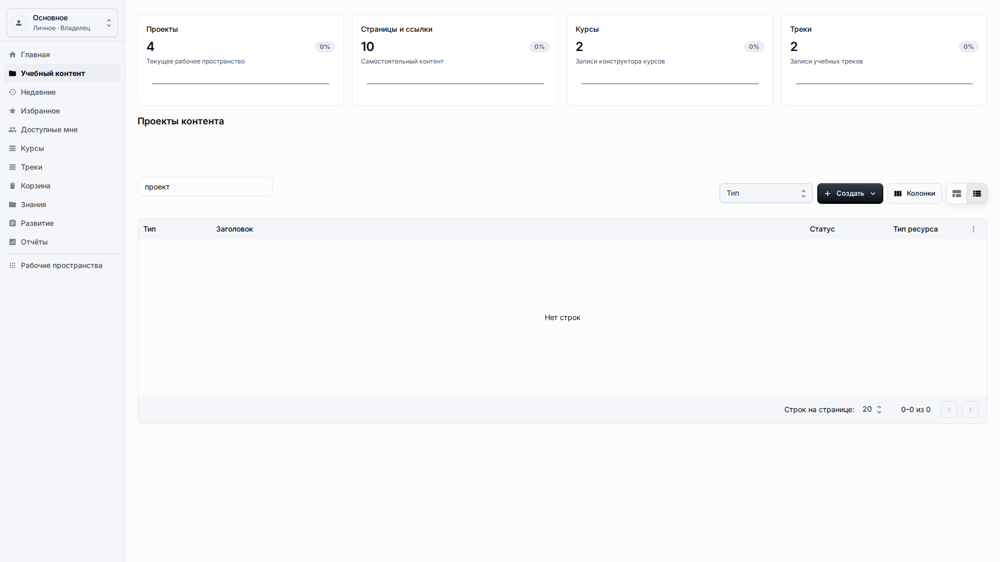
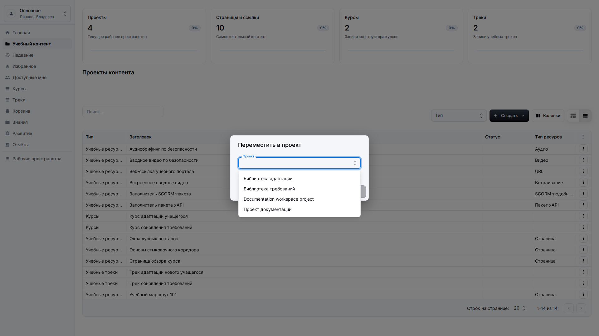
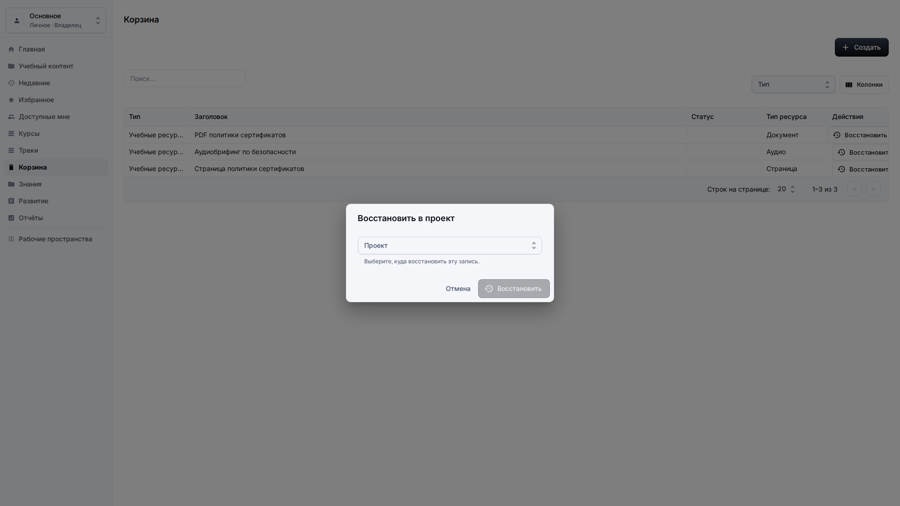

# Проекты

**Роль:** Преподаватель, автор контента или владелец рабочего пространства.

**Цель:** Создавать проектные контейнеры и группировать контент, не смешивая проекты с рабочими пространствами платформы.

## Что нужно

-   Откройте Учебный контент в правильном рабочем пространстве.
-   Определите название проекта и короткое назначение до создания.
-   Проверьте, должен ли контент остаться в текущем проекте или перейти в другой.

## Рабочий процесс

1. Откройте Создать и выберите Проект.
   
2. Введите понятное название и описание проекта, которое узнают другие авторы.
   
3. Сохраните проект и проверьте, что сводка Проекты увеличилась в текущем рабочем пространстве.
   
4. Откройте меню действий элемента контента и выберите Переместить в проект; новый проект должен появиться в списке выбора по названию.
   
5. Используйте Корзину и Восстановить, если проект или элемент удалили по ошибке.
   

## Детали экрана

| Область                  | Как использовать                                                                                                                                                                          |
| ------------------------ | ----------------------------------------------------------------------------------------------------------------------------------------------------------------------------------------- |
| Назначение проекта       | Проект группирует связанные ресурсы, курсы и треки внутри активного рабочего пространства. Используйте понятный заголовок, который другой автор узнает в фильтрах и диалогах перемещения. |
| Поля создания            | Заполните локализованный заголовок и описание перед сохранением. Описание должно объяснять, какой контент относится к проекту и кто его поддерживает.                                     |
| Сводка проектов          | После сохранения сводка Проекты должна увеличиться для текущего рабочего пространства. В диалогах перемещения и восстановления выбирайте проект по понятному названию.                    |
| Перемещение контента     | Используйте действие перемещения в проект, когда элемент относится к другому проекту. Выбирайте назначение по заголовку, а не по техническому ID.                                         |
| Корзина и восстановление | Удалённые проекты или элементы должны оставаться доступными для восстановления из корзины. Восстанавливайте в существующий проект, если исходный контейнер больше недоступен.             |

## Результат

Проекты группируют контент внутри выбранного рабочего пространства приложения.

## Что проверить

Перемещение контента должно использовать названия проектов в списках выбора, а не ID проектов.

## Связанные страницы

-   [Библиотека учебного контента](learning-content-library.md)
-   [Общий доступ, недавнее, избранное и корзина](sharing-recent-favorites-trash.md)
