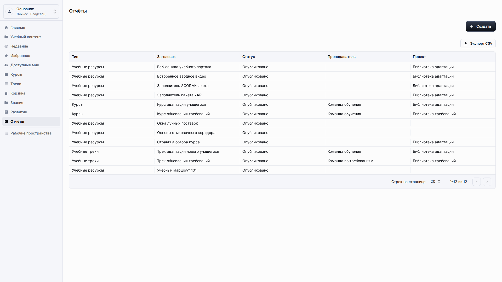
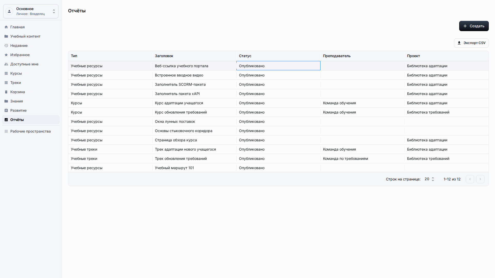
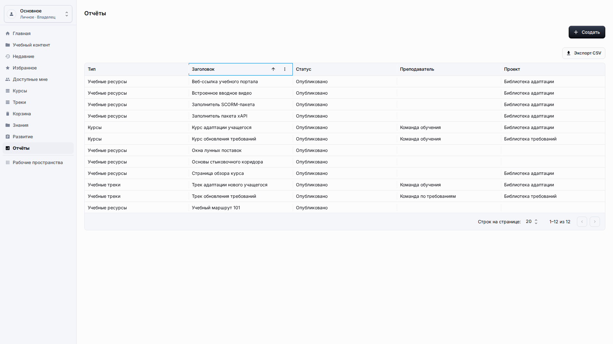
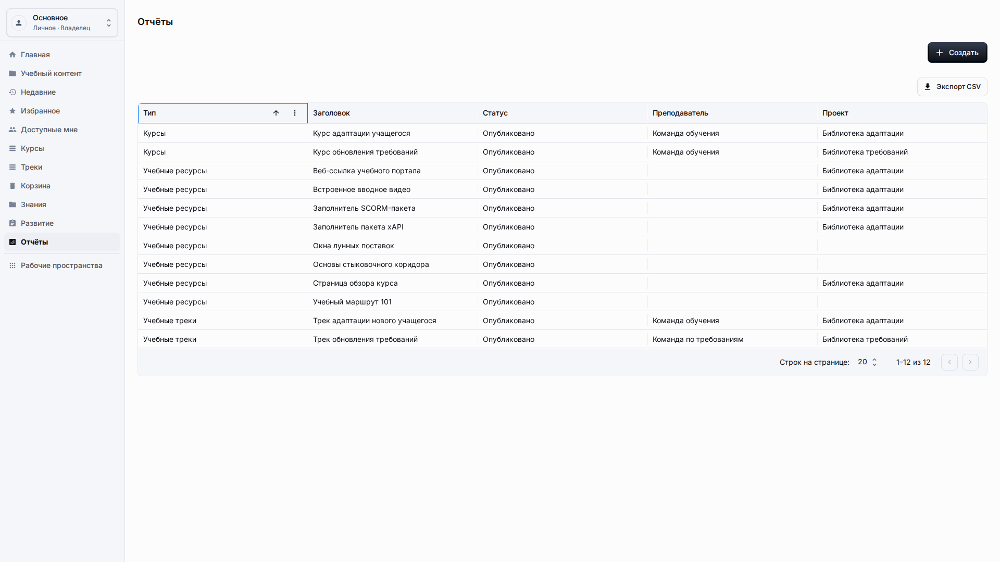
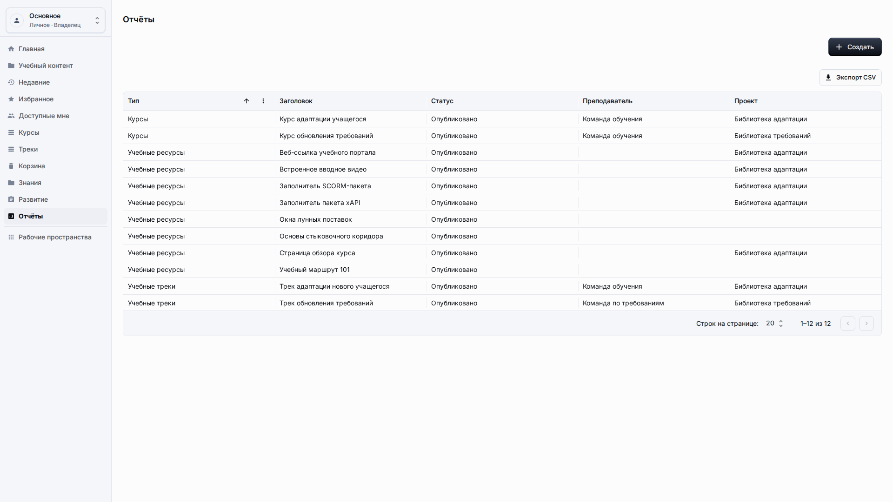
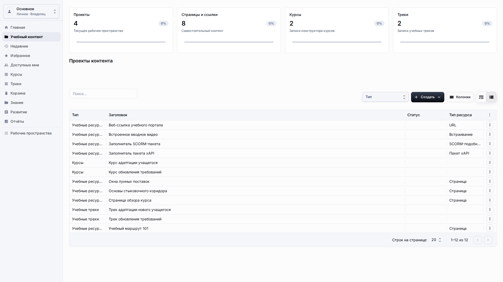

# Отчёты

**Роль:** Владелец рабочего пространства, преподаватель или пользователь отчётов.

**Цель:** Использовать таблицы отчётов для анализа учебного контента без отображения служебных деталей отчётов.

## Что нужно

-   Откройте Отчёты в боковом меню.
-   Проверьте, что выбранное рабочее пространство содержит данные для анализа.
-   Решите, нужно ли только прочитать таблицу или экспортировать её.

## Рабочий процесс

1. Откройте Отчёты в боковом меню и сфокусируйте первую понятную строку отчёта после загрузки таблицы.
   
2. Просмотрите колонки Тип, Заголовок, Статус, Преподаватель и Проект и убедитесь, что каждая строка читается без открытия технической записи.
   
3. Нажмите заголовок рабочей колонки, например Тип, чтобы отсортировать таблицу и проверить порядок под вашу задачу анализа.
   
4. Переведите фокус на действие Экспорт CSV и используйте его только после того, как строки на экране содержат ожидаемые данные для внешнего анализа.
   
5. Вернитесь в Учебный контент, если строка отчёта указывает на курс, трек или ресурс, который нужно исправить, затем снова откройте Отчёты и проверьте результат.
   

## Детали экрана

| Область                | Как использовать                                                                                                                           |
| ---------------------- | ------------------------------------------------------------------------------------------------------------------------------------------ |
| Загрузка отчёта        | Дождитесь завершения загрузки таблицы отчёта перед чтением итогов. Пустые диаграммы должны показывать локализованное состояние без данных. |
| Рабочие колонки        | Используйте тип, заголовок, статус, преподавателя, проект и поля завершения как рабочие показатели. Они должны читаться без ID.            |
| Сортировка             | Сортируйте видимые рабочие колонки перед экспортом или сравнением. Видимый порядок должен соответствовать вопросу, на который нужен ответ. |
| Использование экспорта | Используйте экспорт для внешнего анализа только после того, как экранный отчёт выглядит корректно. Не экспортируйте отладочные поля.       |
| Цикл исправления       | Если отчёт показывает неправильные данные контента, вернитесь на страницу исходного контента и исправьте рабочую запись там.               |

## Результат

Отчёты показывают пользовательские строки, которые можно сортировать и экспортировать без раскрытия сохранённой конфигурации отчёта. Исправление нужно делать в исходном разделе контента, а затем повторно проверять в Отчётах.

## Что проверить

Таблицы отчётов и CSV-экспорт должны показывать метки, а не служебные значения связей или скрытые определения отчётов.

## Связанные страницы

-   [Библиотека учебного контента](learning-content-library.md)
-   [Курсы](courses.md)
-   [Учебные треки](learning-tracks.md)
