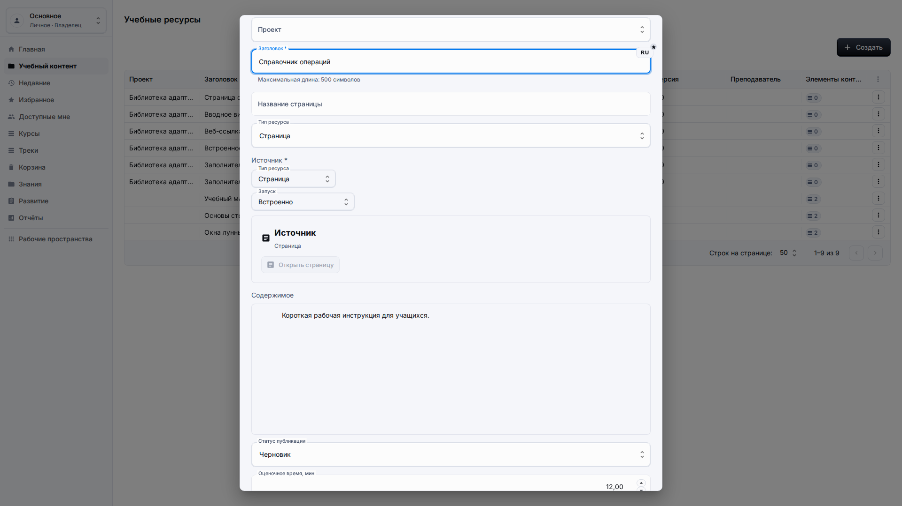
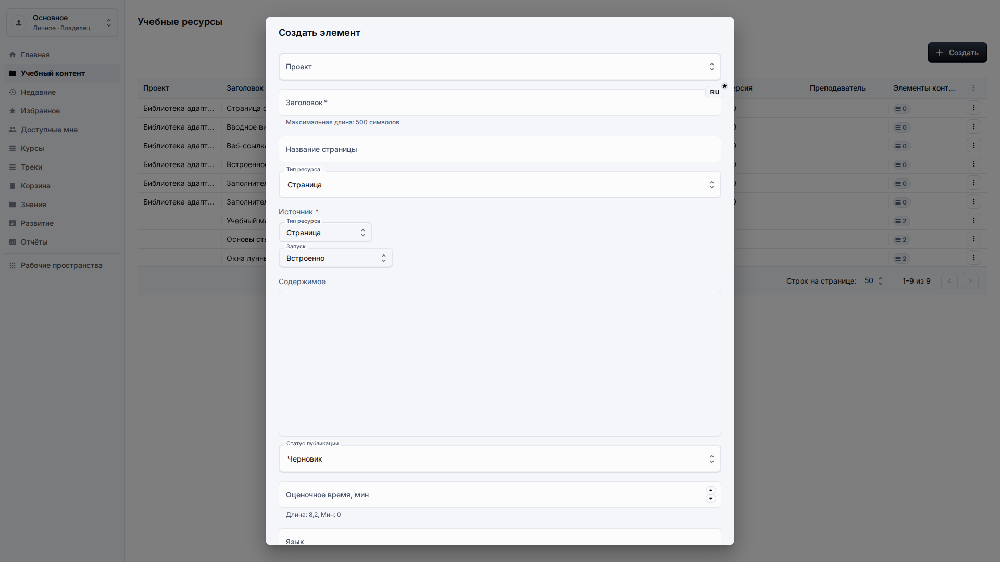
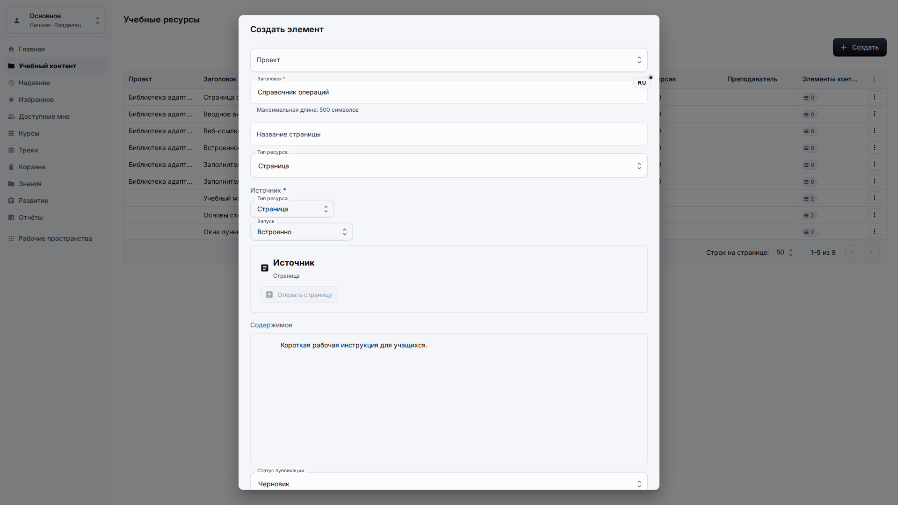
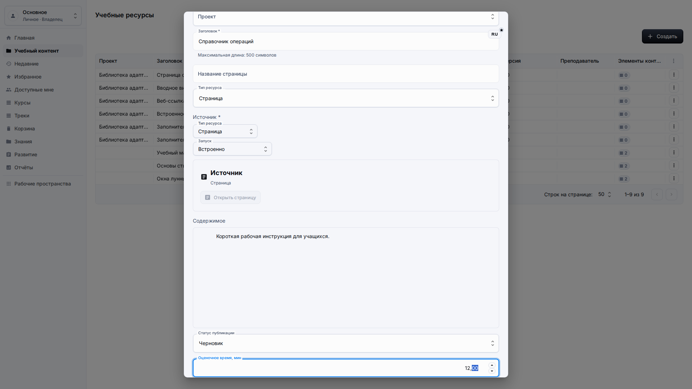
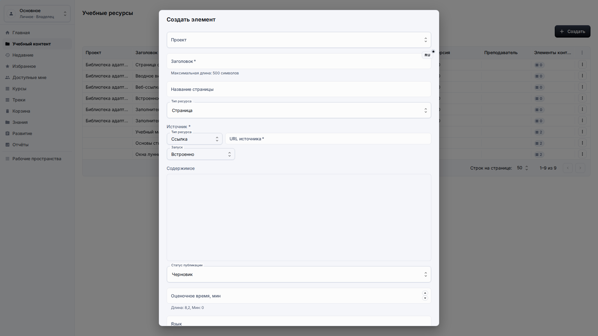
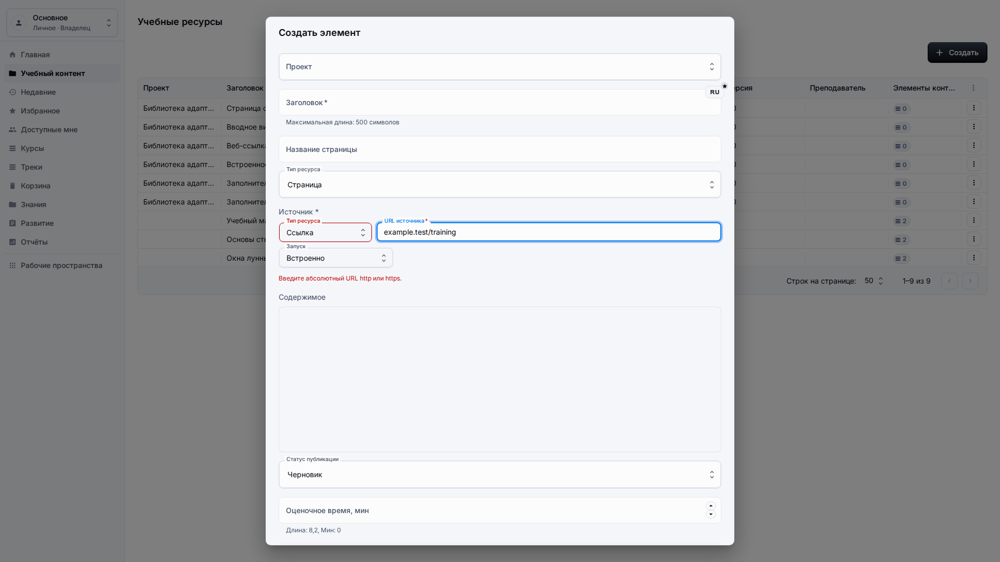

# Страницы и ссылки

**Роль:** Преподаватель или автор контента.

**Цель:** Создавать блочные страницы и проверенные веб-ссылки без редактирования служебных деталей ресурса.

## Что нужно

-   Откройте Учебный контент и выберите целевой проект при необходимости.
-   Подготовьте название, текст и URL источника или содержимое страницы.
-   Используйте только публичные веб-URL при создании ресурса-ссылки.

## Рабочий процесс

1. Откройте Создать и выберите Страница, когда нужен контент в блочном редакторе.
   
2. Заполните локализованное название и напишите содержимое в области редактора.
   
3. Используйте сводку ресурса, чтобы проверить содержимое страницы перед сохранением.
   
4. Откройте Создать и выберите Ссылка, когда учебный элемент ведёт на внешнюю веб-страницу.
   
5. Проверьте валидацию на неполном адресе, прочитайте локализованное сообщение, затем замените его полным URL с `https://` перед сохранением.
   

## Детали экрана

| Область          | Как использовать                                                                                                                                                              |
| ---------------- | ----------------------------------------------------------------------------------------------------------------------------------------------------------------------------- |
| Ресурсы-страницы | Используйте ресурс-страницу, когда учебный материал создаётся прямо в блочном редакторе. Заголовок должен быть локализованным и достаточно коротким для просмотра в таблицах. |
| Содержимое       | Пишите содержимое как материал для учащегося, а не как технические заметки. Длинные текстовые поля должны быть многострочными и удобными для редактирования.                  |
| Сводка ресурса   | Сводка ресурса подтверждает, является ли элемент страницей, ссылкой, встроенным ресурсом или документом до сохранения.                                                        |
| Ресурсы-ссылки   | Используйте ресурс-ссылку для утверждённых внешних страниц. Вводите полный адрес http или https и избегайте временных или приватных ссылок.                                   |
| Проверка ввода   | Сообщения проверки должны быть локализованными и понятными. На скриншоте намеренно показано состояние ошибки; исправьте адрес перед сохранением ресурса.                      |

## Результат

Авторы управляют страницами и ссылками через обычные элементы управления вместо служебных полей.

## Что проверить

Области источника, содержимого и проверки не должны показывать непонятные технические значения или неясные сообщения проверки.

## Связанные страницы

-   [Библиотека учебного контента](learning-content-library.md)
-   [Решение проблем](troubleshooting.md)
