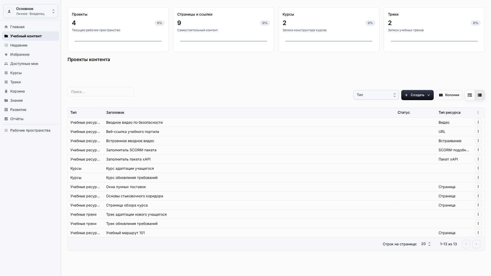
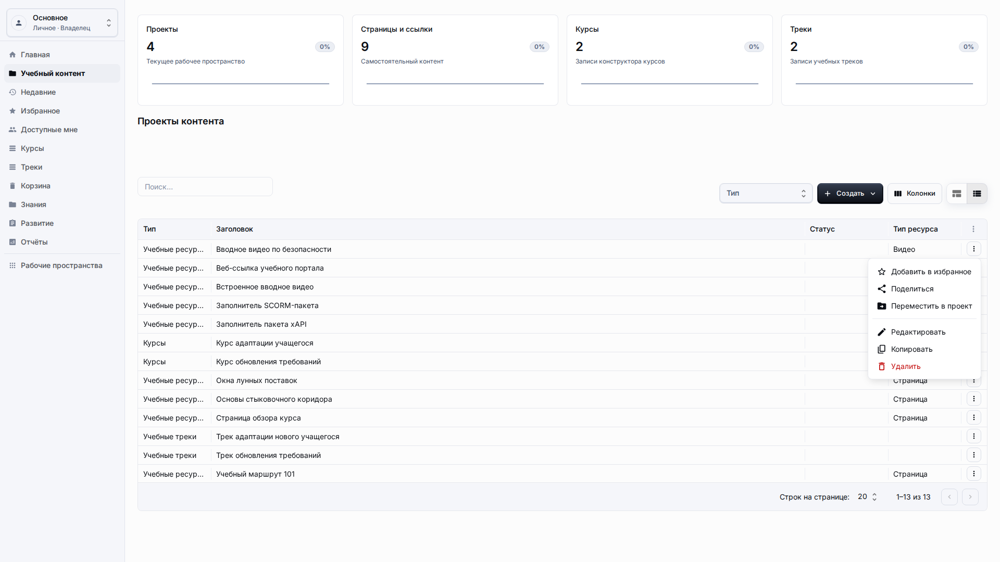
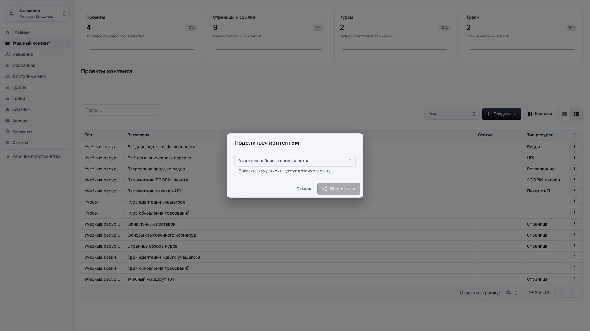
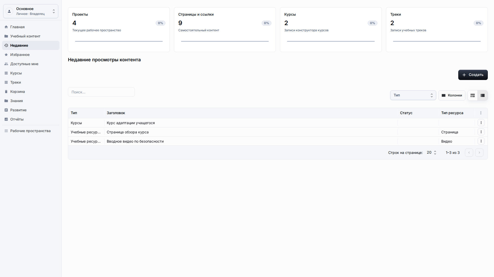
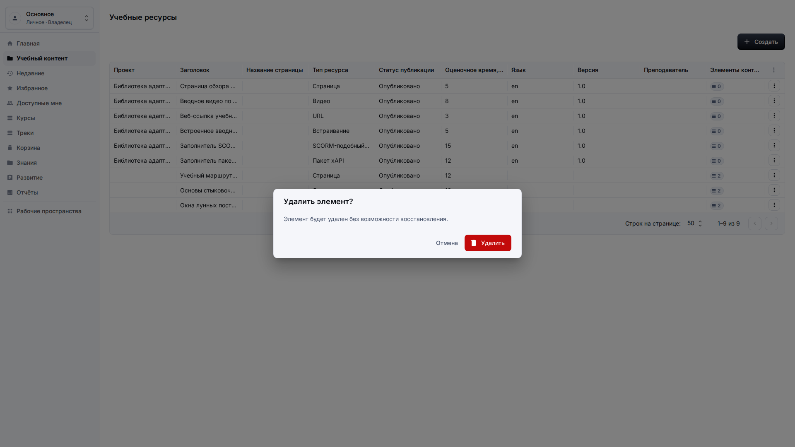
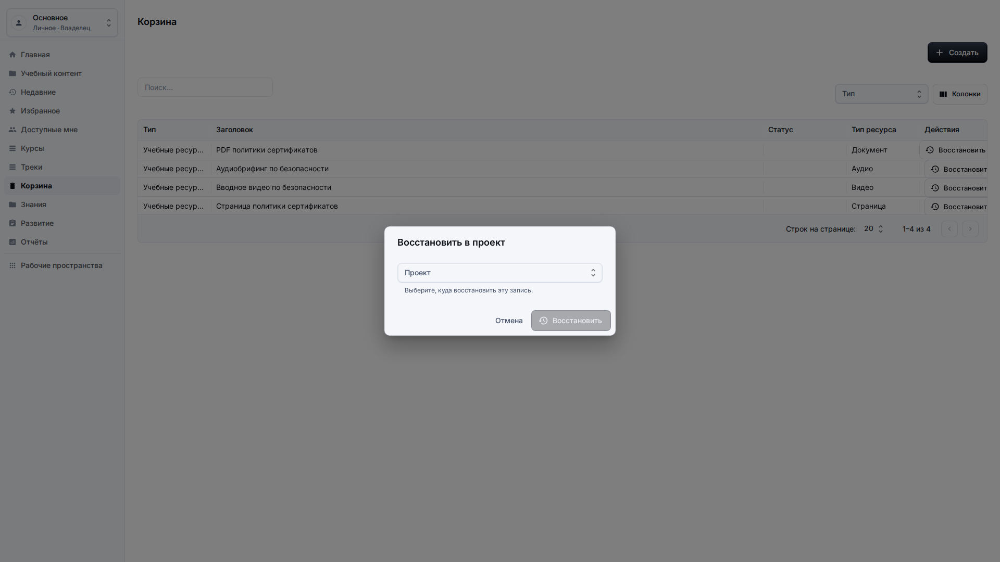

# Общий доступ, недавнее, избранное и корзина

**Роль:** Преподаватель, автор контента или владелец рабочего пространства.

**Цель:** Поддерживать полезные личные и общие представления контента, сохраняя безопасное удаление и восстановление.

## Что нужно

-   Откройте Учебный контент или отдельный раздел Недавние, Избранное, Доступные мне или Корзина.
-   Проверьте, что меню действий элемента относится к элементу, который вы хотите изменить.
-   Используйте восстановление только когда понимаете, куда должен вернуться элемент.

## Рабочий процесс

1. Откройте строку контента и используйте Избранное, когда хотите добавить элемент в личный список.
   
2. Используйте Поделиться, когда другому участнику рабочего пространства нужен доступ к элементу.
   
3. Используйте Недавние, чтобы вернуться к контенту, который вы открывали или завершали ранее.
   
4. Используйте Удалить, когда элемент должен исчезнуть из активных списков, но может понадобиться восстановление.
   
5. Откройте Корзину, выберите Восстановить и укажите действующий проект, если исходный контейнер больше недоступен.
   

## Детали экрана

| Область        | Как использовать                                                                                                                                                 |
| -------------- | ---------------------------------------------------------------------------------------------------------------------------------------------------------------- |
| Избранное      | Избранное является личным быстрым доступом. Используйте его для записей, которые часто проверяете, а не вместо организации по проектам.                          |
| Общий доступ   | Предоставляйте доступ только участникам рабочего пространства, которым он действительно нужен. Перед сохранением проверьте получателя по имени и роли.           |
| Недавнее       | Недавнее помогает вернуться к контенту, который вы открывали или завершали раньше. Там должны быть понятные заголовки без ID сессий.                             |
| Удаление       | Удаление убирает элемент из активных списков, но должно оставлять запись для восстановления в корзине, если это разрешено политикой.                             |
| Восстановление | Восстановление должно запросить действующее назначение, если исходный проект недоступен. После восстановления проверьте, что элемент вернулся в активный список. |

## Результат

Действия жизненного цикла остаются обратимыми там, где платформа поддерживает восстановление.

## Что проверить

Диалоги общего доступа, перемещения, удаления и восстановления должны использовать понятные названия и безопасно отклонять неверные цели.

## Связанные страницы

-   [Библиотека учебного контента](learning-content-library.md)
-   [Проекты](projects.md)
-   [Решение проблем](troubleshooting.md)
