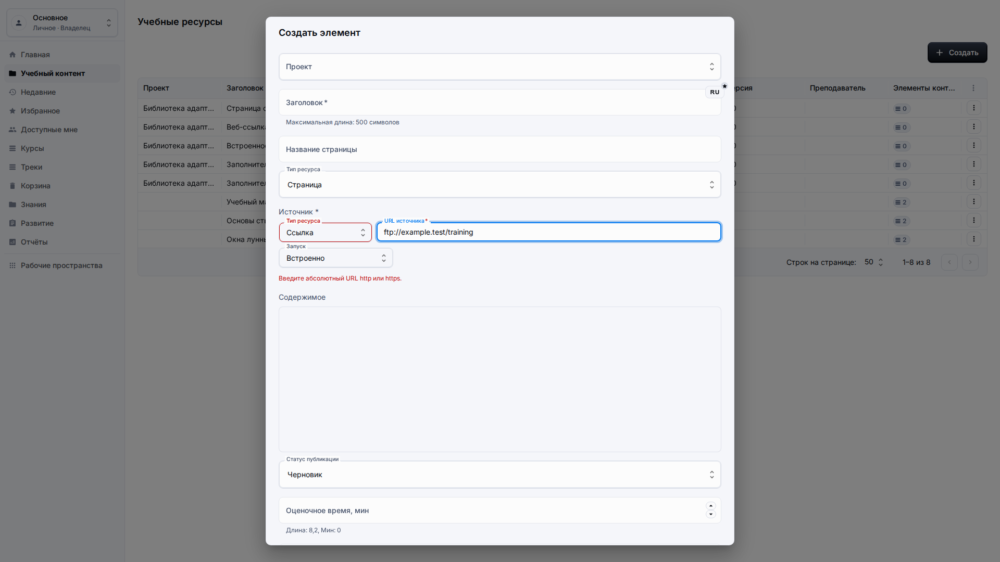
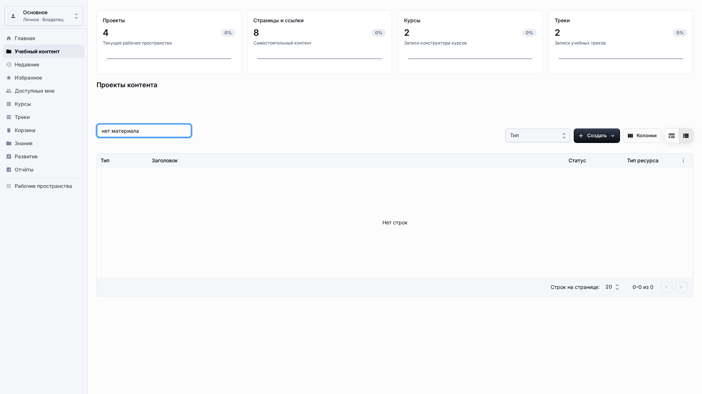
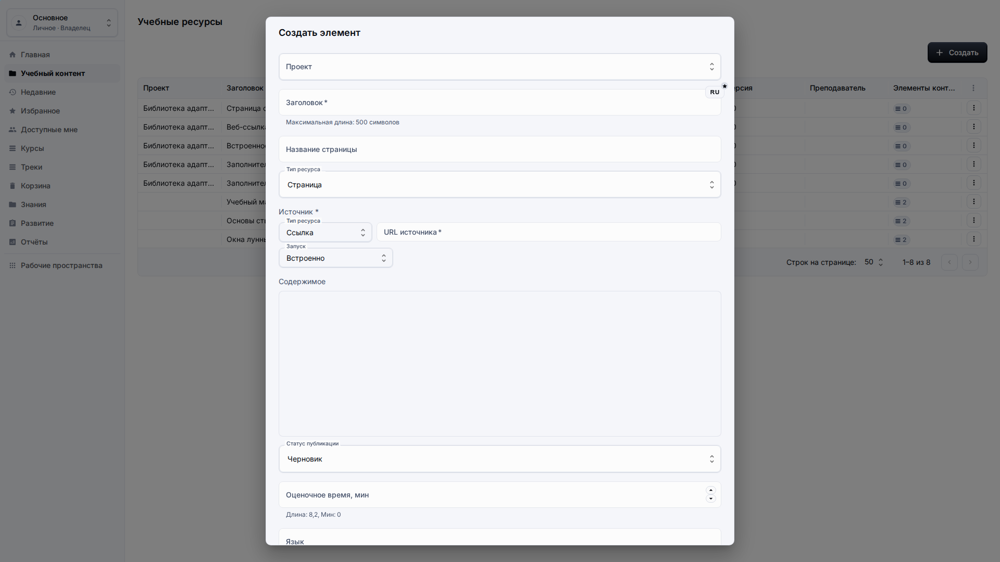
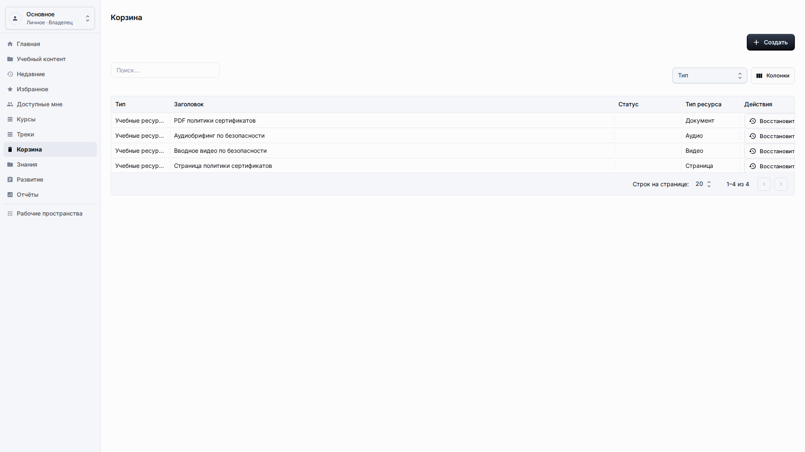
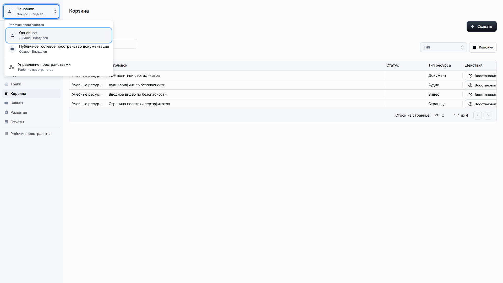

# Решение проблем

**Роль:** Любой пользователь LMS перед обращением к администратору.

**Цель:** Решить частые проблемы без изменения настроек приложения и редактирования скрытых полей.

## Что нужно

-   Оставайтесь внутри опубликованного приложения, если администратор не попросил открыть экраны настройки.
-   Запишите видимое сообщение и раздел, где оно появилось.
-   Не копируйте технические значения или скрытые поля в обычные поля контента.

## Рабочий процесс

1. Если контент не виден, сначала проверьте меню рабочего пространства и активные фильтры.
   
2. Если кнопка сохранения недоступна, проверьте локализованные сообщения проверки рядом с полем.
   
3. Если ресурс-ссылка не проходит проверку, замените её абсолютным URL http или https.
   
4. Если строку удалили, откройте Корзину и восстановите её в действующий проект.
   
5. Если страница прокручивается горизонтально или показывает непонятные технические значения, зафиксируйте видимый экран и сообщите об этом как о дефекте продукта.
   

## Детали экрана

| Область                | Как использовать                                                                                                                                                             |
| ---------------------- | ---------------------------------------------------------------------------------------------------------------------------------------------------------------------------- |
| Пропавший контент      | Проверьте рабочее пространство, текст поиска, фильтр типа и корзину, прежде чем считать запись потерянной. Многие проблемы связаны с неверным контекстом.                    |
| Недоступное сохранение | Ищите локализованную проверку рядом с полем. Обязательные заголовки, неверные ссылки и отсутствующие связи должны объяснять, что исправить.                                  |
| Неверная ссылка        | Ресурс-ссылка должен использовать полный адрес http или https. Исправьте неполные адреса перед сохранением.                                                                  |
| Удалённые строки       | Используйте корзину для восстановления. Восстановление должно использовать действующее назначение, если исходного проекта больше нет.                                        |
| Визуальные дефекты     | Сообщайте о горизонтальной прокрутке всей страницы, непонятных технических значениях, датах в неправильном формате или непереведённых сообщениях с полноэкранным скриншотом. |

## Результат

Большинство пользовательских проблем можно диагностировать по видимому состоянию рабочего пространства, фильтров, проверки и корзины.

## Что проверить

Обычному пользователю не должно требоваться решать проблемы LMS через редактирование непонятных технических значений, скрытых полей или служебных обозначений.

## Связанные страницы

-   [Навигация](getting-around.md)
-   [Библиотека учебного контента](learning-content-library.md)
-   [Гостевой доступ](guest-access.md)
