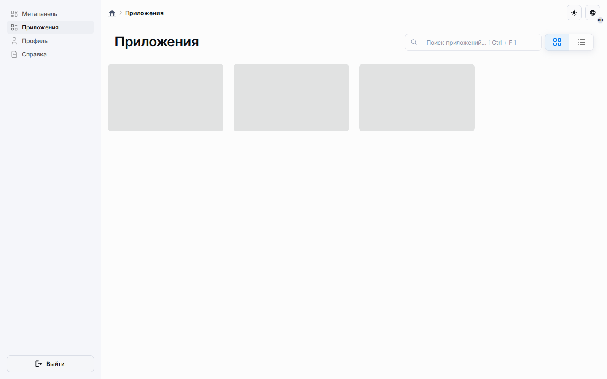

# Платформа

Этот раздел описывает Universo Platformo такой,
какой она существует в репозитории сегодня.

## Текущий охват

| Слой | Текущее состояние |
| --- | --- |
| Платформенная оболочка | Работает в этом репозитории. |
| Аутентификация и onboarding | Работают в этом репозитории. |
| Профили и административные потоки | Работают в этом репозитории. |
| Метахабы, публикации, приложения | Работают в этом репозитории. |
| Система LMS | Работает в этом репозитории. |
| Типы сущностей (Хабы, Объекты, Наборы, Перечисления, Страницы, Регистры) | Работают в этом репозитории. |
| Рабочие пространства и коннекторы | Работают в этом репозитории. |
| Система скриптов | Работает в этом репозитории. |

## Как читать раздел

Читайте страницы этого раздела как документацию текущей реализации.
