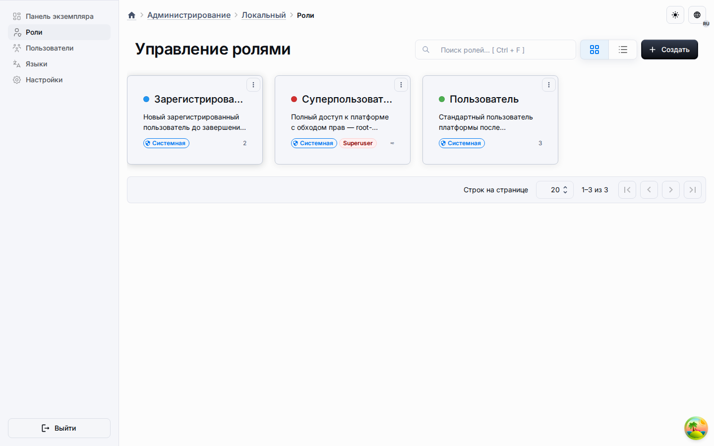

# Администрирование

Административная поверхность — это глобальный уровень управления платформой.
Именно здесь операторы управляют общеплатформенными ролями, пользователями, локалями, экземплярами и настройками, которые не должны жить внутри одного метахаба или одного приложения.

## Чем управляет администрирование

- глобальными ролями и разрешениями;
- глобальными пользователями и конфигурацией локалей;
- поверхностями управления на уровне экземпляра;
- платформенными политиками, которые потребляются метахабами и приложениями;
- административными настройками представления диалогов для области `/admin`.

## Категории настроек

Область административных настроек организована по категориям, чтобы глобальные политики не смешивались с локальными настройками продукта.

| Категория | Назначение |
| --- | --- |
| Общие | Настройки представления диалогов для административной области. |
| Метахабы | Глобальные политики, влияющие на поведение метахабов. |
| Приложения | Глобальные политики, влияющие на поведение приложений. |

## Общие настройки диалогов

Вкладка «Общие» — это административный эквивалент настроек диалогов метахаба и приложения.
Она хранит те же четыре элемента управления представлением диалогов для области маршрутов `/admin`.

| Настройка | Значение |
| --- | --- |
| Предустановка размера диалога | Базовая ширина административных диалогов. |
| Полноэкранный режим | Показывают ли административные диалоги элементы полноэкранного режима. |
| Изменение размера | Показывают ли административные диалоги элемент изменения размера. |
| Поведение закрытия | Остаются ли административные диалоги строгими модальными окнами или разрешают закрытие по клику вне окна. |

## Приоритет областей

Три области настроек диалогов намеренно независимы друг от друга.

| Область маршрутов | Источник истины |
| --- | --- |
| `/admin` | Общие настройки административных диалогов. |
| `/metahub/:metahubId/...` | Общие настройки диалогов метахаба. |
| `/a/:applicationId/admin` | Настройки диалогов приложения. |

Это означает, что изменение административных значений по умолчанию не переписывает молча диалоги создания метахаба или диалоги панели управления приложения.

## Почему глобальные политики важны

Некоторое поведение должно оставаться управляемым платформой даже тогда, когда существуют локальные области.
Например, управление системными компонентами разрешается из административных настроек и затем применяется бэкенд-хелперами политик на стороне метахаба.
Именно поэтому административные страницы документируют платформенные политики, а страницы метахабов документируют поведение создания.

## Рекомендуемое использование

- Используйте общие административные настройки, чтобы стандартизовать работу операторов платформы внутри `/admin`.
- Используйте настройки метахаба, когда проектной команде нужно другое поведение диалогов создания для конкретного метахаба.
- Используйте настройки приложения, когда конкретная панель управления приложения должна вести себя иначе, чем остальная платформа.

Для локального создания и рантайм-потока продолжайте с [Метахабы](metahubs.md) и [Приложения](applications.md).
