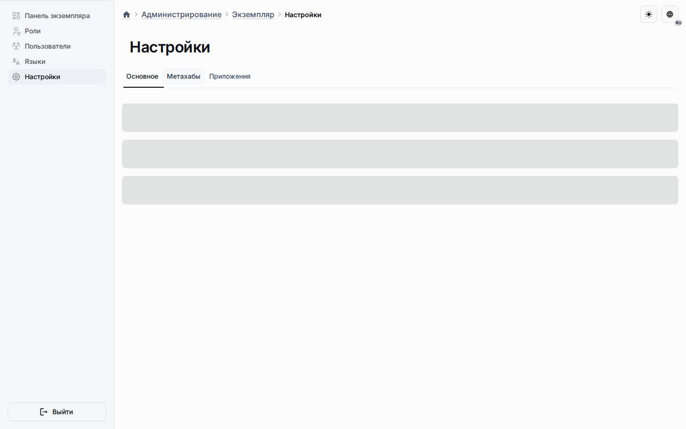

# Аналитика и наблюдаемость

Аналитика в Universo Platformo сейчас означает операционные сигналы, которые
помогают проверять запросы, миграции, публикации, приложения и границы доступа.

## Сигналы текущего репозитория

Репозиторий уже делает акцент на обработке запросов, контроле доступа,
миграциях, валидации, OpenAPI-поверхности и административных потоках. Это и есть
предпосылки для любой серьёзной аналитики и наблюдаемости.

## Текущие границы

- Операционные метрики для модулей платформы и инсталляций.
- Лучшая видимость поведения публикаций и приложений.
- Контуры обратной связи для планирования, управляемости и качества исполнения.
- Общие определения, делающие аналитику переносимой между стеками.

Так аналитика остаётся привязанной к работе платформы и качеству исполнения.

