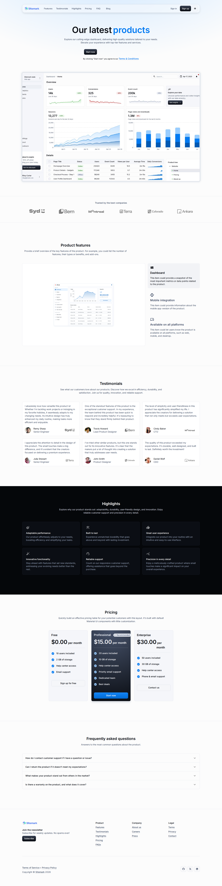

# Шаблон маркетинговой страницы

Шаблон `marketing-page` — это лендинг опубликованного приложения на базе изолированного пакета `@universo-react/apps-template-mui` и MUI 9. Он сохраняет композицию официального примера MUI marketing-page, но весь текст, ссылки, ссылки на медиа, порядок и видимость получает из сущностей метахаба.

## Создание метахаба

1. Откройте **Метахабы → Создать**.
2. Выберите **Маркетинговая страница** в локализованном выборе шаблона.
3. Оставьте включёнными стандартные пресеты Хаб, Объект, Страница, Набор и Перечисление.
4. Создайте метахаб, опубликуйте версию и создайте приложение на основе публикации.

Версии манифеста и снимка схемы не изменяются. Встроенный seed является только исходным демо; редакторы могут менять записи через обычную поверхность редактирования Объектов.

## Модель сущностей seed

Шаблон использует стандартные сущности Объектов, а не новый специальный тип маркетинговой сущности:

| Объект                    | Контент                                                        |
| ------------------------- | -------------------------------------------------------------- |
| MarketingPageSection      | Локализованные заголовки секций, порядок и видимость           |
| MarketingPageSiteSettings | Единичные бренд, первый экран, подвал, рассылка и legal-тексты |
| MarketingPageLogo         | Шесть упорядоченных логотипов клиентов и альтернативный текст  |
| MarketingPageFeature      | Три возможности, иконки, описания и превью                     |
| MarketingPageTestimonial  | Шесть локализованных отзывов, авторов, должностей и аватаров   |
| MarketingPageHighlight    | Шесть локализованных преимуществ и иконок                      |
| MarketingPagePricing      | Три тарифа с преимуществами 4/6/4 и безопасными CTA            |
| MarketingPageFaq          | Четыре локализованных вопроса и ответа                         |
| MarketingPageNavigation   | Упорядоченные цели навигации                                   |
| MarketingPageFooterLink   | Сгруппированные ссылки подвала, legal и социальных сетей       |

Длинные описания, отзывы, ответы и текст подвала в панели редактируются многострочными полями. Внутренние UUID, колонки компонентов и семантические codename не показываются как обычные значения.

## Рантайм и настройки приложения

Макет приложения хранит неизменяемый ключ шаблона `marketing-page` и типизированную настройку внешнего вида:

-   системная, светлая или тёмная тема;
-   необязательные hex-цвета primary и accent;
-   видимость первого экрана, логотипов, возможностей, отзывов, преимуществ, тарифов, FAQ и подвала.

Настройки макета приложения меняют только представление. Контент принадлежит опубликованным записям Объектов. Зонные виджеты дашборда для шаблона не материализуются. Неизвестные ключи, неверная конфигурация, небезопасные URL и повреждённые медиа завершаются безопасной ошибкой, а не переключением на дашборд.

Hosted-маршрут выбирает шаблон до инициализации CRUD-состояния дашборда. Runtime приложения владеет уровнем `AppMainLayout`, чтобы применить сохранённые настройки внешнего вида; сам renderer не создаёт ещё один ThemeProvider. Для прямого предпросмотра шаблона эквивалентным provider владеет standalone-shell.

## Действия и медиа

Действия типизированы как внутренний путь, именованный якорь, внешний HTTP(S)-URL, email или телефон. Отклоняются placeholder `#`, `javascript:`, `data:`, protocol-relative, URL с учётными данными и произвольные endpoint. Для внешних ссылок в новой вкладке выставляется `noopener noreferrer`. Отсутствующее или заблокированное медиа отображается локализованным fallback без показа сырого URL или object.

Seed рассылки использует существующее действие регистрации. Новый API хранения
лидов не создаётся: опубликованный runtime показывает CTA-навигацию и не
показывает поле email, пока хост не предоставит утверждённую same-origin
возможность отправки. Это не позволяет молча потерять введённый адрес или
поместить его в URL/историю.

## Проверка

Используйте детерминированный lifecycle и браузерные проверки из руководства [Браузерное E2E-тестирование](../guides/browser-e2e-testing.md): создайте метахаб, опубликуйте и синхронизируйте приложение, откройте рантайм, измените seeded Объект и после перезагрузки проверьте локализованное значение. Marketing matrix должна находиться в `specs/matrix/**`, чтобы её запускали проекты EN/RU и светлой/тёмной темы.

Минимально проверьте:

-   порядок секций и базовые количества (6 логотипов, 3 возможности, 6 отзывов, 6 преимуществ, 3 тарифа с 4/6/4 преимуществами и 4 FAQ);
-   клавиатурную навигацию, семантику accordion, локализованные подписи и `<html lang>`;
-   светлую/тёмную тему и длинный русский текст на desktop, tablet и mobile;
-   отсутствие горизонтального переполнения страницы, утечки UUID/JSON/object, небезопасных ссылок и ошибок console/page;
-   сохранность `templateKey` и appearance config при restore снимка и синхронизации приложения.

Минимальный профиль Supabase проверяет SQL/RLS и безопасную обработку seeded-ссылок на URL-медиа. Ресурсы MUI/Webflow находятся во внешней сети, поэтому визуальные прогоны требуют доступности сети; детерминированные локальные/Storage-медиа и поведение Storage API/imgproxy проверяются отдельным full-stack набором.
