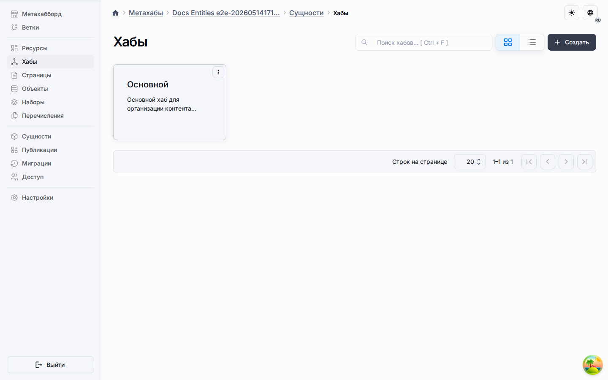

# Метахабы

Метахабы являются проектным источником истины для структур, ресурсов, скриптов и контента, готового к публикации.
Это не просто папки: каждый метахаб владеет моделью настройки, которая позже становится данными публикации и состоянием рантайма приложения.

## Чем владеет метахаб

- ветвями для проектной эволюции;
- типами сущностей, экземплярами сущностей, определениями полей, фиксированными значениями, записями и другими проектными ресурсами;
- выделенным рабочим пространством ресурсов, включая общие макеты, переиспользуемые пулы метаданных и переиспользуемые скрипты;
- скриптами, прикреплёнными на уровне ресурсов, метахаба или сущности;
- публикациями, которые упаковывают текущее утверждённое состояние.

## Основные поверхности проектирования

| Поверхность | Назначение |
| --- | --- |
| Ресурсы | Настройка общих макетов, переиспользуемых ресурсов метаданных и переиспользуемых скриптов из одной выделенной поверхности. |
| Сущности | Настройка стандартных и пользовательских типов из единого рабочего пространства сущностей. |
| Ветви | Отдельные проектные линии изменений и контролируемая активация. |
| Публикации | Фиксация версии, которую можно доставить в приложения. |
| Участники | Управление тем, кто может настраивать и администрировать метахаб. |

Стандартная поверхность Хабов остаётся доступной через дерево маршрутов сущностей, когда шаблон создаёт пресет Хаба.

## Уровни настроек вокруг метахабов

Поведение метахаба управляется несколькими слоями настроек, и эти слои намеренно разделены.

| Слой | Где хранится | На что влияет |
| --- | --- | --- |
| Настройки диалогов метахаба | Хранилище настроек метахаба | Размер, полноэкранный режим, изменение размера и закрытие диалогов, относящихся к метахабу. |
| Поведение общего макета | Конфигурация выбранного общего макета | Настройки рантайм-представления по умолчанию и поведение создания, редактирования и копирования до первого переопределения макета сущности. |
| Поведение макета сущности | Конфигурация выбранного макета сущности | `showCreateButton`, `searchMode` и поведение создания, редактирования и копирования для выбранного макета сущности. |
| Настройки приложения | Запись приложения | Только диалоги панели управления приложением, а не диалоги настройки метахаба. |

## Область действия рабочего пространства ресурсов

Реальная точка входа для сквозной настройки теперь находится в выделенной рабочей области `/resources`.
Общие макеты остаются централизованными, переиспользуемые пулы метаданных остаются общими, а ресурсные скрипты сохраняют контракт импортов `@shared/<codename>`.
Это сохраняет разделение между настройкой в метахабе, административными диалогами и диалогами панели управления приложением.

Записи объекта используют тот же паттерн владения сущностью: пресет даёт сфокусированное представление проектирования, а сам объект всё равно участвует в общей модели сущностей.

## Как метахабы питают рантайм

1. Создайте структуру, общие макеты, переиспользуемые ресурсы метаданных и скрипты в метахабе.
2. Опубликуйте версию, когда проектное состояние готово.
3. Привяжите или обновите приложение из этой публикации.
4. Дайте синхронизации приложения материализовать плоские рантайм-макеты, виджеты и скрипты в таблицах приложения.
5. Откройте опубликованный рантайм на `/a/:applicationId`.

## Скрипты и макеты вместе

Сценарий с квизом хорошо показывает, почему именно метахабы остаются единым источником истины.
Вспомогательная общая библиотека создаётся в Ресурсах, потребляющий скрипт виджета создаётся на уровне метахаба, размещение виджета настраивается в модели общего макета, а итоговая публикация переносит все три части в связанное приложение.
Пока у сущности нет первого переопределения макета, рантайм-поведение берётся из выбранного общего макета; после этого выбранный макет сущности начинает управлять рантайм-поведением создания, редактирования и копирования.

## Практический порядок чтения

1. Прочитайте [руководство по скриптам метахаба](../guides/metahub-scripting.md), чтобы понять контракт скриптов.
2. Прочитайте [туториал по приложению-квизу](../guides/quiz-application-tutorial.md) для примера квиза, созданного через браузер.
3. Прочитайте [Приложения](applications.md) для части с панелью управления и рантайм-доставкой.
