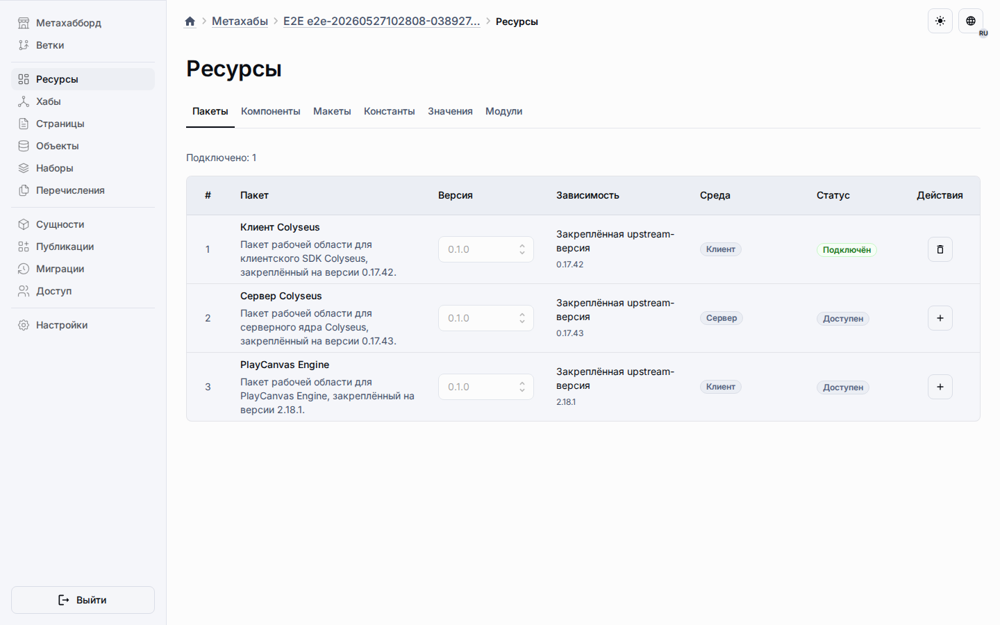

# Пакеты метахаба

Пакеты — это переиспользуемые workspace-библиотеки, которые метахаб может декларативно указать как runtime-зависимости для своих модулей.

Первый MVP-реестр содержит три встроенные обёртки:

-   `@universo-react/colyseus-client`
-   `@universo-react/colyseus-server`
-   `@universo-react/playcanvas-engine`

Project-local MMOOMM skills в `.agents/skills/` используют эти обёртки как
источник версий: PlayCanvas Engine guidance ориентирован на `playcanvas@2.18.1`,
Colyseus client guidance — на `@colyseus/sdk@0.17.42`, а Colyseus server
guidance — на `@colyseus/core@0.17.43`.

## Вкладка Resources

Откройте **Metahub → Resources → Packages**, чтобы увидеть доступные пакеты реестра и пакеты, подключённые к текущему метахабу.

Вкладка показывает пользовательское имя пакета, workspace import name, выбранную версию, upstream-библиотеку, поддерживаемый runtime target и статус подключения. Пакет можно подключить, отключить или переключить на другую зарегистрированную версию.

## Runtime-публикация

При публикации метахаба подключённые пакеты попадают в snapshot публикации и синхронизируются в runtime-таблицу приложения `_app_packages`. После этого runtime-модули могут объявлять разрешённые package imports и импортировать подключённый пакет по его workspace-имени.

## Текущий scope

Этот фундамент не устанавливает пакеты из внешних репозиториев, не добавляет package sharing или ACL-настройки, не публикует marketplace-каталог и не переиспользует контент метахаба как пакет. Реестр наполняется bootstrap-процессом платформы и не редактируется из runtime UI.
